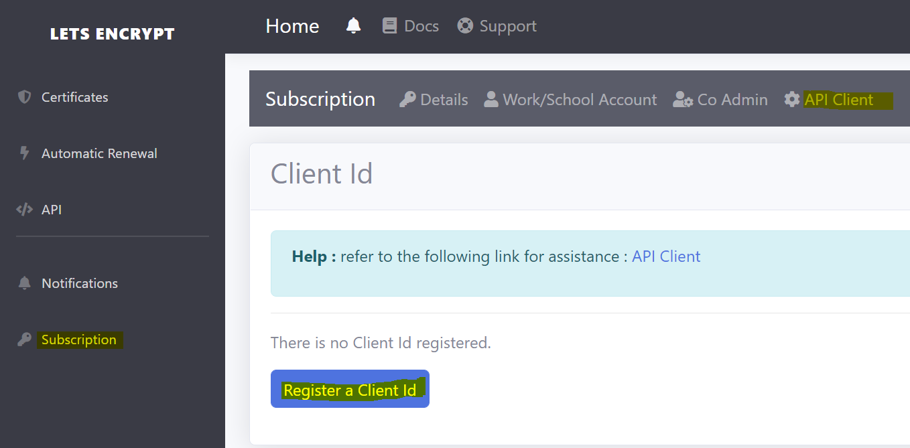
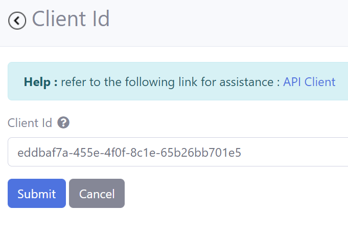

# Obtaining Access Tokens
**V6.0.10**

Steps in acquiring access tokens :

- Register an AAD Application
- Set Access Control for the AAD application to access resources in an Azure subscription
- Register the AAD Application's Client Id in the **RCL Portal**
- Make a POST request to the AAD Application-specific token endpoint to obtain the tokens

## Registering an AAD Application

To register an AAD application, please follow the instruction in this link :

- [Registering an AAD Application](../authorization/aad-application)

## Get the AAD Credentials

To obtain the following credentials from the AAD application:

- Client Id
- Client Secret
- Tenant Id

follow the instructions in this link :

- [Get the AAD Application Credentials](../authorization/aad-application#get-the-aad-application-credentials)

## Set Access Control for the AAD application

A user must set access control for the AAD application to access resources in their Azure subscription. Please refer to the following link :

- [Setting Access Control for the AAD Application](../authorization/access-control-app)

## Add the Client Id in the RCL Portal

A user must add the **Client Id** in the **RCL Portal** in order to associate the AAD application with the user's RCL subscription.

- Open the **RCL Portal**

- In the 'Subscription' section, click on 'API Client', then click the 'Register a Client Id' button



- Add the **Client Id** for the AAD application. (To obtain the Client Id from the AAD application, please refer to : [Get the AAD Application Credentials](../authorization/aad-application#get-the-aad-application-credentials)



- Click the 'Submit' button when you are done.
 

## Request an Access Token

 To request an access token, use an HTTP POST to the Application-specific Azure AD token endpoint.

 ```
 https://login.microsoftonline.com/<tenantId>/oauth2/token
 ```

 Replace the `tenantId` placeholder with the **Tenant Id** credential for the user's AAD Application.

 Include the following parameters in the **body** of the POST request in the [Form-UrlEncoded](https://developer.mozilla.org/en-US/docs/Web/HTTP/Methods/POST) format :

- grant_type : should be : ``client_credentials``
- client_id : the Client Id of the AAD application
- client_secret : the Client Secret of the AAD application
- resource : the Azure Resource Manager resource, should be : ``https://management.core.windows.net``  
the Key Vault resource should be : ``https://vault.azure.net``

 ### Example - Azure Resource Manager token

 ```
POST /88cd9a7c-bc7c-3426-b9c2-2702c3b6b0e7/oauth2/token HTTP/1.1
Host: login.microsoftonline.com
Content-Type: application/x-www-form-urlencoded

grant_type=client_credentials&client_id=625bc9f6-3bf6-4b6d-94ba-e97cf07a22de&client_secret=qkDwDJlDfig2IpeuUZYKH1Wb8q1V0ju6sILxQQqhJ+s=&resource=https%3A%2F%2Fmanagement.core.windows.net
 ```

  ### Example - Azure Key Vault token

 ```
POST /88cd9a7c-bc7c-3426-b9c2-2702c3b6b0e7/oauth2/token HTTP/1.1
Host: login.microsoftonline.com
Content-Type: application/x-www-form-urlencoded

grant_type=client_credentials&client_id=625bc9f6-3bf6-4b6d-94ba-e97cf07a22de&client_secret=qkDwDJlDfig2IpeuUZYKH1Wb8q1V0ju6sILxQQqhJ+s=&resource=https%3A%2F%2Fvault.azure.net
 ```

## Service Response

A success response contains a JSON OAuth 2.0 response with the following parameters:

| Parameter | Description |
| --- | --- |
| access_token |The requested access token. |
| token_type |Indicates the token type value. |
| expires_in |How long the access token is valid (in seconds). |
| expires_on |The time when the access token expires. The date is represented as the number of seconds from 1970-01-01T0:0:0Z UTC until the expiration time. This value is used to determine the lifetime of cached tokens. |
| not_before |The time from which the access token becomes usable. The date is represented as the number of seconds from 1970-01-01T0:0:0Z UTC until time of validity for the token.|
| resource |The App ID URI of the receiving web service. The RCL resource. |


### Example of response

The following example shows a success response to a request for an access token.

```
{
"access_token":"eyJ0eXAiO ... 0X2tnSQLEANnSPHY0gKcgw",
"token_type":"Bearer",
"expires_in":"3599",
"expires_on":"1388452167",
"resource":"https://management.core.windows.net"
}
```

## Use the Access Tokens to Make a Request

To make a request to the RCL Public API, the access tokens (Azure Resource Manager and Key Vault) is set in the body of the request as a JSON using the ``ResourceRequest`` class

| Parameter | Description | Type
| --- | --- |--- |
| accessToken |The Azure Resource Manager access token. | string |
| accessTokenKeyVault |The Key Vault Access Token | string |

The base URL for the RCL Public API is :
```
https://rclapi.azure-api.net/public
```

The following example illustrates how to make a **POST** request to the : ``/v1/subscription/{subscriptionid}/public/certificate/test`` API endpoint. This API tests for a valid authenticated connection to the RCL Public API.

Each request should include the **Subscription Id** of the subscription in the RCL Portal.


### Example

```
POST /public/v1/subscription/subscr-34001/public/certificate/test HTTP/1.1
Host: rclapi.azure-api.net
Content-Type: application/json

{
    "accessToken" : "eyJ0eXAiOiJk..ww",
    "accessTokenKeyVault" : "eyJ0eXAiOZ..DQ"
}
```


## Related Articles

- [Introduction to RCL API](./api.md)
- [Post Certificate Test](./post-certificate-renewal.md)

