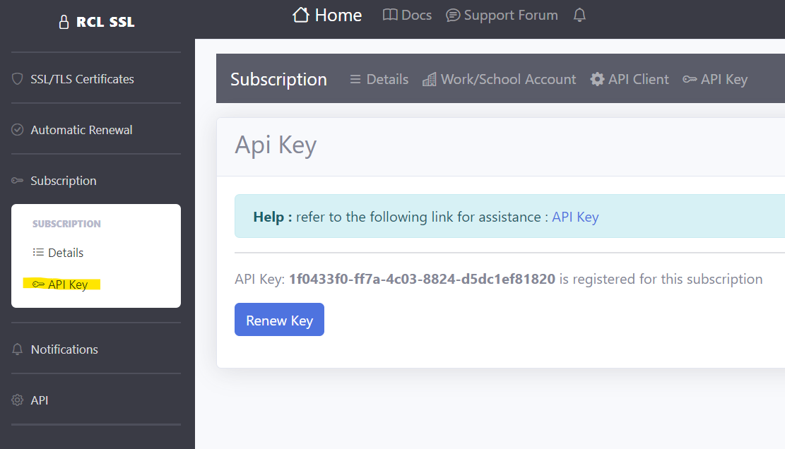

## Authorization
**V7.0.0**

You can use an Api Key to obtain authorized access to resources on the [RCL SSL Core API](../apicore/api.md), [RCL SSL SDK](../sdk/sdk.md) and [RCL SSL HTTP AutoRenew](../httpautorenew/httpautorenew.md).

## Create an Api Key

- In the [RCL SSL Portal](../portal/portal.md) side menu, click on **Subscription > API Key**

- In the ``API Key`` page, create the Api key

## Related Articles

- [HTTP AutoRenew](../httpautorenew/httpautorenew.md)
- [RCL SSL Core API](../apicore/api.md)
- [RCL SDK](../sdk/sdk.md)