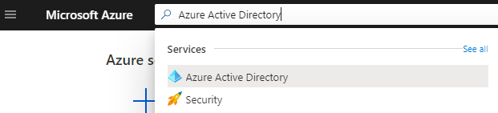
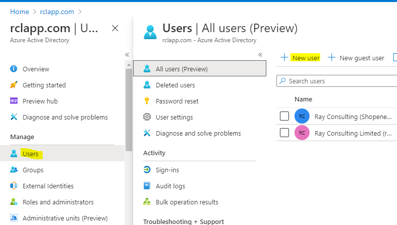
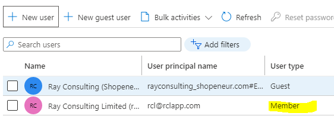
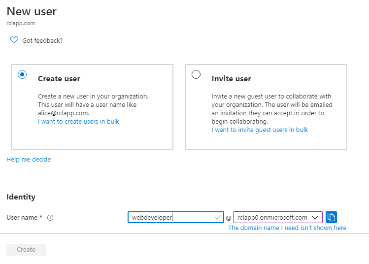

# Azure Active Directory Organization Account
**V7.1.0**

An Azure Active Directory (AAD) organization account is required to sign in to the [RCL SSL Portal](../portal/portal.md) to manage Azure Resources (App Services, DNS, Key Vault, etc.) in a Subscription. An organization account is also called a **‘Work or School’ account**. Follow these steps to use an AAD account in the RCL SSL Portal.

- In the Azure Portal, search for the **Azure Active Directory** and open it

- In your tenant, click the ‘Users’ link

# Use an Exiting User Account

You can select an exiting user account who is a **member** of the tenant to login to the RCL SSL Portal. **Guest users cannot be used.**

# Create a New User Account

You can also create a new user account to sign in to the RCL SSL Portal.

- Click the ‘New user’ link to create a new user

- Add the new user

- Ensure the new user is a **member** in your organization

- You will need to associate this new AAD organization account to login in to the RCL SSL Portal.

# Access Control

To access resources in you Microsoft Azure account a further step is required. Your AAD Work or School account must be an 'Administrator' or 'Owner' in the Subscription containing your azure resources. 

Refer to the following link for more information :

- [Set Access Control for the AAD user](./access-control-user)

