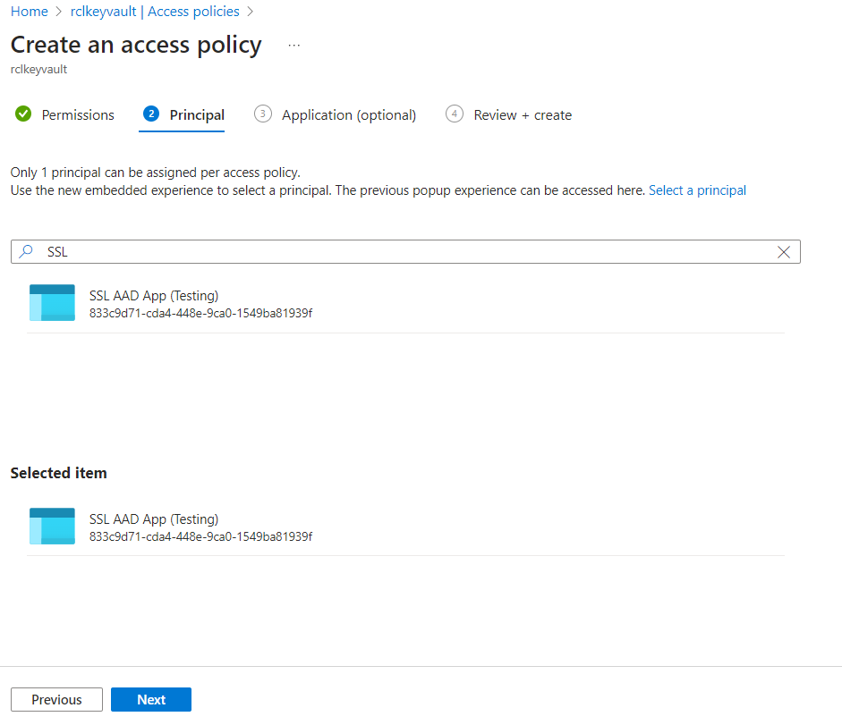

## Set Access Control for the AAD application
**V6.0.10**

A user will need to provide **Access Control** to the [AAD Application](./aad-application) for it to manage the user's Azure Services (App Services, DNS Zone and Key Vault).

- Go to Azure subscriptions, and open the subscription that contains your Azure App Services, DNS Zone, Key Vault

- In the subscription, click on 'Access control (IAM)' and add a new **role assignment**

- Select the 'Contributor' role and click the 'Next' button

- Search for the AAD App that was registered and select it. (If you did not register an AAD app previously, please follow the instruction in this link : [Registering an AAD Application](../authorization/aad-application))

- Click the 'Review + assign' button 

- In the 'Role assignments' tab, you will see the new role assignment you just added

**You must repeat these steps for each Azure Subscription that a user may wish to access.**

## Access Policies for Key Vault

If a user is creating SSL/TLS certificates for **Azure Key Vault**, they will need to set **Access policies** for the certificate in Key Vault. 

**This step is not required, if SSl/TLS certificates are not being created for Key Vault.**

- In Key Vault, click on 'Access policies' and 'Add Access Policy'

- In the 'Certificate permissions' dropdown, select all **16 permissions**, including 'Purge' permission.

- Then , click on 'Select principal'

- Search for the application that was registered and click the 'Select; button to select it 

- Click the 'Add' button when you are done

- Click the 'Save' button to save the access policy

- The newly added access policy will be displayed

## Related Articles

- [AutoRenew Function](../autorenew/autorenew.md)

