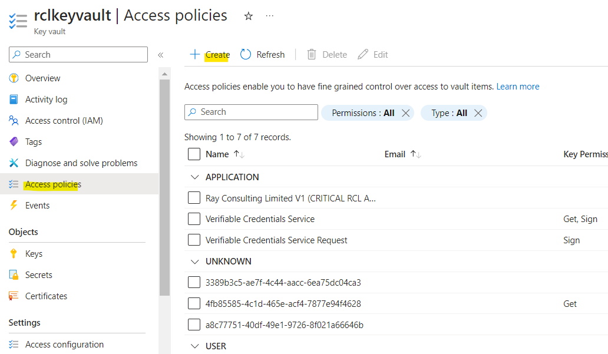

## Set Access Control for the AAD application
**V7.1.0**

A user will need to provide **Access Control** to an [AAD Application](./aad-application) for the application to manage the user's Azure Services (Key Vault, DNS Zone and App Services) in a Subscription.

- Go to Azure **Subscriptions**, and open the subscription that contains your Azure Key Vault, DNS Zone, App Services, etc.

- In the subscription, click on 'Access control (IAM)' and add a new **role assignment**

- Click on the **Privileged administrator role** link

- Select the 'Contributor' role and click the 'Next' button

- Assign access to : 'User, groups or service principal' and click the 'Select members' link

- Search for the AAD App that was registered and select it. (If you did not register an AAD app previously, please follow the instruction in this link : [Registering an AAD Application](../authorization/aad-application))

- Click the 'Review + assign' button 

- In the 'Role assignments' tab, you will see the new role assignment you just added

{: .information }
You must repeat these steps for each Azure Subscription to access Azure Resources.

## Access Policies for Key Vault

If SSL/TLS certificates ae being created for **Azure Key Vault**, they will need to set **Access policies** for the certificate in Key Vault. 

{: .information }
This step is not required, if SSL/TLS certificates are not being created for Key Vault.

- In your Azure Key Vault, click on the ‘Access policies’ link. Then click on ‘Create’.

- Select all the permissions for the ‘Certificate Management Operations’ (select all). Ensure you include the **purge** permission.

- Select all the permissions for the ‘Secret Management Operations’ (select all). Ensure you include the **purge** permission.

- Click the 'Next' button when you are done

- Select a service principal : search for the Azure Active Directory application you use created

- Click the ‘Next’ button

- Click the ‘Create’ button when you are done

- The newly added access policy will be displayed

## Related Articles

- [AAD Application](../authorization/aad-application.md)
- [RCL SSL AutoRenew Function](../autorenew/autorenew.md)