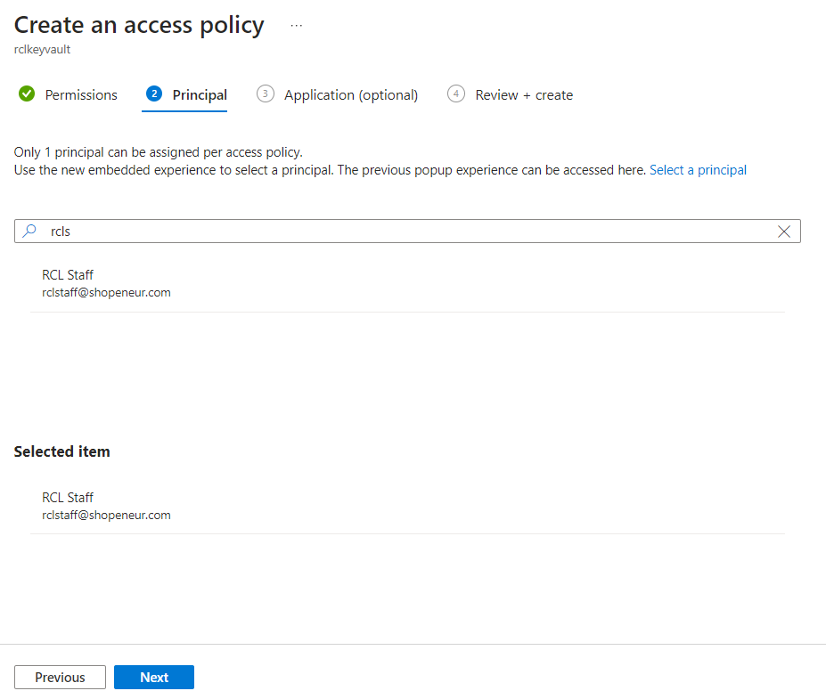

# Set Access Control for the AAD user
**V7.1.0**

The Azure Active Directory (AAD) organization (Work or School) account that you use to login to the [RCL SSL Portal](../portal/portal.md)  must either be :

- An 'Owner' to your Azure subscription
- Have a role of ‘Owner’ or ‘Contributor’ to your Azure subscription

If either of these requirements are not met, you will not be able to use the RCL SSL Portal to manage your Azure resources (App Services, DNS, Key Vault, etc) in the subscription.

You may also experience an error message.

In this article, you will learn how to set access control for your AAD organization account (**AAD user**) to your Azure subscription.

You can select or create a new **AAD user account** in your AAD tenant to sign in to the RCL SSL Portal. Refer to the following link for more information :

- [AAD User Account](./aad-account)

# Subscription Administrator

You can determine if your AAD organization account is an 'Owner' on the Azure subscription by logging in to the Azure portal with the same AAD account that you use to login to to the the RCL SSL Portal.

- In the Azure portal, search for 'Subscriptions' and navigate to it

- Select a subscription that contain your Azure resources

- After you select a subscription, click on the ‘My permissions’ link for the subscription

- Here , you can determine if you are an 'Owner' on the subscription

# Set Owner or Contributor roles

If the AAD account that you use to log in to the RCL SSL Portal is not an 'Owner' in the Azure subscription, you need to add the AAD account as an ‘Owner’ or ‘Contributor’ to the Azure subscription.

- Click on the the ‘Access Control (IAM)’ link in the Subscription section

- In the subscription, click on 'Access control (IAM)' and add a new **role assignment**

- Click on the **Privileged administrator role** link

- Select the 'Contributor' role and click the 'Next' button

- Search for and select the AAD user account that you use to login to the RCL SSL Portal

- You will see the new role assignment in the ‘Role assignments’ tab

**You must do this for each Azure subscription that you want to use in the RCL SSL Portal.**

## Access Policies for Key Vault

If a user is creating SSL/TLS certificates for **Azure Key Vault**, they will need to set **Access policies** for the certificate in Key Vault. 

{: .information }
This step is not required, if SSL/TLS certificates are not being created for Key Vault.

- In your Azure Key Vault, click on the ‘Access policies’ link. Then click on ‘Create’.

- Select all the permissions for the ‘Certificate Management Operations’ (select all). Ensure you include the **purge** permission.

- Select all the permissions for the ‘Secret Management Operations’ (select all). Ensure you include the **purge** permission.

- Click the 'Next' button when you are done

- Select a service principal : search for the Azure Active Directory organizational user account that you use to login to the RCL SSL portal

- Click the ‘Next’ button

- Click the ‘Create’ button when you are done

- The new access policy will be added

