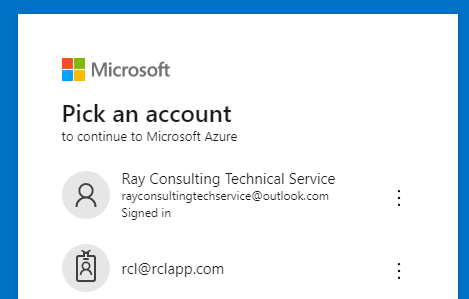
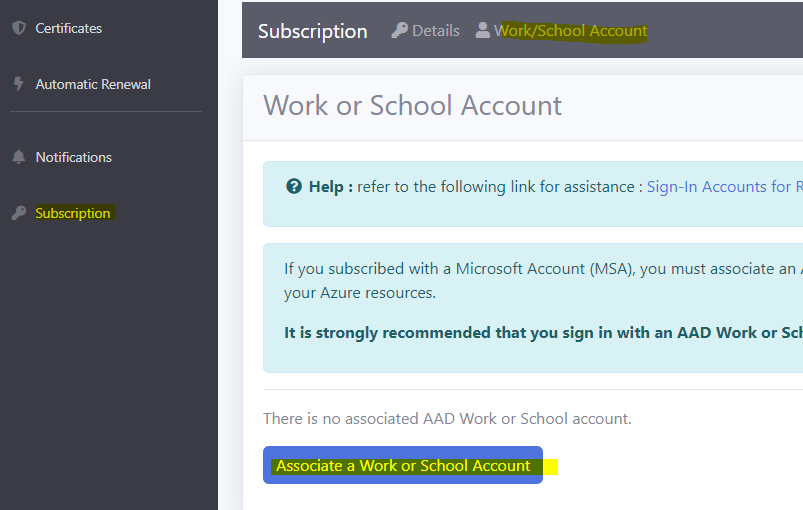
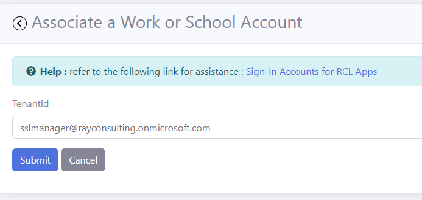

# Sign-In Accounts for RCL SSL Portal
**V8.0**

You can subscribe to and sign in to the [RCL SSL Portal](../portal/portal.md) with a :

- Microsoft personal account (MSA)
- Microsoft Entra ID (formerly Azure Active Directory) organization account (Work or School)

In the image above, the top account is a **MSA account** and the one below is a **Work or School account**. Work or School accounts are indicated by an 'id badge' image.

# Account Types

## Microsoft Accounts (MSA)

The MSA account is a personal Microsoft account. You usually register for one to use Microsoft consumer products such as Xbox, Outlook, Store, etc.

## Microsoft Entra ID Organization Account

The Work or School account is issued to users by an organization from their **Microsoft Entra ID** tenant. These accounts are normally used to access enterprise resources and applications provided by organizations to their employees or students.

# Account Limitations

{: .warning }
MSA accounts cannot be used to Manage Azure Resources in a Subscription such as App Services, Key Vault, DNS, etc. You must use a Work or School Account to manage these services.

If you try to manage an Azure Resource with a MSA account you will get the following error.

# Associating a Work or School Account to a Subscription

If you subscribed to [RCL SSL Portal](../portal/portal.md) with an MSA account, you must associate the subscription with an AAD Work or School account to manage Azure resources.

This will allow you to login to your subscription with the AAD Work or School account.

To associate an Work or School account follow these steps.

- Select or create a new user account in your Microsoft Entra ID tenant. Refer to the following link for more information : [Organization Account](./aad-account)

- In the Subscription section of the RCL, click on the 'Work/School Account' menu item. Then, click on the button to associate your Work or School account

- Add the name of the Work or School account to be associated with your subscription and click the submit button

- After the account is associated with your subscription, sign in with the Work or School account in the RCL SSL Portal.

# Access Control

To access resources in you Microsoft Azure account a further step is required. Your Work or School account must be an 'Administrator' or 'Owner' on the subscription containing your azure resources. 

Alternatively, you can assign the 'Contributor' or 'Owner' role to the Work or School account in your azure subscription.

Refer to the following link for more information :

- [Set Access Control for the organization user](./access-control-user)

