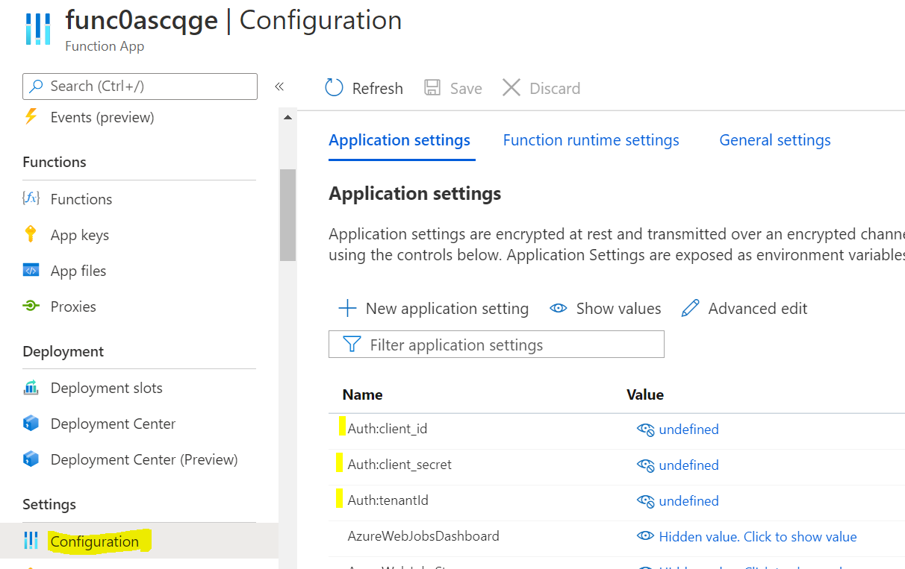
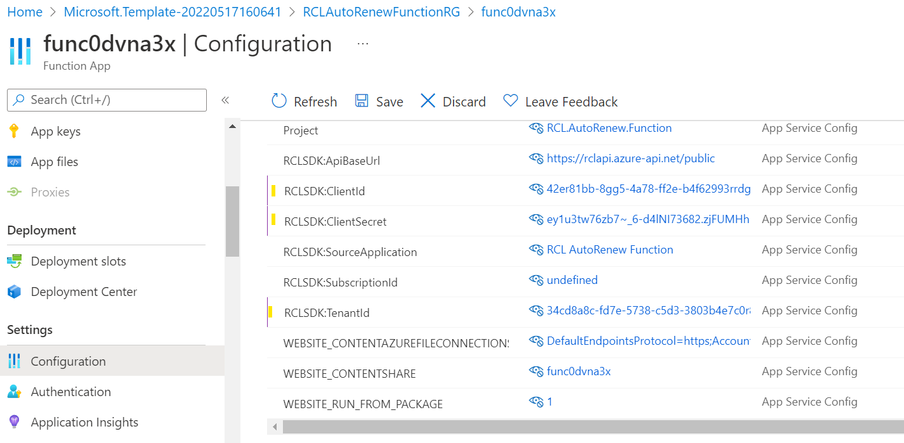
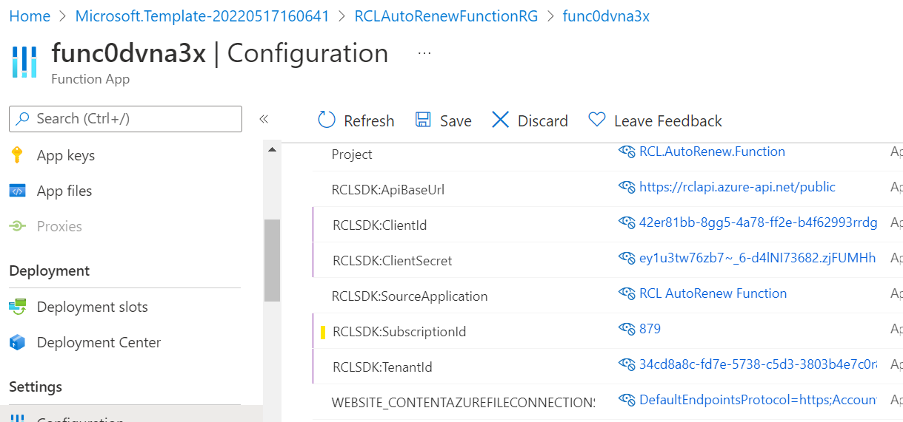

---
title: Configure
description: Configuring the RCL AutoRenew Function
parent: AutoRenew Function
nav_order: 2
---

# Configure the RCL SSL AutoRenew Function App
**V7.1.0**

In this section, you will configure the [RCL SSL AutoRenew Function](../autorenew/autorenew.md) app.

## Register an AAD Application

An Azure Active Directory (AAD) application must be registered to obtain permission to access a user's Azure resources (Key Vault, DNS Zone, App Services). Please refer to the following link for instructions on how to register the AAD application:

- [Registering an AAD Application](../authorization/aad-application)

## Set Access Control for the AAD application

Access control must be set for the AAD application to access resources in a user's Azure subscription (Key Vault, DNS Zone, App Services). Please refer to the following link for instructions:

- [Setting Access Control for the AAD Application](../authorization/access-control-app)

## Get the AAD Credentials 

Please refer to the link  below to get the following AAD credentials :

    - Client Id
    - Client Secret
    - Tenant Id

To configure the function app :

- [Get the AAD Application Credentials](../authorization/aad-application#get-the-aad-application-credentials)

## Add the Configuration variables

- Open the function app and click on 'Configuration'



Update the following configuration entries with the credentials from the AAD application :

- RCLSDK:ClientId - the AAD App Client Id
- RCLSDK:ClientSecret - the AAD App Client Secret
- RCLSDK:TenantId - the AAD App Tenant Id



- In the [RCL SSL Portal](../portal/portal.md), open the 'Subscription Details' page


- Scroll down and copy the 'Subscription Id' for configuration purposes


- In the Function App configuration page, add the 'Subscription Id' value to the **RCLSDK:SubscriptionId** configuration entry



- In the Function App configuration page, add the certificates that you would like to renew in the **CertificateBot:IncludeCertificates** configuration entry

- You can add a single certificate by its name, or multiple certificates separated by semi-colons (;)

Example single certificate

```bash
CertificateBot:IncludeCertificates      acme.com
```

Example single SAN certificate

```bash
CertificateBot:IncludeCertificates      acme.com,*.acme.com
```

Example multiple certificates

```bash
CertificateBot:IncludeCertificates      acme.com,*.acme.com;contoso.com;fabricam.com
```

- Click the 'Save' button when you are done

## Add the Client Id in the RCL Portal

The AAD Application must be registered in the [RCL SSL Portal](../portal/portal.md) to associate the AAD application to a user's RCL SSL subscription.

To add the AAD Application's ``Client Id`` to the portal, please follow the instructions in this link :

- [Add the Client Id in the RCL SSL Portal](../api/authorization.md#add-the-client-id-in-the-rcl-portal)

## Next Step

- [Testing the RCL SSL AutoRenew Function](./test.md)


