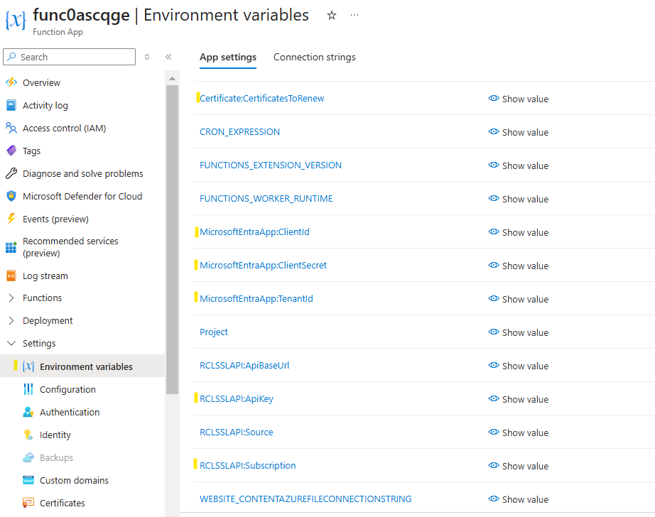
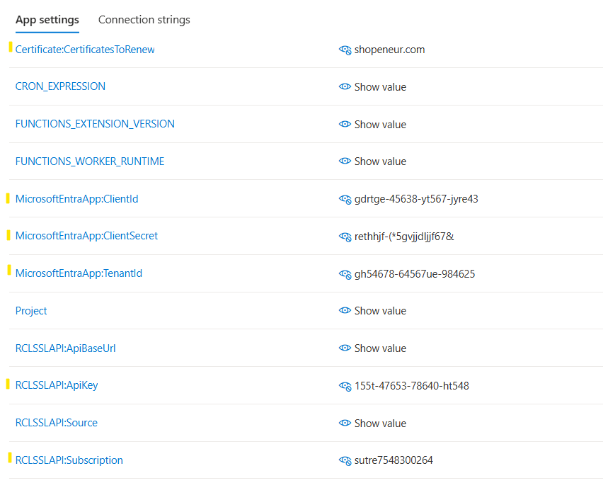

# Configure the RCL SSL AutoRenew Function App
**V8.0**

In this section, you will configure the [RCL SSL AutoRenew Function](../autorenew/autorenew.md) app.

## Register a Microsoft Entra ID (formerly AAD) Application

A Microsoft Entra application must be registered to obtain permission to access a user's Azure resources (Key Vault, DNS Zone, App Services, etc.) in a Subscription. Please refer to the following link for instructions on how to register the AAD application:

- [Registering a Microsoft Entra Application](../authorization/aad-application)

## Set Access Control for the application

Access control must be set for the application to access resources in a user's Azure Subscription (Key Vault, DNS Zone, App Services, etc.). Please refer to the following link for instructions:

- [Setting Access Control for the Application](../authorization/access-control-app)

## Get the Application Credentials 

Please refer to the link  below to get the following application credentials :

    - Client Id
    - Client Secret
    - Tenant Id

To configure the function app :

- [Get the Application Credentials](../authorization/aad-application#get-the-aad-application-credentials)

## Add the Environment variables

- Open the function app and click on 'Environment variables'



Update the following entries with the credentials from the Microsoft Entra application :

- MicrosoftEntraApp:ClientId - the App Client Id
- MicrosoftEntraApp:ClientSecret - the App Client Secret
- MicrosoftEntraApp:TenantId - the App Tenant Id

- In the [RCL SSL Portal](../portal/portal.md), open the 'Subscription Details' page


- Scroll down and copy the 'Subscription' for configuration purposes

- In the Function App configuration page, add the 'Subscription' value to the **RCLSSLAPI:Subscription** configuration entry


- In the [RCL SSL Portal](../portal/portal.md) side menu, click on **Subscription > API Key** , in the ``API Key`` page, you can view the API Key

- In the Function App configuration page, add the 'API Key' value to the **RCLSSLAPI:ApiKey** configuration entry


- In the Function App configuration page, add the certificate(s) that you would like to renew in the **Certificate:CertificatesToRenew** entry

- You can add a single certificate by its name, or multiple certificates separated by semi-colons (;)

Example single certificate

```bash
Certificate:CertificatesToRenew      acme.com
```

Example single SAN certificate

```bash
Certificate:CertificatesToRenew      acme.com,*.acme.com
```

Example multiple certificates

```bash
Certificate:CertificatesToRenew     acme.com,*.acme.com;contoso.com;fabricam.com
```



- Click the 'Save' button when you are done

## Next Step

- [Testing the RCL SSL AutoRenew Function](./test.md)


