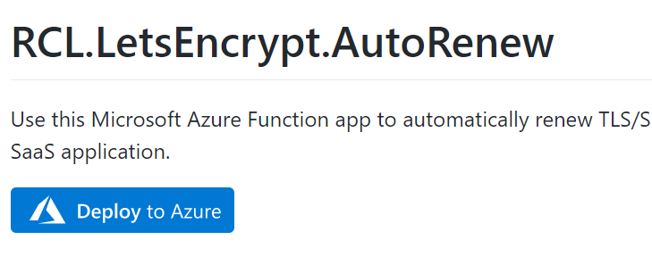
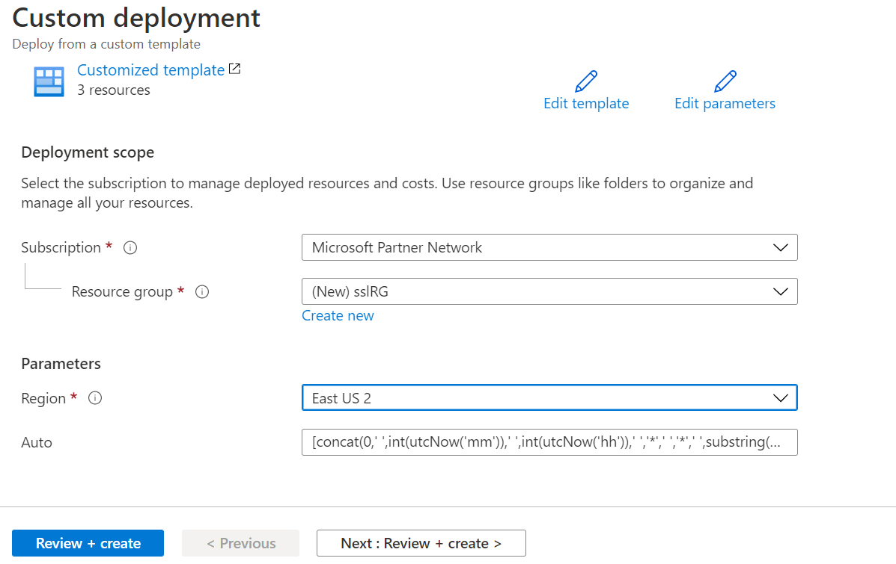

---
title: Installing the Function
description: Installing the RCL Auto Renew Function
parent: RCL AutoRenew Function
nav_order: 2
---

# Installing AutoRenew Function
**V6.0.10**

In this section, you will learn how to install the [RCL AutoRenew Function](../autorenew/autorenew.md) in an Azure account.

If you have an older version of the AutoRenew function installed in your Azure account, you should delete the function and its dependencies (storage account and consumption plan) before you re-install the AutoRenew function.

## Install in Azure

- Open the [Github Project Page ](https://github.com/rcl-ssl/RCL.AutoRenew.Function) for the AutoRenew function , and in the **master** branch, click on the 'Deploy to Azure' button on the **README** page

- Create a new **Resource Group** and install the function app. Do not edit the 'Auto Generated' settings.

The following Azure resources will be installed in the Resource Group :

- Function app - this is used to automatically renew the SSL/TLS certificates
- Consumption plan - the function app will run on a [consumption plan](https://docs.microsoft.com/en-us/azure/azure-functions/consumption-plan) and the user will pay only when the function is running
- Storage account - required by the function app

The estimated cost for these Azure resources may be a few cents or dollars per month based on the number of certificates in a user's subscription.

## Next Step

- [Configuring the AutoRenew Function](./configure.md)