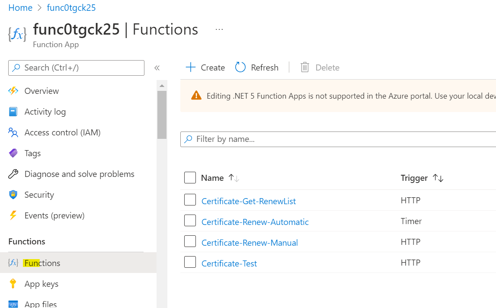
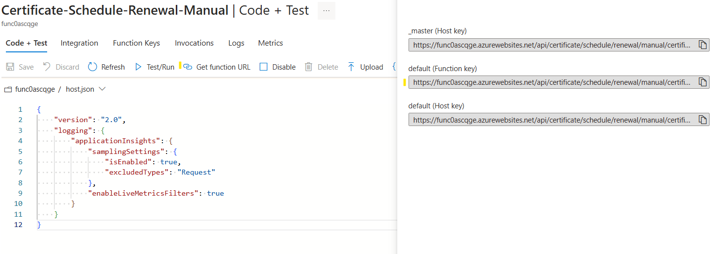

---
title: Testing the Function
description: Testing the RCL AutoRenew Function
parent: AutoRenew Function
nav_order: 4
---

## Testing the Functions

In this section, you will learn how to test the RCL AutoRenew functions.

- In the Azure portal, open the function app and open the functions

- In the **RenewCertificates** function, click on 'Code + Test', and then click on 'Test/Run'

- Click the 'Run' button to manually run the function

- You should see the output of the function in the logs window.

- You may need to run the function twice to see the message from the function app. It will identity if there are any certificates that it has scheduled for renewal.

- Please ensure that there are no errors in the log. If there are errors, the function is misconfigured and certificate renewal will fail.

**Note: The 'RenewCertificates' function will run on a weekly basis and automatically renew certificates that are about to expire. There is no need to manually run the function apart from manual testing**

## Related Articles

- [Installing AutoRenew Function](./installation.md)
- [Configuring AutoRenew Function](./configure.md)

