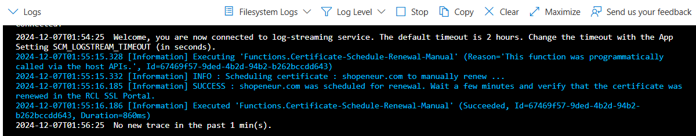
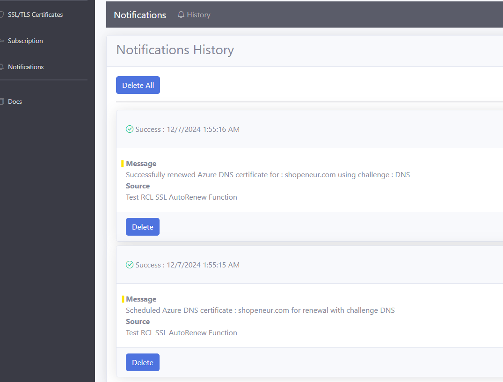

---
title: Test
description: Testing the RCL SSL AutoRenew Function
parent: AutoRenew Function
nav_order: 3
---

## Testing the RCL SSL AutoRenew Function
**V8.0**

In this section, you will learn how to test the RCL SSL AutoRenew function. 

- In the Azure portal, open the function app and click the 'Functions' link

- Then, open the 'Certificate-Schedule-Renewal-Manual' function


- In the **Certificate-Schedule-Renewal-Manual** function, click on 'Code + Test', and expand the 'Logs' window

- Switch to **Filesystem Logs** instead of **App Insights Logs**

- Get the **function Url**

### Example Function URL with a function key

```bash
https://func0ascqge.azurewebsites.net/api/certificate/schedule/renewal/manual/certificatename/{certificatename}?code=nzIK9EkwJp0Y7wIwx_fTOj2BZ4FyP6NrdQS9IJ6TP9AIAzFuoPV3kw%3D%3D
```


- Replace the {certificatename} place holder with a certificate you created in the RCL SSL Portal.

```bash
https://func0ascqge.azurewebsites.net/api/certificate/schedule/renewal/manual/certificatename/shopeneur.com?code=nzIK9EkwJp0Y7wIwx_fTOj2BZ4FyP6NrdQS9IJ6TP9AIAzFuoPV3kw%3D%3D
```

- Paste the URL in a browser and send the request

- You should see the output of the function in the browser similar to the one shown below. 


- You should see the output of the function in the logs window similar to the one shown below.



- Please ensure that there are no errors in the log. If there are errors, the function is misconfigured and certificate renewal will fail.

- Wait a few minutes and ensure check the RCL SSL Portal to see if the certificate was renewed.



{: .information }
The 'Certificate-Schedule-Renewal-Automatic' function will automatically run on a weekly basis and automatically renew certificates that are about to expire. There is no need to manually run the 'Certificate-Schedule-Renewal-Manual' function apart from manual testing.


