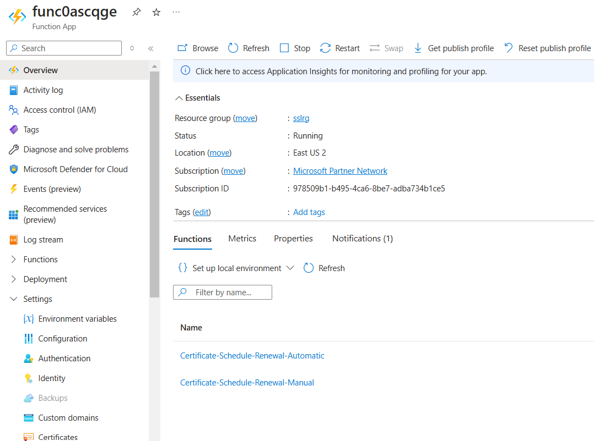
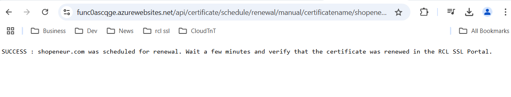

## Testing the RCL SSL AutoRenew Function
**V7.1.0**

In this section, you will learn how to test the RCL SSL AutoRenew function. 

- In the Azure portal, open the function app and click the 'Functions' link

- Then, open the 'Certificate-Test' function



- In the **Certificate-Test** function, click on 'Code + Test', and expand the 'Logs' window

- Switch to **Filesystem Logs** instead of **App Insights Logs**

- Get the **function Url**


- Paste the function url in a browser

- You should see the output of the function in the browser similar to the one shown below. 



- You should see the output of the function in the logs window similar to the one shown below.


- Please ensure that there are no errors in the log. If there are errors, the function is misconfigured and certificate renewal will fail.

## Troubleshoot a Failed Test

### Configuration not properly set

If you get the following error when testing :

```
TEST FAILED: Access Token Error : Could not obtain Access Token. {"error":"invalid_request","error_description":"AADSTS900023: Specified tenant identifier 'undefined' is neither a valid DNS name, nor a valid external domain.\r\nTrace ID: 235aa450-4376-40be-afcc-5951223bbd01\r\nCorrelation ID: 971609ea-f509-4676-b1a6-ea8423c635b2\r\nTimestamp: 2022-08-17 18:52:27Z","error_codes":[900023],"timestamp":"2022-08-17 18:52:27Z","trace_id":"235aa450-4376-40be-afcc-5951223bbd01","correlation_id":"971609ea-f509-4676-b1a6-ea8423c635b2","error_uri":"https://login.microsoftonline.com/error?code=900023"}
```

This indicates the the the AAD Application was not properly configured. Ensure the configuration values are correctly set for the function app.

### Subscription ID not properly set

If you get the following error when testing :

```
TEST FAILED: The request is Unauthorized. Please check the configuration for the auth credentials. Also, check the configuration for the SubscriptionId.
```

This may indicate that the Subscription ID is not properly configured for the function app.

### Client ID not set in the RCL Portal

If you get the following error when testing :

```
TEST FAILED: The request is Unauthorized. Please check the configuration for the auth credentials. Also, check the configuration for the SubscriptionId.
```

This may indicate that the Client ID of the AAD Application is not registered in the RCL SSL Portal in the subscription section.

### Access Control not set

If you get the following error when testing :

```
TEST FAILED: BadRequest : Access Control for the AAD Application has not been set appropriately. Access Control (Contributor or Owner Role) of the AAD Application has to be set for the user's subscription containing the user's Azure Resources via IAM.  Access Control is required to manage the user’s Azure Resouces (App Services, DNS Zone, Key Vault, etc.) in the user's subscription
```

This may indicate the you have not set the Access Control for the AAD Application to access the subscription containing your Azure resources.


## Manually Test the Certificate Renewal Process

### Force Certificate Expiration

In order to test certificate renewal, you must first force certificate expiration in the RCL SSL Portal.

- In the RCL SSL Portal, click on the **SSL/TLS Certificate > Certificates List** link in the side menu

- In the certificates list, click the **Manage > Force Expiry** link

- In the ``Force Expiry`` page, click the **Force Expiry** button

- The certificate will be forced to expire in the next 14 days


### Test Certificate Renewal

 - To manually test the certificate renewal process, open the 'Certificate-Renew-Manual' function

- In the **Certificate-Renew-Manual** function, click on 'Code + Test', and expand the 'Logs' window

- Switch to **Filesystem Logs** instead of **App Insights Logs**

- Get the **function Url**


- Paste the function url in a browser


- You should see the output of the function in the logs window similar to the one shown below.


**Note: The 'Certificate-Renew-Automatic' function will automatically run on a weekly basis and automatically renew certificates that are about to expire. There is no need to manually run the 'Certificate-Renew-Manual' function apart from manual testing**

## Related Articles

- [Installing RCL SSL AutoRenew Function](./installation.md)
- [Configuring RCL SSL AutoRenew Function](./configure.md)


