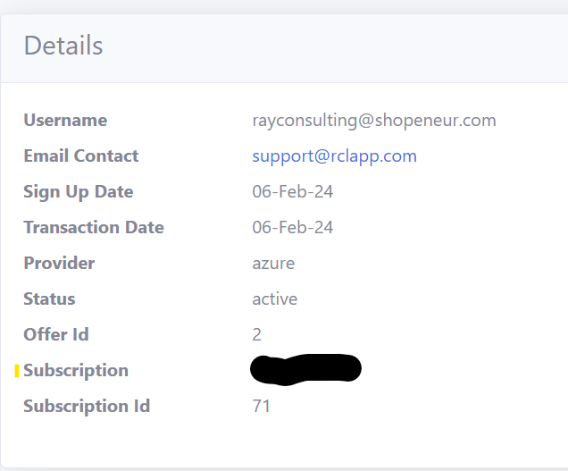

# RCL CertificateBot for Linux

RCL CertificateBot runs as a **Daemon** in a Linux Server. The daemon will run every seven (7) days to automatically renew and save SSL/TLS certificates from a user's subscription in the **RCL Portal** to a Linux Server.

## Automatically Renew TLS/SSL Certificates

You can use RCL CertificateBot to automatically renew SSL/TLS certificates created in the **RCL Portal** using the the following creation options :

- Azure DNS (including SAN) - **Recommended**
- Azure Key Vault (including SAN)

**'Stand Alone' certificates are not supported by RCL CertificateBot.**

# Installing RCL CertificateBot

## Download and Extract the Daemon Files to the Linux Server

- You will download the files from the RCL CertificateBot [GitHub Project Page](https://github.com/rcl-ssl/RCL.CertificateBot) in the [Releases](https://github.com/rcl-ssl/RCL.CertificateBot/releases) section; and extract it to your Linux Server in the ``/usr/sbin`` folder:

- In your Linux server, navigate to the ``/usr/sbin`` folder

```bash
cd /usr/sbin
```

- Run the command in the folder to download and extract the ``linux-x64`` files:

```bash
wget -c https://github.com/rcl-ssl/RCL.CertificateBot/releases/download/V6.0.10/certificatebot-linux-x64.tar.gz -O - | sudo tar -xz
```

or ``linux-arm`` files :

```bash
wget -c https://github.com/rcl-ssl/RCL.CertificateBot/releases/download/V2.1/certificatebot-linux-arm.tar.gz -O - | sudo tar -xz
```

## Configure the Daemon

### Register an AAD Application

An Azure Active Directory (AAD) application must be registered to obtain permission to access a user's Azure resources (eg: DNS Zone). 

Please refer to the following link to register an AAD application:

- [Registering an AAD Application](../authorization/aad-application)

### Set Access Control for the AAD Application

Access control must be set for the AAD application to access resources in a user's Azure subscription. Please refer to the following link to set access control :

- [Setting Access Control for the AAD Application](../authorization/access-control-app)

### Get the AAD Application Credentials 

To obtain the following credentials from the AAD application:

- ClientId
- ClientSecret
- TenantId

follow the instructions in this link :

- [Get the AAD Application Credentials](../authorization/aad-application#get-the-aad-application-credentials)

## Get the SubscriptionId

Get the **Subscription Id** in the RCL Portal.


- Scroll down and copy the 'Subscription Id' 



## Register the AAD Application's ``Client Id`` in the RCL Portal

The AAD Application must be associated with a user's RCL subscription. This is achieved by registering the AAD Application's ``Client Id`` in the **RCL Portal**.

To add the AAD Application's ``Client Id`` to the portal, please follow the instructions in this link :

- [Add the Client Id in the RCL Portal](../api/authorization#add-the-client-id-in-the-rcl-lets-encrypt-portal)


## Add the Configuration variables

- Navigate to the folder you downloaded and extracted the daemon files :

```bash
cd /usr/sbin/certificatebot-linux-x64
```

or for ``arm``

```bash
cd /usr/sbin/certificatebot-linux-arm
```

- Use nano (or other text editor) to edit the **appsettings.json** file in the folder

```bash
sudo nano appsettings.json
```

- Add the credentials for the AAD Application and SubscriptionId in the **RCLSDK** section :
  - ClientId
  - ClientSecret
  - TenantId
  - SubscriptionId

- In the **CertificateBot** section, set a folder path to save the SSL/TLS certificates. Recommended path : /etc/ssl/certificatebot

  - saveCertificatePath

- Create the folder in the server and ensure it has read/write permissions so that the certificates can be saved to it. 

```bash
sudo mkdir -m 777 /etc/ssl/certificatebot
```

- The ``includeCertificates`` settings will allow for including specific certificates by its name 
(eg:  "contoso.com"  or "contoso.com, *.contoso.com" - for SAN) as an array of strings in the renewal and installation operation. 

Example
```
  "CertificateBot": {
    "saveCertificatePath": "/etc/ssl/certificatebot",
     "includeCertificates": [
       "contoso.com",
       "fabricam.com",
       "acme.com,*.acme.com",
       "adworks.com, www.adworks.com"
       ],
  },
```

Example app.settings file

```
{
  "Logging": {
    "LogLevel": {
      "Default": "Information",
      "Microsoft.Hosting.Lifetime": "Information"
    }
  },
  "RCLSDK": {
    "ApiBaseUrl": "https://rclapi.azure-api.net/public",
    "SourceApplication": "RCL CertificateBot",
    "ClientId": "35ca82aa-9ff3-5a67-bb7f-c3c71027eecf",
    "ClientSecret": "hdytev539dgw~_8-g4lNI84V01.yIDUMHh",
    "TenantId": "22cd4a8c-bc2c-3618-b1c3-4610c1b9b3e8",
    "SubscriptionId": "879"
  },
  "CertificateBot": {
    "SaveCertificatePath": "/etc/ssl/certificatebot",
    "IncludeCertificates": [
      "shopeneur.com,*.shopeneur.com"
    ]
  }
}
```
- Save the updated **appsettings.json** file when you are done

# Add the Linux Daemon

## Create the Daemon

- Navigate to the **/etc/systemd/system** folder

```bash
cd /etc/systemd/system
```

- Create the daemon file

```bash
sudo touch certificatebot.service
```

- Use nano (or other text editor) to edit the service file 

```bash
sudo nano certificatebot.service
```

- Add the following code to the file

```bash
[Unit]
Description=RCL CertificateBot

[Service]
Type=notify
WorkingDirectory=/usr/sbin/certificatebot-linux-x64
ExecStart=/usr/sbin/certificatebot-linux-x64/RCL.CertificateBot.Linux

[Install]
WantedBy=multi-user.target

```

If you installed the ``arm`` version, change the directory to the arm path ``/usr/sbin/certificatebot-linux-arm`` instead of ``/usr/sbin/certificatebot-linux-x64`` in the 'WorkingDirectory' and 'ExecStart' settings

- Save the file when you are done

## Reload the Daemon

- Reload the daemon anytime you make changes to the service file

```bash
sudo systemctl daemon-reload
```

## Start the Daemon

- Run the code to start the daemon

```bash
sudo systemctl start certificatebot
```

## View the Status of the Daemon

- Run the code to view the status of the daemon

```bash
sudo systemctl status certificatebot
```

- You will see the status of the daemon. The most recent logs will also be displayed. 

- Ensure that there are no errors in the logs. If there are errors, the daemon is misconfigured and will not function

## View the Detailed Logs

- Run the command to view the daemon's detailed logs

```bash
sudo journalctl -u certificatebot --no-pager
```

- If the application is working correctly you should see messages similar to the one below :

```bash
RCL.CertificateBot.Linux.Worker[0] Found 1 certificate(s) to save locally.  Successfully saved : shopeneur.com,*.shopeneur.com.  Did not find any certificates to renew.
```

## When you need to Stop the Daemon

- Run the code when you need to stop the daemon. When the daemon is stopped, CertificateBot will discontinue certificate renewals and installation in the server.

```bash
sudo systemctl stop certificatebot
```

# Fixing Errors

If you encounter errors in the logs for the daemon, please stop the daemon. Ensure the 'appsettings' configuration is correct for the AAD Application credentials and the certificate save path settings. 

The folder to save the certificate must have read/write access. 

Reload and restart the daemon after you make changes and check if the errors were resolved.

# Installing Certificates in Web Servers

RCL CertificateBot will save renewed SSL/TLS certificate files to a folder in the server. You should then configure the web server to use these files to implement SSL/TLS in your website.

Please follow the links below to configure your web server:

- [Installing SSL/TLS Certificates in Apache Server](../installations/apache)
- [Installing SSL/TLS Certificates in Apache Tomcat](../installations/apache-tomcat)
- [Installing SSL/TLS Certificates in NGINX](../installations/nginx)
- [Installing SSL/TLS Certificates in Web Servers and Hosting Services](../installations/web-servers)


