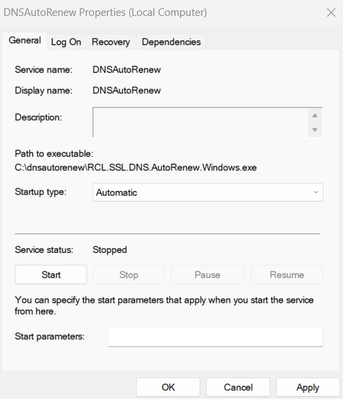
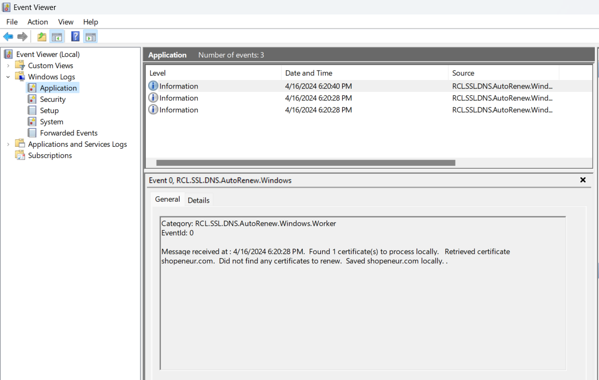

# RCL CertificateBot for Windows

RCL CertificateBot runs as a **Windows Service** in a Windows Server. The Windows Service will run every four (4) days to automatically renew and save TLS/SSL certificates from a user's subscription in the **RCL Portal**.

## Automatically Renew TLS/SSL Certificates

You can use RCL CertificateBot to automatically renew TLS/SSL certificates created in the **RCL Portal** using the the following creation options :

- Azure DNS (including SAN) - Recommended
- Azure Key Vault (including SAN)

**'Stand Alone' certificates are not supported by RCL CertificateBot.**

## Download the Files

- Download the Windows Service files from the GitHub Project page in the Releases section:

- Click to : [Download RCL CertificateBot Files](https://github.com/rcl-letsencrypt-auto-ssl/RCL.LetsEncrypt.CertBot/releases)

- Select the zip file with bitness (win-x86, win-x64, win-arm) to match your Windows server bitness

- Extract the zip file to a folder on your server after it is downloaded

## Configure the Service

### Register an AAD Application

An Azure Active Directory (AAD) application must be registered to obtain permission to access a user's Azure resources and to make authorized requests to the [RCL API](../api/api). 

Please refer to the following link to register an AAD application:

- [Registering an AAD Application](../authorization/aad-application)

### Set Access Control for the AAD application

Access control must be set for the AAD application to access resources in a user's Azure subscription. Please refer to the following link to set access control :

- [Setting Access Control for the AAD Application](../authorization/access-control-app)

### Get the AAD Application Credentials 

Please refer to the following link to get the AAD credentials to configure the service :

- [Get the AAD Application Credentials](../authorization/aad-application#get-the-aad-application-credentials)

### Add the Configuration variables

- In the folder containing the files for the Windows Service that you extracted, find and open the **appsettings.json** file

- Add the credentials for the AAD Application in the **Auth** section :

  - client_id
  - client_secret
  - tenantId

- In the **CertBot** section, set a folder path to save the TLS/SSL certificates. Create the folder in the server and set it with read/write permissions so that the certificates can be saved to it :

  - saveCertificatePath

- The ``includeCertificates`` settings will allow for including specific certificates by its name 
(eg: [ "contoso.com" ] or ["contoso.com, *.contoso.com"] for SAN) as an array of strings in the renewal operation. Multiple certificates can be also be set (eg: [ "contoso.com", "acme.com", "fabricam.com, *.fabricam.com" ]). To include all certificates in the renewal operation, leave the settings as [ "all" ]

- The ``serverIdentifier`` setting should be used to identify the server in which the service is being installed

```
{
  "Auth": {
    "client_id": "3434354ere455-6464-5456",
    "client_secret": "~irjhfyyr-6653gfghf",
    "tenantId": "47735-477635-46534"
  },
  "CertBot": {
    "saveCertificatePath": "c:/ssl/reclcertbot",
    "includeCertificates": ["all"],
    "serverIdentifier": "default",
    "bindings": []
  },
  "Logging": {
    "LogLevel": {
      "Default": "Information",
      "Microsoft": "Warning",
      "Microsoft.Hosting.Lifetime": "Information"
    },
    "EventLog": {
      "LogLevel": {
        "Default": "Information",
        "Microsoft.Hosting.Lifetime": "Information"
      }
    }
  },
  "LetsEncryptSDK": {
    "apiEndPoint": "https://letsencryptapi.azure-api.net",
    "armResource": "https://management.core.windows.net",
    "keyVaultResource": "https://vault.azure.net"
  }
}
```

# Create the Windows Service

- Open a **Command Prompt** in the Windows server as an **Administrator**

- Run the command to install the Windows Service. Replace the < file-path > placeholder with the actual path where your windows service files were downloaded and extracted

```
sc.exe create RCLCertBot binpath= <file-path>\RCL.LetsEncrypt.Certbot.WindowsService.exe
```

- After the service in installed, open **Windows Service** and Start the service


- You can set the **Properties** of the service to start automatically when the server starts



# View the Event Logs

- Open **Event Viewer**, under 'Windows Logs > Application', look for the 'RCL.LetsEncrypt.Certbot.WindowsService' events



- Ensure that there are no error events for the service. If there are error events, the service is misconfigured and will not function

- Additional logs can be found at the location : < saveCertificatePath > / log.txt, where 'saveCertificatePath' is the path that you configured in 'appsettings' to save the TLS/SSL certificates

- Each time a certificates is downloaded and saved in the server or a certificate is scheduled for renewal, a log will be written

# Deleting the Windows Service

Run the command to delete the service

```
sc.exe delete RCLCertBot  
```

# Fixing Errors

If you encounter error events for the service in the Event Viewer, please stop the service and delete it completely. Ensure the 'appsettings' configuration is correct for the AAD Application and the certificate save path settings. Then restart the service.

# Installing Certificates in Web Servers

RCL CertificateBot will save renewed TLS/SSL certificate files to a folder in the server. You should then configure the web server to use these files to implement SSL/TLS in your website.

Please follow the links below to configure your web server:

- [Installing TLS/SSL Certificates in Apache Server](../installations/apache)
- [Installing TLS/SSL Certificates in Apache Tomcat](../installations/apache-tomcat)
- [Installing TLS/SSL Certificates in NGINX](../installations/nginx)
- [Installing TLS/SSL Certificates in IIS](./iis)

