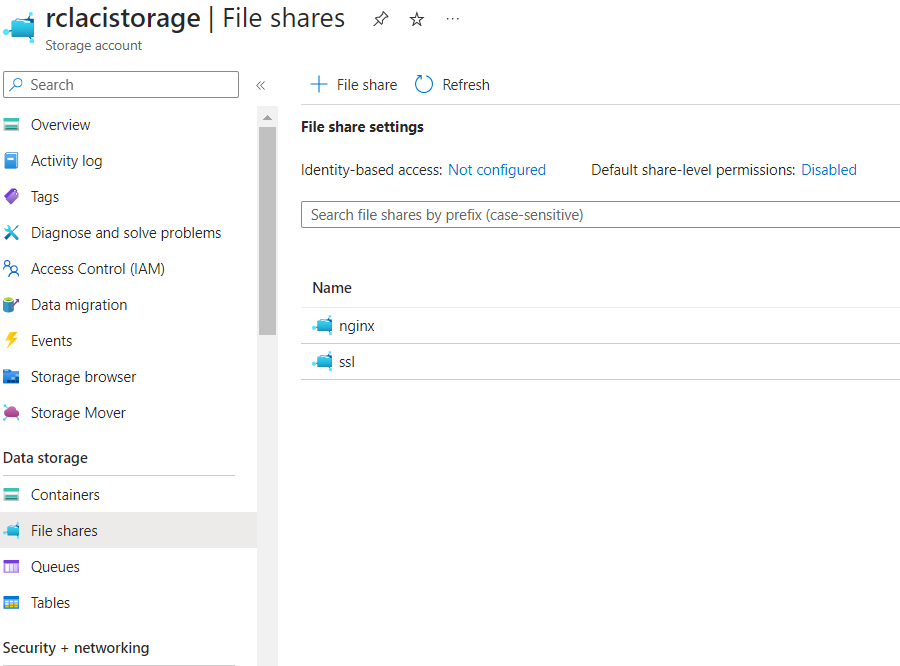
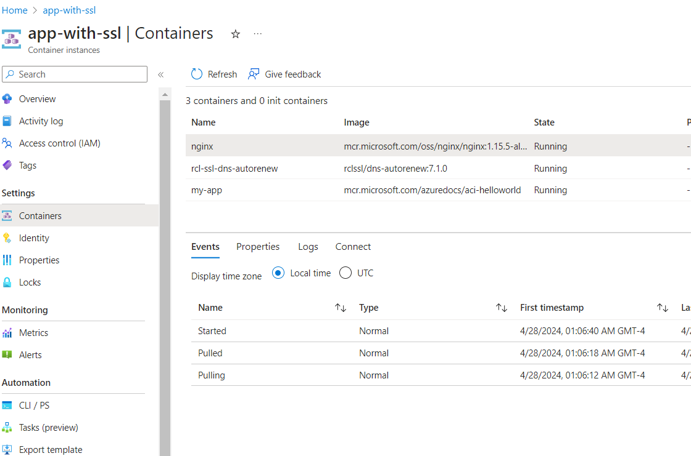
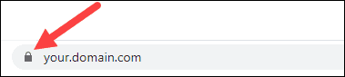

# SSL/TLS for Azure Container Instance

In this section, you will learn how to set up SSL/TLS in an Azure Container Instance. In this sample app, we will create a container group with the the following containers :

- An application container that runs a simple web app using the public Microsoft ``aci-helloworld`` image

- A sidecar container running the public NGINX image, configured to use SSL/TLS. NGINX will act as a reverse proxy, forwarding public requests to the container group of port 443(HTTPS) to the web app that listens on port 80 (HTTP) on ``localhost``

- A sidecar container running RCL SSL DNS AutoRenew for Docker to provide SSL/TLS certificates for NGINX to use

{: .information }
Before you can use RCL SSL DNS AutoRenew for Docker, you must have already created your certificate(s) in the RCL SSL Portal using the [Azure DNS](../portal/azure-dns.md) or [Azure DNS SAN](../portal/azure-dns-san.md) option. The certificate(s) that you would like to install must be specified in your [configuration](#notes) of RCL SSL DNS AutoRenew for Docker.

# Prerequisites

Follow the instructions in the link below to learn how to configure, install and test RCL SSL DNS AutoRenew for Docker.

- [RCL SSL DNS AutoRenew for Docker](./docker.md)

# Create an Azure File Share

A volume is mounted for RCL SSL DNS AutoRenew to save SSL/TLS certificate files. These certificates files are used from this shared volume by NGINX.

Create an Azure Storage Account. Add two ``File shares`` as follows :

- nginx - a file share to save NGINX configuration
- ssl - a file share to save SSL/TLS certificate files



# Configure NGINX to use SSL/TLS

{: .information }
You can download the files used in this sample from GitHub:
[ACI with SSL/TLS](https://github.com/rcl-ssl/nginx-with-ssl-docker)

Firstly, we will create a configuration file for NGINX to accept public incoming SSL/TLS connections on port 443(HTTPS) to the container group. NGINX will act as a reverse proxy and forward public requests to the web app which listens on port 80 (HTTP) on localhost.

Create a file named ``default.conf`` and add the following configuration :

```bash
server {
    listen              443 ssl;
    server_name         myaci.example.com;
    ssl_certificate     /etc/ssl/rcl/myaci-example-com/fullChainCertificate.crt;
    ssl_certificate_key /etc/ssl/rcl/myaci-example-com/privateKey.key;

    location / {
        proxy_pass http://localhost:80; 
    }
}
```

- This is a minimalist configuration file, you can amend it with additional configuration to meet your requirements

- Replace ``myaci.example.com`` with your own custom domain name. You must create a custom domain for your container group to use SSL/TLS. In your DNS provider, create a CNAME record that maps to the FQDN of your container group. Create a SSL/TLS certificate for your custom domain in the RCL SSL Portal using the [Azure DNS](../portal/azure-dns.md) or Azure [DNS SAN](../portal/azure-dns-san.md) option. You must configure RCL SSL DNS AutoRenew to use this certificate for your custom domain name.

- RCL SSL DNS AutoRenew will auto generate folder names to store certificate files. In this case, for the domain ``myaci.example.com``, the full chain certificate and private key files are stored in a folder named ``myaci-example-com`` following a folder naming convention. For your domain, follow the [Folder Naming Convention](./docker.md#certificate-files) described in the link to set the folder name for your domain

- Upload the file to the ``nginx`` file share in the Azure Storage Account

# Deploy the Container Group

Create a deployment file named ``aci-deploy.yaml`` and add the following code

```yaml
api-version: 2019-12-01
location: westus
name: app-with-ssl
properties:
  containers:
  - name: nginx
    properties:
      image: mcr.microsoft.com/oss/nginx/nginx:1.15.5-alpine
      ports:
      - port: 443
        protocol: TCP
      resources:
        requests:
          cpu: 1.0
          memoryInGB: 1.5
      volumeMounts:
      - name: nginx-config
        mountPath: /etc/nginx/conf.d
      - name: rclssl-certs
        mountPath: /etc/ssl/rcl
  - name: rcl-ssl-dns-autorenew
    properties:
      image: rclssl/dns-autorenew:7.1.0
      environmentVariables:
        - name: RCLSDK__ClientId
          value: your-client-id
        - name: RCLSDK__ClientSecret
          value: your-client-secret
        - name: RCLSDK__TenantId
          value: your-tenant-id
        - name: RCLSDK__SubscriptionId
          value: your-subscription-id
        - name: CertificateBot__SaveCertificatePath
          value: /etc/ssl/rcl
        - name: CertificateBot__IncludeCertificatesArray
          value: myaci.example.com
      resources:
        requests:
          cpu: 1.0
          memoryInGB: 1.5
      volumeMounts:
      - name: rclssl-certs
        mountPath: /etc/ssl/rcl  
  - name: my-app
    properties:
      image: mcr.microsoft.com/azuredocs/aci-helloworld
      ports:
      - port: 80
        protocol: TCP
      resources:
        requests:
          cpu: 1.0
          memoryInGB: 1.5
  volumes:
  - name: nginx-config
    azureFile:
      sharename: nginx
      storageAccountName: your-storage-account-name
      storageAccountKey: your-storage-account-key
  - name: rclssl-certs
    azureFile:
      sharename: ssl
      storageAccountName: your-storage-account-name
      storageAccountKey: your-storage-account-key
  ipAddress:
    dnsNameLabel: myaci
    ports:
    - port: 443
      protocol: TCP
    type: Public
  osType: Linux
tags: null
type: Microsoft.ContainerInstance/containerGroups
```

There are three containers in this container group :

- NGINX - a reverse proxy to accepts public SSL/TLS requests on port 443 and forward to the webapp that listens on localhost port 80

- RCL SSL DNS AutoRenew - installs and renews SSL/TLS certificates for NGINX to use 

- A web app based on the ``aci-helloworld`` image

A volume mount, ``nginx-config`` is used to store the NGINX configuration file. Another volume mount ``rcl-certs`` shared with NGINX and RCL SSL DNS AutoRenew is used to store the SSL/TLS certificate files. These volume mounts use the Azure Storage Account. Add the ``storageAccountName`` and ``storageAccountKey``.

The container group uses a FQDN with a dns label ``myaci``. Since the public IP of the container group is not static, a FQDN will be used to map a custom domain. A CNAME record should be created to map your domain name to the FQDN of the container group. In this case , ``myaci.example.com`` uses a CNAME DNS record to map to ``myaci.westus.azurecontainer.io``. You can use your own ``dnsNameLablel``.

The container group listens on port 443 to public SSL/TLS requests.

You should add you own [Configuration Values](./docker.md#configuration-prerequisite) eg, client-id, etc. for RCL SSL DNS AutoRenew

# Deployment

- Open the Azure CLI in the Azure Portal

- Upload the ``aci-depoly.yaml`` file in the CLI

- Run the following command to deploy the container group

```bash
az container create --resource-group your-resource-group --file aci-deploy.yaml
```



- Ensure the containers are up and running

- View the [Log Files](./docker.md#view-the-logs) to see if there are any errors in the RCL SSL DNS AutoRenew container

- Ensure the SSL/TLS is successfully installed in NGINX by viewing your website in a browser and checking the SSL/TLS certificate




