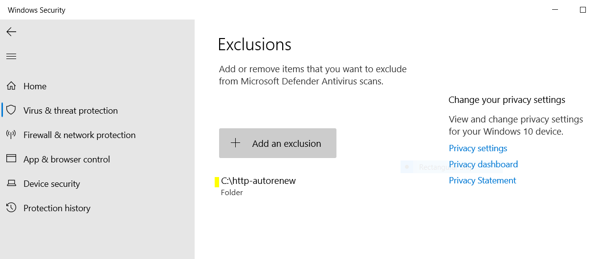
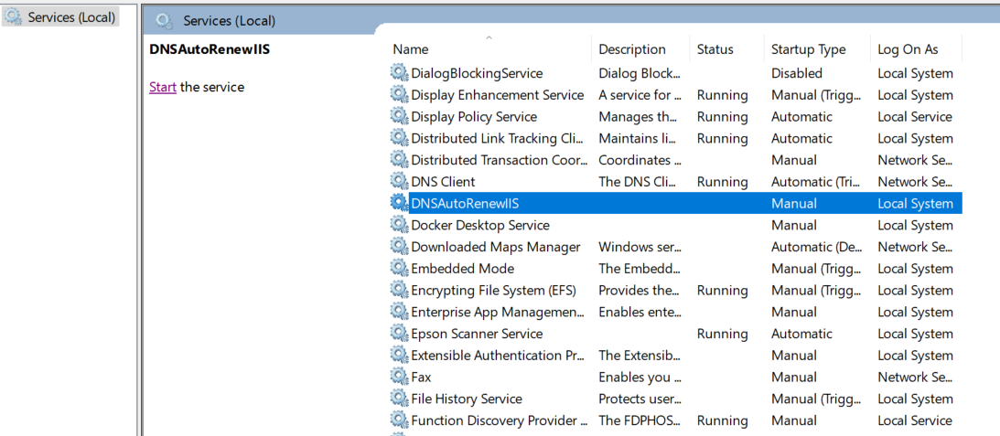
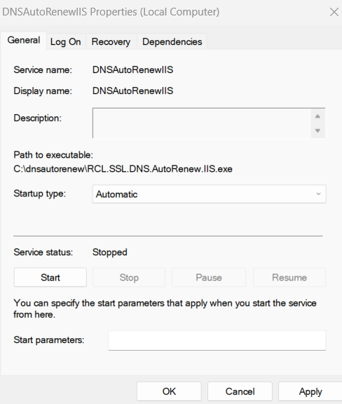

# RCL SSL DNS AutoRenew for IIS
**V7.1.0**

RCL SSL DNS AutoRenew for IIS runs as a **Windows Service** in a Windows hosting machine. The Windows Service will run every seven (7) days to automatically renew and save SSL/TLS certificates from a user's subscription in the **RCL SSL Portal** to the Windows hosting machine.

Certificates will be automatically saved to the ``Local Machine`` certificate store in the  ``Personal`` folder. Certificates will also be automatically bound to the **IIS Web Server** on the hosting machine.

{: .information }
Before you can use RCL SSL DNS AutoRenew, you must have already created your certificate(s) in the RCL SSL Portal using the [Azure DNS](../portal/azure-dns.md) or [Azure DNS SAN](../portal/azure-dns-san.md) option. The certificate(s) that you would like to install must be specified in your [configuration](#add-the-configuration-variables) of RCL SSL DNS AutoRenew.

## Automatically Renew SSL/TLS Certificates

You can use RCL SSL DNS AutoRenew for IIS to automatically renew SSL/TLS certificates created in the **RCL SSL Portal** using the the following creation options :

- [Azure DNS](../portal//azure-dns.md) (including [SAN](../portal/azure-dns-san.md)) 


# Install RCL SSL DNS AutoRenew for IIS

If you have an older version of the RCL DNS AutoRenew for IIS installed in your hosting machine, you should delete it and install the new service.

## Download the Files

- The Windows Service files (``dns-autorenew-iis-win-xx``) are available in the [GitHub Project](https://github.com/rcl-ssl/rcl-ssl-automatic-renewal) page in the [Releases](https://github.com/rcl-ssl/rcl-ssl-automatic-renewal/releases/tag/V7.1.0) section:

- Download the zip file with bitness :

  - [win-x64](https://github.com/rcl-ssl/rcl-ssl-automatic-renewal/releases/download/V7.1.0/dns-autorenew-iis-x64.zip) 
  - [win-x86](https://github.com/rcl-ssl/rcl-ssl-automatic-renewal/releases/download/V7.1.0/dns-autorenew-iis-x86.zip)
  - [win-arm](https://github.com/rcl-ssl/rcl-ssl-automatic-renewal/releases/download/V7.1.0/dns-autorenew-iis-arm.zip)
  
  to match the Windows bitness of your hosting machine

- Extract the zip file to a folder on your Windows hosting machine after it is downloaded

## Configure the Service

### Register an AAD Application

An Azure Active Directory (AAD) application must be registered to obtain permission to access a user's Azure resources (**DNS Zone**). 

Please refer to the following link to register an AAD application:

- [Registering an AAD Application](../authorization/aad-application)

### Set Access Control for the AAD Application

Access control must be set for the AAD application to access resources (**DNS Zone**) in a user's Azure subscription. Please refer to the following link to set access control :

- [Setting Access Control for the AAD Application](../authorization/access-control-app)

### Get the AAD Application Credentials 

To obtain the following credentials from the AAD application:

- ClientId
- ClientSecret
- TenantId

follow the instructions in this link :

- [Get the AAD Application Credentials](../authorization/aad-application#get-the-aad-application-credentials)

### Get the SubscriptionId

Get the **Subscription Id** in the RCL SSL Portal.


- Scroll down and copy the 'Subscription Id' 


### Register the AAD Application's ``Client Id`` in the RCL SSL Portal

The AAD Application must be associated with a user's RCL SSL subscription. This is achieved by registering the AAD Application's ``Client Id`` in the **RCL SSL Portal**.

To add the AAD Application's ``Client Id`` to the portal, please follow the instructions in this link :

- [Add the Client Id in the RCL SSL Portal](../api/authorization.md)

### Add the Configuration variables

- In the folder containing the files for the Windows Service that you extracted, find and open the **appsettings.json** file

- Add the credentials for the AAD Application and SubscriptionId in the **RCLSDK** section :
  - ClientId
  - ClientSecret
  - TenantId
  - SubscriptionId

```json
"RCLSDK": {
    "ApiBaseUrl": "https://rclapi.azure-api.net/v2",
    "SourceApplication": "RCL SSL DNS AutoRenew IIS",
    "ClientId": "23568fghjrtr3",
    "ClientSecret": "7466rggvvdggdff",
    "TenantId": "1103984664",
    "SubscriptionId": "890"
  }
```

- In the **CertificateBot** section, set a folder path to save the SSL/TLS certificates. Recommended path : C:/ssl

  - SaveCertificatePath

- **Note : when setting the folder path , use forward slashes(``/``) in the path name, eg. ``C:/ssl``. Failure to do this will result in inability to run the windows service.**

- Create the folder in the hosting machine and ensure it has read/write permissions so that the certificates can be saved to it. 

- Configure the site bindings for each website that you want to bind a SSL/TLS certificate. You can have a single or multiple bindings.

  - IISBindings

- Example of multiple bindings :

```json
"IISBindings": [
  {
    "siteName":"Home",
    "ip":"*",
    "port":"443",
    "host":"shopneur.com",
    "certificateName":"shopeneur.com,*.shopeneur.com"
  },
  {
    "siteName":"Home",
    "ip":"*",
    "port":"443",
    "host":"www.shopneur.com",
    "certificateName":"shopeneur.com,*.shopeneur.com"
  },
  {
    "siteName":"Fabricam",
    "ip":"*",
    "port":"443",
    "host":"fabricam.com",
    "certificateName":"fabricam.com"
  },
  {
    "siteName":"Contoso",
    "ip":"*",
    "port":"443",
    "host":"contoso.com",
    "certificateName":"contoso.com"
  }
]
```

- Example of a single binding :

```json
"IISBindings": [
  {
    "siteName":"Home",
    "ip":"*",
    "port":"443",
    "host":"shopneur.com",
    "certificateName":"shopeneur.com"
  }
]
```

- siteName - this is the **Site** name of the IIS website
- ip - this is the **IP Address** of the IIS website (you can use any (``*``))
- port - the is the **Port** number of the IIS website (you can use ``443``)
- host - the the **Host Name** assigned to the IIS website
- certificateName - this is the name of the certificate in the RCL SSL Portal to be installed in the IIS website


The image above illustrates a site hosted in IIS named 'Home' with multiple bindings. The site is bound to a naked apex domain, 'shopeneur.com', and a sub-domain 'www.shopeneur.com'. The website can be accessed publicly on the web with either of these domains. The site uses the same multi-domain [SAN](../portal/azure-dns-san.md) certificate named : 'shopeneur.com,*.shopeneur.com' to provide SSL/TLS for both the domains.

## Example of a configured **appsettings.json** file

```json
{
  "Logging": {
    "LogLevel": {
      "Default": "Information",
      "Microsoft": "Warning",
      "Microsoft.Hosting.Lifetime": "Information"
    },
    "EventLog": {
      "LogLevel": {
        "Default": "Information",
        "Microsoft.Hosting.Lifetime": "Information"
      }
    }
  },
  "RCLSDK": {
    "ApiBaseUrl": "https://rclapi.azure-api.net/v2",
    "SourceApplication": "RCL SSL DNS AutoRenew IIS",
    "ClientId": "23568fghjrtr3",
    "ClientSecret": "7466rggvvdggdff",
    "TenantId": "1103984664",
    "SubscriptionId": "890"
  },
  "CertificateBot": {
    "SaveCertificatePath": "C:/ssl",
    "IISBindings": [
      {
        "siteName":"Home",
        "ip":"*",
        "port":"443",
        "host":"shopneur.com",
        "certificateName":"shopeneur.com,*.shopeneur.com"
      },
      {
        "siteName":"Home",
        "ip":"*",
        "port":"443",
        "host":"www.shopneur.com",
        "certificateName":"shopeneur.com,*.shopeneur.com"
      }
    ]
  }
}
```
- Save the **appsettings.json** file when you are done.

# Create the Windows Service

- Open a **Command Prompt** in the Windows hosting machine as an **Administrator**

- Run the following command to install the Windows Service. Replace the < file-path > placeholder with the actual path where your windows service zip files were extracted

```
sc.exe create DNSAutoRenewIIS binpath= <file-path>\RCL.SSL.DNS.AutoRenew.IIS.exe
```

## Allow the Service through Microsoft Defender Antivirus

Microsoft Defender Antivirus may block the service. You must add the folder that you stored the service files to the ``Exclusions`` list in Microsoft Defender Antivirus Scans



Alternatively, you can run a custom antivirus scan on the folder before you run the service.

## Starting the Service

- After the service is installed, open **Services** in Windows, look for the ``DNSAutoRenewIIS`` service and **Start** the service



- Set the **Properties** of the service to start automatically when the hosting machine starts



# View the Event Logs

- Open **Event Viewer**, under 'Windows Logs > Application', look for the ``RCL.SSL.CertificateBot.IIS`` events


- Ensure that there are no error events for the service. If there are error events, the service is misconfigured and will not function

- Each time a certificate is downloaded and saved in the server or a certificate is scheduled for renewal, a log will be written

- The service will run every seven (7) days to automatically renew certificates in the IIS web server

# Fixing Errors

If you encounter error events for the service in the Event Viewer, please stop the service and delete it completely. 

Ensure the ``appsettings`` configuration is correct for the AAD Application and the certificate save path settings point to a folder that exists. 

Fix any other errors that are reported. Then, re-install and restart the service.

# Deleting the Windows Service

If you need to remove the Windows Service for any reason, first stop the service, then run the command to delete the service

```
sc.exe delete DNSAutoRenewIIS
```

# Updating the Service

If you need to update the service to include other IIS bindings and certificates, follow these steps:

- Stop the service and delete it
- Change the ``appsettings.json`` file to include updated IIS bindings and certificates
- Re-create the service and start it

# Reset the Service

If you need to reset the service because of a error or corrupted certificate renewal, follow these steps :

- Stop the service and delete it
- Delete all certificates and their folders in the directory in which certificates are saved
- Re-create the service and start it

# Manually Testing Certificate Renewal

## Force Certificate Expiration

In order to manually test certificate renewal, you must first force certificate expiration in the RCL SSL Portal.

- In the RCL SSL Portal, click on the **SSL/TLS Certificate > Certificates List** link in the side menu

- In the certificates list, click the **Manage > Force Expiry** link

- In the ``Force Expiry`` page, click the **Force Expiry** button

- The certificate will be forced to expire in the next 14 days


## Testing Renewal

- Re-start the service to trigger the certificate renewal

- Open **Event Viewer**, under 'Windows Logs > Application', look for the ``RCL.SSL.HTTP.AutoRenew.IIS`` events

- Ensure that the certificate has been scheduled for renewal

- Wait for 15 mins , then, re-start the services to save the certificate to the local machine and bind it to the IIS Web Server

- Check that the certificate(s) are bound to the IIS website(s)

- Once this test passes, the service will run automatically every seven days to renew certificate(s) and bind them to the IIS website(s)