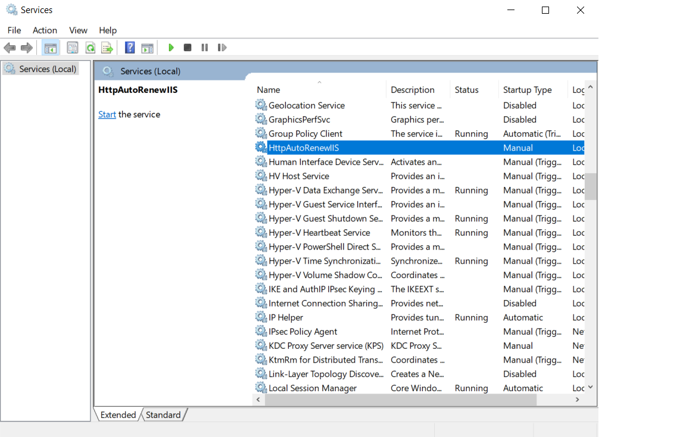
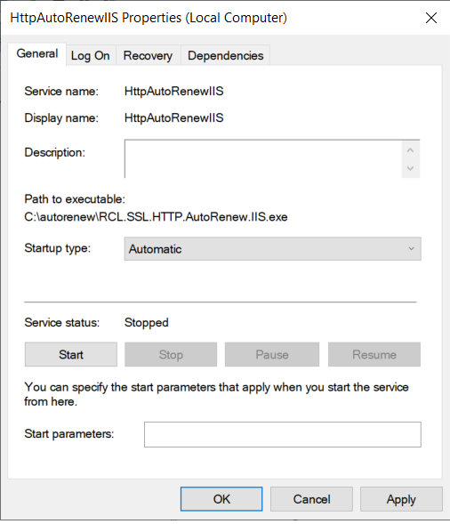
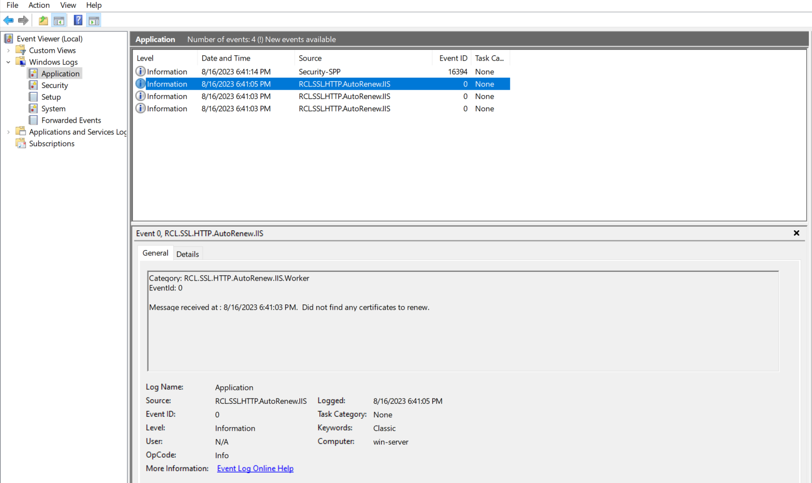

# RCL SSL HTTP AutoRenew for IIS
**V7.0.0**

RCL SSL HTTP AutoRenew for IIS runs as a **Windows Service** in a Windows hosting machine. The Windows Service will run every seven (7) days to automatically renew and save SSL/TLS certificates from a user's subscription in the **RCL SSL Portal** to the Windows hosting machine.

Certificates will be automatically saved to the ``Local Machine`` certificate store in the  ``Trusted People`` folder. Certificates will also be automatically bound to the **IIS Web Server** on the hosting machine.

## Automatically Renew SSL/TLS Certificates

You can use the service for IIS to automatically renew SSL/TLS certificates created in the **RCL SSL Portal** using the the following creation options :

- [Stand Alone](../portal/stand-alone.md) (including [SAN](../portal/stand-alone-san.md)) using the [HTTP Challenge](../portal/stand-alone.md#completing-the-http-challenge) type.

# Installation

If you have an older version of the service installed on your hosting machine, you should delete it and install the new service.

## Download the Files

- The Windows Service files (``http-autorenew-iis-win-xxx``) are available in the [GitHub Project](https://github.com/rcl-ssl/RCL.SSL.CertificateBot) page in the [Releases](https://github.com/rcl-ssl/RCL.SSL.CertificateBot/releases/tag/V7.0.1) section:

- Download the zip file with bitness :

  - [win-x64](https://github.com/rcl-ssl/RCL.SSL.CertificateBot/releases/download/V7.0.1/http-autorenew-iis-win-x64.zip) 
  - [win-x86](https://github.com/rcl-ssl/RCL.SSL.CertificateBot/releases/download/V7.0.1/http-autorenew-iis-win-x86.zip)
  - [win-arm](https://github.com/rcl-ssl/RCL.SSL.CertificateBot/releases/download/V7.0.1/http-autorenew-iis-win-arm.zip)
  
  to match your Windows bitness

- Extract the zip file to a folder on your Windows hosting machine after it is downloaded

## Configure the Service

### Create an API Key

The service uses the [RCL SSL Core API](../apicore/api.md) and [RCL SDK](../sdk/) to renew certificates. You must create an Api Key to make authorized requests to the API. Follow the instructions in the following link to create an Api Key in the RCL SSL Portal.

[Create an Api Key](../apicore/authorization.md)

### Get the SubscriptionId

Get the **Subscription Id** in the RCL SSL Portal.


- Scroll down and copy the 'Subscription Id' 


### Add the Configuration variables

- In the folder containing the files for the Windows Service that you extracted, find and open the **appsettings.json** file

- Add the credentials for the Api Key and SubscriptionId in the **RCLSDK** section :

  - Api Key
  - SubscriptionId

Example
```json
"RCLSDK": {
    "ApiBaseUrl": "https://rclapi.azure-api.net/public",
    "SourceApplication": "RCL HTTP AutoRenew IIS",
    "ApiKey": "xxx",
    "SubscriptionId": "xxx"
  }
```

- In the **CertificateBot** section, set a folder path to save the SSL/TLS certificates. Recommended path : C:/ssl

  - saveCertificatePath

Example
```json
    "CertificateBot" : {
        "IncludeCertificates":[],
        "SaveCertificatePath": "C:/ssl",
        
    }
  ```

- **Note : when setting the folder path , use forward slashes(``/``) in the path name, eg. ``C:/ssl``. Failure to do this will result in inability to run the windows service.**

- Create the folder in the hosting machine and ensure it has read/write permissions so that the certificates can be saved to it. 

- Configure the site bindings for each website that you want to bind a SSL/TLS certificate. You can have a single or multiple bindings.

- Example of multiple bindings (using a [SAN](../portal/stand-alone-san.md) certificate):

Example
```json
"IISBindings": [
  {
    "siteName":"Home",
    "ip":"*",
    "port":"443",
    "host":"shopneur.com",
    "certificateName":"shopeneur.com,www.shopeneur.com",
    "validationPath": "C:/inetpub/wwwroot"
  },
  {
    "siteName":"Home",
    "ip":"*",
    "port":"443",
    "host":"www.shopneur.com",
    "certificateName":"shopeneur.com,www.shopeneur.com",
    "validationPath": "C:/inetpub/wwwroot"
  }
]
```

- Example of a single binding :

Example
```json
"IISBindings": [
  {
    "siteName":"Home",
    "ip":"*",
    "port":"443",
    "host":"shopneur.com",
    "certificateName":"shopeneur.com",
    "validationPath": "C:/inetpub/wwwroot"
  }
]
```

- siteName - this is the **Site** name of the IIS website
- ip - this is the **IP Address** of the IIS website (you can use any (``*``))
- port - the is the **Port** number of the IIS website (you can use ``443``)
- host - the the **Host (Domain) Name** assigned to the IIS website
- certificateName - this is the name of the certificate in the RCL SSL Portal to be installed in the IIS website
- validationPath - the root path to the folder where your website is hosted. This is where the validation tokens will be saved for the HTTP challenge


The image above illustrates a site hosted in IIS named 'Home' with multiple bindings. The site is bound to a naked apex domain, 'shopeneur.com', and a sub-domain 'www.shopeneur.com'. The website can be accessed publicly on the web with either of these domains. The site uses the same multi-domain [SAN](../portal/azure-dns-san.md) certificate named : 'shopeneur.com,www.shopeneur.com' to provide SSL/TLS for both the domains.

## Example of a configured **appsettings.json** file

```json
{
  "Logging": {
    "LogLevel": {
      "Default": "Information",
      "Microsoft": "Warning",
      "Microsoft.Hosting.Lifetime": "Information"
    },
    "EventLog": {
      "LogLevel": {
        "Default": "Information",
        "Microsoft.Hosting.Lifetime": "Information"
      }
    }
  },
  "RCLSDK": {
    "ApiBaseUrl": "https://rclapi.azure-api.net/public",
    "SourceApplication": "RCL SSL HTTP AutoRenew IIS",
    "ApiKey": "xxx",
    "SubscriptionId": "xxx"
  },
  "CertificateBot": {
    "IncludeCertificates":[],
    "SaveCertificatePath": "C:/ssl",
    "IISBindings": [
      {
        "siteName":"Home",
        "ip":"*",
        "port":"443",
        "host":"shopneur.com",
        "certificateName":"shopeneur.com,www.shopeneur.com",
        "validationPath": "C:/inetpub/wwwroot"
      },
      {
        "siteName":"Home",
        "ip":"*",
        "port":"443",
        "host":"www.shopneur.com",
        "certificateName":"shopeneur.com,www.shopeneur.com",
        "validationPath": "C:/inetpub/wwwroot"
      }
    ]
  }
}
```
- Save the **appsettings.json** file when you are done.

# Create the Windows Service

- Open a **Command Prompt** in the Windows hosting machine as an **Administrator**

- Run the following command to install the Windows Service. Replace the < file-path > placeholder with the actual path where your windows service zip files were extracted

```
sc.exe create HttpAutoRenewIIS binpath= <file-path>\RCL.SSL.HTTP.AutoRenew.IIS.exe
```

- After the service in installed, open **Services** in Windows, look for the ``HttpAutoRenewIIS`` service and **Start** the service



- Set the **Properties** of the service to start automatically when the hosting machine starts



# View the Event Logs

- Open **Event Viewer**, under 'Windows Logs > Application', look for the ``RCL.SSL.HTTP.AutoRenew.IIS`` events



- Ensure that there are no error events for the service. If there are error events, the service is misconfigured and will not function

- Each time a certificate is renewed, a log will be written

- The service will run every seven (7) days to automatically renew certificates in the IIS web server

# Fixing Errors

If you encounter error events for the service in the Event Viewer, please stop the service and delete it completely. 

Ensure the ``appsettings`` configuration is correct for the ``Api Key`` and the certificate ``Save Path`` settings point to a folder that exists. 

Fix any other errors that are reported. Then, re-install and restart the service.

# Deleting the Windows Service

If you need to remove the Windows Service for any reason, first stop the service, then run the command to delete the service

```
sc.exe delete HttpAutoRenewIIS
```

# Updating the Service

If you need to update the service to include other IIS bindings and certificates, follow these steps:

- Stop the service and delete it
- Change the ``appsettings.json`` file to include updated IIS bindings and certificates
- Re-create the service and start it

# Reset the Service

If you need to reset the service because of a error or corrupted certificate renewal, follow these steps :

- Stop the service and delete it
- Delete all certificates and their folders in the directory in which certificates are saved
- Re-create the service and start it