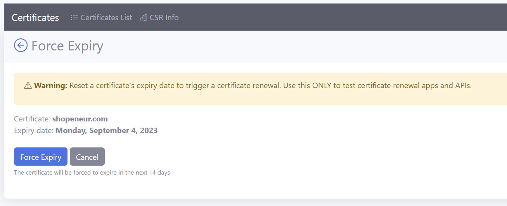

# RCL SSL HTTP AutoRenew for Linux
**V7.0.0**

RCL SSL HTTP AutoRenew for Linux runs as a **Daemon** in a Linux hosting machine. The daemon will run every seven (7) days to automatically renew and save SSL/TLS certificates from a user's subscription in the **RCL SSL Portal** to the Linux hosting machine.

## Automatically Renew SSL/TLS Certificates

You can use the daemon to renew SSL/TLS certificates created in the **RCL SSL Portal** using the the following creation options :

- [Stand Alone](../portal/stand-alone.md) (including [SAN](../portal/stand-alone-san.md)) using the [HTTP Challenge](../portal/stand-alone.md#completing-the-http-challenge) type.

# Installation

If you have an older version of the daemon installed in your hosting machine, you should completely delete it and install the new one.

## Download and Extract the Daemon Files to the Linux Server

In this section, you will download the files from the [GitHub Project Page](https://github.com/rcl-ssl/RCL.SSL.CertificateBot) in the [Releases](https://github.com/rcl-ssl/RCL.SSL.CertificateBot/releases/tag/V7.0.1) section. Then, extract it to your Linux Server in the ``/usr/sbin`` folder:

- In your Linux server, navigate to the ``/usr/sbin`` folder

```bash
cd /usr/sbin
```

- Run the command in the folder to download and extract the ``linux-x64`` files:

```bash
wget -c https://github.com/rcl-ssl/RCL.SSL.CertificateBot/releases/download/V7.0.1/http-autorenew-linux-x64.tar.gz -O - | sudo tar -xz
```

or ``linux-arm`` files :

```bash
wget -c https://github.com/rcl-ssl/RCL.SSL.CertificateBot/releases/download/V7.0.1/http-autorenew-linux-arm.tar.gz -O - | sudo tar -xz
```

or ``linux-arm64`` files :

```bash
wget -c https://github.com/rcl-ssl/RCL.SSL.CertificateBot/releases/download/V7.0.1/http-autorenew-linux-arm64.tar.gz -O - | sudo tar -xz
```

## Configure the Daemon

### Create an API Key

The daemon uses the [RCL SSL Core API](../apicore/api.md) and [RCL SDK](../sdk/) to renew certificates. You must create an Api Key to make authorized requests to the API. Follow the instructions in the following link to create an Api Key in the RCL SSL Portal.

[Create an Api Key](../apicore/authorization.md)

### Get the SubscriptionId

Get the **Subscription Id** in the RCL SSL Portal.


- Scroll down and copy the 'Subscription Id' 


## Add the Configuration variables

- Navigate to the folder you downloaded and extracted the daemon files :

```bash
cd /usr/sbin/http-autorenew-linux-x64
```

or for ``arm``

```bash
cd /usr/sbin/http-autorenew-linux-arm
```

or for ``arm64``

```bash
cd /usr/sbin/http-autorenew-linux-arm64
```

- Use nano (or other text editor) to edit the **appsettings.json** file in the folder

```bash
sudo nano appsettings.json
```

- Add the credentials for the Api Key and SubscriptionId in the **RCLSDK** section :

  - Api Key
  - SubscriptionId

Example
```json
"RCLSDK": {
    "ApiBaseUrl": "https://rclapi.azure-api.net/public",
    "SourceApplication": "RCL HTTP AutoRenew Linux",
    "ApiKey": "xxx",
    "SubscriptionId": "xxx"
  }
  ```

- In the **CertificateBot** section, set a folder path to save the SSL/TLS certificates.

  - saveCertificatePath

  Example
  ```json
    "CertificateBot" : {
        "IncludeCertificates":[],
        "SaveCertificatePath": "/etc/ssl/httpautorenew",
        
    }
  ```

- The ``includeCertificates`` settings will allow for including specific certificates by its name 
(eg:  "contoso.com"  or "contoso.com, www.contoso.com" - for SAN) for the certificate(s) you want to save on the server. 

- ``certificateName`` - the name of the certificate in the RCL Portal to be included from automatic renewal

- ``validationPath`` - the path to the root folder where the website is hosted from. The validations tokens for the [HTTP Challenge](../portal/stand-alone.md#completing-the-http-challenge) will be saved to the root of the website

Example of multiple certificates
```json
  "CertificateBot": {
    "saveCertificatePath": "/etc/ssl/httpautorenew",
     "includeCertificates": [
        {
          "certificateName": "contoso.com",
          "validationPath": "/var/www/contoso"
        },
        {
          "certificateName": "fabricam.com,www.fabricam.com",
          "validationPath": "/var/www/fabricam"
        }
      ]
  }

Example of a single certificate
```json
  "CertificateBot": {
    "saveCertificatePath": "/etc/ssl/httpautorenew",
     "includeCertificates": [
        {
          "certificateName": "adventureworks.com",
          "validationPath": "/var/www/adventureworks"
        }
      ]
  }
```

## Example of a configured **appsettings.json** file

```json
{
  "Logging": {
    "LogLevel": {
      "Default": "Information",
      "Microsoft.Hosting.Lifetime": "Information"
    }
  },
  "RCLSDK": {
    "ApiBaseUrl": "https://rclapi.azure-api.net/public",
    "SourceApplication": "RCL HTTP AutoRenew Linux",
    "ApiKey": "xxx",
    "SubscriptionId": "xxx"
  },
  "CertificateBot": {
    "SaveCertificatePath": "/etc/ssl/httpautorenew",
    "includeCertificates": [
        {
          "certificateName": "adventureworks.com",
          "validationPath": "/var/www/adventureworks"
        }
      ],
    "IISBindings": []
  }
}
```
- Save the updated **appsettings.json** file when you are done

- Create the folder in the server and ensure it has read/write permissions so that the certificates can be saved to it. 

```bash
sudo mkdir -m 777 /etc/ssl/httpautorenew
```

# Add the Linux Daemon

## Create the Daemon

- Navigate to the **/etc/systemd/system** folder

```bash
cd /etc/systemd/system
```

- Create the daemon file

```bash
sudo touch httpautorenew.service
```

- Use nano (or other text editor) to edit the service file 

```bash
sudo nano httpautorenew.service
```

- Add the following code to the file

```bash
[Unit]
Description=RCL HttpAutorenew

[Service]
Type=notify
WorkingDirectory=/usr/sbin/http-autorenew-linux-x64
ExecStart=/usr/sbin/http-autorenew-linux-x64/RCL.SSL.HTTP.AutoRenew.Linux

[Install]
WantedBy=multi-user.target

```

If you installed the ``arm`` version, change the directory to the arm path ``/usr/sbin/http-autorenew-linux-arm`` or ``/usr/sbin/http-autorenew-linux-arm64`` in the 'WorkingDirectory' and 'ExecStart' settings

- Save the file when you are done

## Reload the Daemon

- Reload the daemon anytime you make changes to the service file

```bash
sudo systemctl daemon-reload
```

## Start the Daemon

- Run the code to start the daemon

```bash
sudo systemctl start httpautorenew
```

## View the Status of the Daemon

- Run the code to view the status of the daemon

```bash
sudo systemctl status httpautorenew
```

- You will see the status of the daemon. The most recent logs will also be displayed. 

- Ensure that there are no errors in the logs. If there are errors, the daemon is misconfigured and will not function

## View the Detailed Logs

- Run the command to view the daemon's detailed logs

```bash
sudo journalctl -u httpautorenew --no-pager
```

- If the application is working correctly you should see messages similar to the one below :

```bash
 RCL.SSL.HTTP.AutoRenew.Linux[1508]: RCL.SSL.HTTP.AutoRenew.Linux.Worker[0] Found 1 certificate(s) to process locally.  Did not find any certificates to renew
```

## If you need to Stop the Daemon

- Run the code if you need to stop the daemon (in case you need to update settings or fix errors). 

When the daemon is stopped, the daemon will discontinue certificate renewals and installation in the server.

**Note: You need to keep the daemon running to automatically renew certificates.**

```bash
sudo systemctl stop httpautorenew
```

# Fixing Errors

If you encounter errors in the logs for the daemon, please stop the daemon. Ensure the 'appsettings' configuration is correct and the certificate save path settings exists. 

The folder to save the certificate must have read/write access. 

Reload and restart the daemon after you make changes and check if the errors were resolved.

# Updating the Daemon

If you need to update the service to include other certificates, follow these steps:

- Stop the daemon
- Change the ``appsettings.json`` file to include additional certificates
- Re-load the daemon
- Re-start the daemon

# Reset the Daemon

If you need to reset the service because of a error or corrupted certificate renewal, follow these steps :

- Stop the daemon
- Delete all certificates and their folders in the directory in which certificates are saved
- Re-load the daemon
- Re-start the daemon

# Testing Certificate Renewal

## Force Certificate Expiration

In order to test certificate renewal, you must first force certificate expiration in the RCL SSL Portal.

- In the RCL SSL Portal, click on the **SSL/TLS Certificate > Certificates List** link in the side menu

- In the certificates list, click the **Manage > Force Expiry** link

- In the ``Force Expiry`` page, click the **Force Expiry** button

- The certificate will be forced to expire in the next 14 days



## Testing Renewal

- Re-start the daemon to trigger the certificate renewal

```bash
sudo systemctl restart httpautorenew
```

- Run the command to view the daemon's detailed logs

```bash
sudo journalctl -u httpautorenew --no-pager
```

- Check the logs to ensure successful certificate renewal. If there are errors: fix the errors , restart the demon and run the test again

- Check that the certificate files are stored in the folder that you specified, eg. ``"/etc/ssl/httpautorenew"``

- Once this test passes, the daemon will run every seven days to automatically renew certificates and save the certificate files to a folder you specify

# Installing Certificates in Web Servers

The daemon will automatically save renewed SSL/TLS certificate files to a folder in the server. You should then configure the web server to use these files to implement SSL/TLS in your website.

## Certificate Files

The SSL/TLS certificate files will be stored at the path you specified in the ``appsettings.json`` configuration file. In this example, we used the path ``/etc/ssl/httpautorenew`` to store the certificate files.

To view the files

```bash
cd /etc/ssl/httpautorenew
```

When configuring the web servers, you will reference the specific certificate files stored at that path in a folder generated by the daemon for a specified domain.

The following files are downloaded and saved on the server :

  - ``certificate.pfx`` - The PFX certificate file
  - ``primaryCertificate.crt`` The Primary Certificate file
  - ``fullChainCertificate.crt`` - The full chain certificate file
  - ``caBundle.crt`` - The Intermediate Certificates (CA Bundle) file
  - ``privateKey.key`` - The Certificate's Private Key file

## Configuring the Web Servers

Please follow the links below to configure your web server:

- [Installing SSL/TLS Certificates in Apache Server](../installations/apache)
- [Installing SSL/TLS Certificates in Apache Tomcat](../installations/apache-tomcat)
- [Installing SSL/TLS Certificates in NGINX](../installations/nginx)
- [Installing SSL/TLS Certificates in Web Servers and Hosting Services](../installations/web-servers)