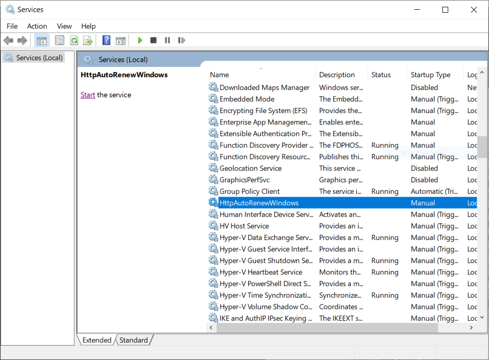
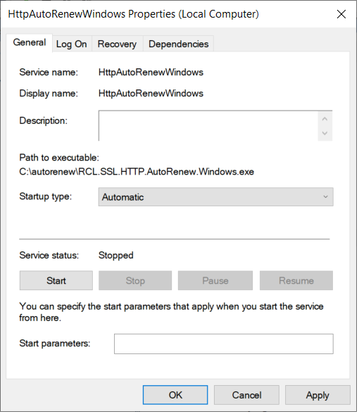
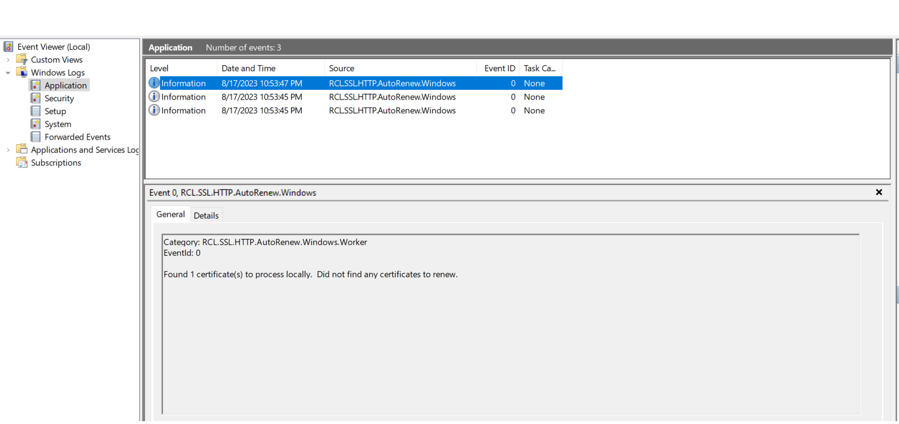

# RCL SSL HTTP AutoRenew for Windows
**V7.1.0**

RCL SSL HTTP AutoRenew runs as a **Windows Service** in a Windows hosting machine. The Windows Service will run every seven (7) days to automatically renew and save SSL/TLS certificates from a user's subscription in the **RCL SSL Portal** to the Windows hosting machine.

## Automatically Renew SSL/TLS Certificates

You can use the service to automatically renew SSL/TLS certificates created in the **RCL SSL Portal** using the the following creation options :

- [Stand Alone](../portal/stand-alone.md) (including [SAN](../portal/stand-alone-san.md)) using the [HTTP Challenge](../portal/stand-alone.md#completing-the-http-challenge) type.

# Installation

If you have an older version of the service installed in your hosting machine, you should completely delete it and install the new one.

## Download the Files

- The Windows Service files (``http-autorenew-win-xxx``) are available in the [GitHub Project](https://github.com/rcl-ssl/rcl-ssl-automatic-renewal) page in the [Releases](https://github.com/rcl-ssl/rcl-ssl-automatic-renewal/releases/tag/V7.1.0) section:

- Download the zip file with bitness

  - [win-x64](https://github.com/rcl-ssl/rcl-ssl-automatic-renewal/releases/download/V7.1.0/http-autorenew-win-x64.zip) 
  - [win-x86](https://github.com/rcl-ssl/rcl-ssl-automatic-renewal/releases/download/V7.1.0/http-autorenew-win-x86.zip)
  - [win-arm](https://github.com/rcl-ssl/rcl-ssl-automatic-renewal/releases/download/V7.1.0/http-autorenew-win-arm.zip)
  
  to match your Windows bitness

- Extract the zip file to a folder on your Windows hosting machine after it is downloaded

## Configure the Service

### Create an API Key

The service uses the [RCL SSL Core API](../apicore/api.md) to renew certificates. You must create an Api Key to make authorized requests to the API. Follow the instructions in the following link to create an Api Key in the RCL SSL Portal.

[Create an Api Key](../apicore/authorization.md)

### Get the SubscriptionId

Get the **Subscription Id** in the RCL SSL Portal.


- Scroll down and copy the 'Subscription Id' 


### Add the Configuration variables

- In the folder containing the files for the Windows Service that you extracted, find and open the **appsettings.json** file

- Add the credentials for the Api Key and Subscription Id in the **RCLSDK** section :

  - ApiKey
  - SubscriptionId

Example
```json
"RCLSDK": {
    "ApiBaseUrl": "https://rclapi.azure-api.net/v2",
    "SourceApplication": "RCL SSL HTTP AutoRenew Windows",
    "ApiKey": "xxx",
    "SubscriptionId": "xxx"
  }
```

- In the **CertificateBot** section, set a folder path to save the SSL/TLS certificates.

  - saveCertificatePath

Example
  ```json
    "CertificateBot" : {
        "IncludeCertificates":[],
        "SaveCertificatePath": "C:/ssl",
    }
  ```

 **Note : when setting any folder path , use forward slashes(``/``) in the path name, eg. ``C:/ssl`` .  Failure to do this will result in inability to run the windows service.**

- Create the folder on your hosting machine at the path you specified to save the certificates.

- Ensure the folder has read/write permissions so that the certificates can be saved to it. 

- The ``includeCertificates`` settings will allow for including specific certificates by its name 
(eg:  "contoso.com"  or "contoso.com, www.contoso.com" - for SAN) for the certificate(s) you want to save on the server. 

- ``certificateName`` - the name of the certificate in the RCL Portal to be included for automatic renewal
- ``validationPath`` - the path to the root folder where the website is hosted from. The validations tokens for the [HTTP Challenge](../portal/stand-alone.md#completing-the-http-challenge) will be saved to the root of the website

> The website must be actively served by the web server from the ``validationPath`` and the site must be publicly accessible on the web in a web browser. If these conditions are not met, the SSL/TLS certificate update will fail for the HTTP challenge.

Example of a single certificate
```json
  "CertificateBot": {
    "saveCertificatePath": "C:/ssl",
     "includeCertificates": [
        {
          "certificateName": "adventureworks.com",
          "validationPath": "C:/sites/adventureworks/wwwroot"
        }
      ]
  }
  
```

Example of multiple certificates
```json
  "CertificateBot": {
    "saveCertificatePath": "C:/ssl",
     "includeCertificates": [
        {
          "certificateName": "contoso.com",
          "validationPath": "C:/sites/contoso/wwwroot"
        },
        {
          "certificateName": "fabricam.com,www.fabricam.com",
          "validationPath": "C:/sites/fabricam/wwwroot"
        }
      ]
  }
```


## Example of a configured **appsettings.json** file

```json
{
  "Logging": {
    "LogLevel": {
      "Default": "Information",
      "Microsoft": "Warning",
      "Microsoft.Hosting.Lifetime": "Information"
    },
    "EventLog": {
      "LogLevel": {
        "Default": "Information",
        "Microsoft.Hosting.Lifetime": "Information"
      }
    }
  },
  "RCLSDK": {
    "ApiBaseUrl": "https://rclapi.azure-api.net/v2",
    "SourceApplication": "RCL SSL HTTP AutoRenew Windows",
    "ApiKey": "abc123",
    "SubscriptionId": "2345"
  },
  "CertificateBot": {
    "SaveCertificatePath": "C:/ssl",
    "IncludeCertificates": [
      {
        "certificateName": "adventureworks.com",
        "validationPath": "C:/inetpub/adventureworks/wwwroot"
      }
    ],
    "IISBindings": []
  }
}
```

- Save the **appsettings.json** file when you are done.

# Create the Windows Service

- Open a **Command Prompt** in the Windows server as an **Administrator**

- Run the following command to install the Windows Service. Replace the < file-path > placeholder with the actual path where your windows service zip files were extracted

```
sc.exe create HttpAutoRenewWindows binpath= <file-path>\RCL.SSL.HTTP.AutoRenew.Windows.exe
```

- After the service in installed, open **Services** in Windows, look for the ``HttpAutoRenewWindows`` service and **Start** the service



- Set the **Properties** of the service to start automatically when the hosting machine starts



# View the Event Logs

- Open **Event Viewer**, under 'Windows Logs > Application', look for the ``RCL.SSL.HTTP.AutoRenew.Windows`` events



- Ensure that there are no error events for the service. If there are error events, the service is misconfigured and will not function

- Each time a certificate is renewed, a log will be written

# Fixing Errors

If you encounter error events for the service in the Event Viewer, please stop the service and delete it completely. 

Ensure the 'appsettings' configuration is correct and the certificate save path settings point to a folder that exists. 

Fix any other errors that are reported. Then, re-install and restart the service.

# Deleting the Windows Service

If you need to remove the Windows Service for any reason, run the command to delete the service

```
sc.exe delete HttpAutoRenewWindows
```

# Updating the Service

If you need to update the service to include other certificates, follow these steps:

- Stop the service and delete it
- Change the ``appsettings.json`` file to include additional certificates
- Re-create the service and start it

# Reset the Service

If you need to reset the service because of an error or corrupted certificate renewal, follow these steps :

- Stop the service and delete it
- Delete all certificates and their folders in the directory in which certificates are saved
- Re-create the service and start it

# Testing Certificate Renewal

## Force Certificate Expiration

In order to test certificate renewal, you must first force certificate expiration in the RCL SSL Portal.

- In the RCL SSL Portal, click on the **SSL/TLS Certificate > Certificates List** link in the side menu

- In the certificates list, click the **Manage > Force Expiry** link

- In the ``Force Expiry`` page, click the **Force Expiry** button

- The certificate will be forced to expire in the next 14 days


## Testing Renewal

- Re-start the service to trigger the certificate renewal

- Open **Event Viewer**, under 'Windows Logs > Application', look for the ``RCL.SSL.HTTP.AutoRenew.Windows`` events

- Ensure that there are no error events for the service

- If there are errors: fix the errors , restart the service to run the test again

- Check that the certificate files are stored in the folder that you specified. Review the section below to learn how the service saves certificate files

- Once this test passes, the service will run every seven days to automatically renew certificates and save the certificate files to the folder.

# Certificate Files

The SSL/TLS certificate files will be stored at the path you specified in the ``appsettings.json`` configuration file. In this example, we used the path ``C:/ssl`` to store the certificate files.

At this path, a folder is generated by the service based on the certificate name. All the files for the certificate will be stored in this folder.

For each certificate, the following files are downloaded and saved on the hosting machine with the following file names:

  - ``certificate.pfx`` - The PFX certificate file
  - ``primaryCertificate.crt`` - The Primary Certificate file
  - ``fullChainCertificate.crt`` - The full chain certificate file
  - ``caBundle.crt`` - The Intermediate Certificates (CA Bundle) file
  - ``privateKey.key`` - The Certificate Private Key file

   The files are saved in a folder generated by the service based on the certificate name following these conventions :

  |Type               |Example Certificate Name         |Example Folder Name
  |-------------------|---------------------------------|---------------------
  |Apex Domain        |shopeneur.com                    |shopeneur-com
  |Sub-domain         |store.shopeneur.com              |store-shopeneur-com
  |Wildcard domain    |*.shopeneur.com                  |wcard-shopeneur-com
  |SAN HTTP Challenge |shopeneur.com,www.shopeneur.com  |shopeneur-com-san-www
  |SAN DNS Challenge  |shopeneur.com,*.shopeneur.com    |shopeneur-com-san-wcard

# Configuring the Web Servers

After, you have installed the Windows Service and the renewed certificates have been downloaded to the specified folder. Please follow the links below to configure your web server to use the certificates files in the folder generated by the service :

- [Installing SSL/TLS Certificates in Apache Server](../installations/apache)
- [Installing SSL/TLS Certificates in Apache Tomcat](../installations/apache-tomcat)
- [Installing SSL/TLS Certificates in NGINX](../installations/nginx)
- [Installing SSL/TLS Certificates in Web Servers and Hosting Services](../installations/web-servers)

