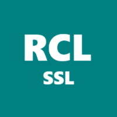
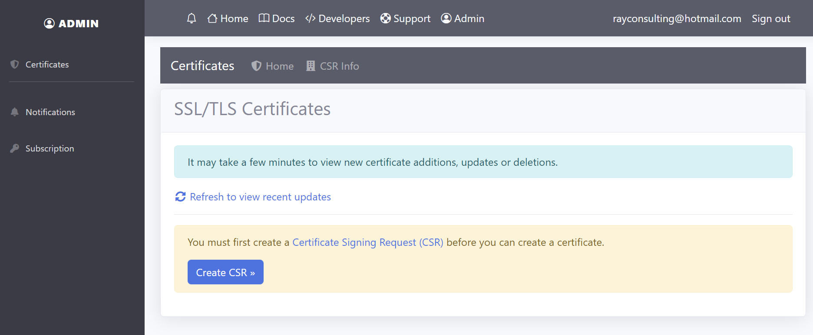

---
title: Introduction
description: The RCL SSL client for Let's Encrypt allows you to create SSL/TLS certificates for your web sites / applications using the popular Let's Encrypt V2 API.
has_children: false
nav_order: 1
---

# Introduction
**V7.0.0**

The RCL SSL Client for *Let's Encrypt*TM allows you to create free SSL/TLS certificates for your web sites / applications using the popular *Let's Encrypt*TM V2 API.

Use the various RCL SSL Apps to create and renew single or multiple-domain SSL/TLS certificates for your web sites / applications. The following domains are supported

- Naked apex domains (e.g. contoso.com)
- Sub-domains (e.g. store.contoso.com, www.contoso.com)
- Wild card domains (e.g. *.contoso.com) 
- Subject Alternative Name (SAN) mutli-domains (multiple domains in a single certificate) 

Let's Encrypt is a trademark of the [Internet Security Research Group](https://www.abetterinternet.org/). All rights reserved.

# RCL SSL Portal

The [RCL SSL Portal](../portal/portal) is the **primary application** in the RCL SSL Apps. It is a SaaS application that you can subscribe for on the Web, Microsoft Azure Marketplace and Amazon Web Services Marketplace.

The RCL SSL Portal is a simple-to-use online Web UI and allows you to :

- Create [Single](../portal/stand-alone) and [Multi-Domain SAN](../portal/stand-alone-san) SSL/TLS certificates. You can download the certificates and manually install them in your web servers. It is ideal for web applications hosted in web servers (eg. Apache, Tomcat, NGINX, IIS, Express, etc.).

- Automatically create and install SSL/TLS certificates in Microsoft Azure Services such as [Azure Key Vault](./portal/azure-keyvault.md) and [Azure App Services](./portal/azure-appservice.md).

# The Other RCL Apps

## RCL SSL HTTP AutoRenew

The [RCL SSL HTTP AutoRenew](./httpautorenew/httpautorenew.md) runs as a [Windows Service](../certbot/windows-service) in a Windows hosting machine and a [Linux Daemon](../certbot/linux-daemon) in a Linux hosting machine. The primary purpose of service is to automatically renew SSL/TLS certificates created in the [RCL SSL Portal](./portal/portal.md) using the [Stand Alone](./portal/stand-alone.md) (including [SAN](./portal/stand-alone-san.md)) option and save them to a folder in the hosting machine. The web server must be configured to use the certificates files from the folder. In this way, the installation and renewal of certificates in a web server (eg. Apache, Tomcat, NGINX, IIS, Express, etc) is fully automated. RCL SSL HTTP AutoRenew is an open-source project and is available on [GitHub](https://github.com/rcl-ssl/RCL.SSL.CertificateBot).

## RCL SSL CertificateBot

The [RCL SSL CertificateBot](../certbot/certbot) runs as a [Windows Service](../certbot/windows-service) in a Windows hosting machine and a [Linux Daemon](../certbot/linux-daemon) in a Linux hosting machine. The primary purpose of CertificateBot is to automatically renew SSL/TLS certificates created in the [RCL SSL Portal](./portal/portal.md) using the [Azure DNS](./portal/azure-dns.md) (including [SAN](./portal/azure-dns-san.md)) option and save them to a folder in the hosting machine (Virtual Machine). The web server must be configured to use the certificates files from the folder. In this way, the [Installation and Renewal](../installations/installations) of certificates in a web server (eg. Apache, Tomcat, NGINX, IIS, Express, etc) is fully automated. RCL SSL CertificateBot is an open-source project and is available on [GitHub](https://github.com/rcl-ssl/RCL.SSL.CertificateBot).

## RCL SSL AutoRenew Function

The [RCL SSL AutoRenew](/autorenew/autorenew) function is an Azure Function app that runs in an [Azure Consumption Plan](https://docs.microsoft.com/en-us/azure/azure-functions/consumption-plan). The primary purpose of the RCL SSL AutoRenew Function is to automate the renewal and installation of certificates created in the [RCL SSL Portal](./portal/portal.md) for an [Azure App Service](./portal/azure-appservice.md) , [Azure Key Vault](./portal/azure-keyvault.md) or [Azure DNS](./portal/azure-dns.md). The RCL SSL AutoRenew function is an open-source project and can be directly deployed to a user's Azure Account from the [GitHub](https://github.com/rcl-ssl/RCL.SSL.AutoRenew.Function) project page.

# REST API 

## RCL SSL Core API

The [RCL SSL Core API](./apicore/) is a REST API service to get and renew SSL/TLS certificates created in the [RCL SSL Portal](./portal/portal.md). It is primarily focused on automating the renewal of certificates. It applies to certificates created with the following option :

- [Stand Alone](./portal/stand-alone.md) (Including [SAN](./portal/stand-alone-san.md))

You can use the API to create your own applications to automate the installation and renewal of SSL/TLS certificates created in the RCL SSL Portal.

## RCL SSL API

The [RCL SSL API](../api/api) is a REST API service to get and renew SSL/TLS certificates created in the [RCL SSL Portal](./portal/portal.md). It is primarily focused on automating the renewal of certificates. It applies to certificates created with the following options :

- [Azure DNS](./portal/azure-dns.md) (Including [SAN](./portal/azure-dns-san.md))
- [Azure DNS + Key Vault](./portal/azure-keyvault.md) (Including [SAN](./portal/azure-keyvault-san.md))
- [Azure App Service](./portal/azure-appservice.md)

You can use the API to create your own applications to automate the installation and renewal of SSL/TLS certificates created in the RCL SSL Portal.

# SDK

## RCL SSL SDK

The [RCL SSL SDK](https://github.com/rcl-ssl/RCL.SDK) provides a C# .NET Core library to use the [RCL SSL Core API](./apicore/api.md) and [RCL SSL API](./api/api.md). The SDK can be used to renew certificates created in th [RCL SSL Portal](./portal/portal.md).

