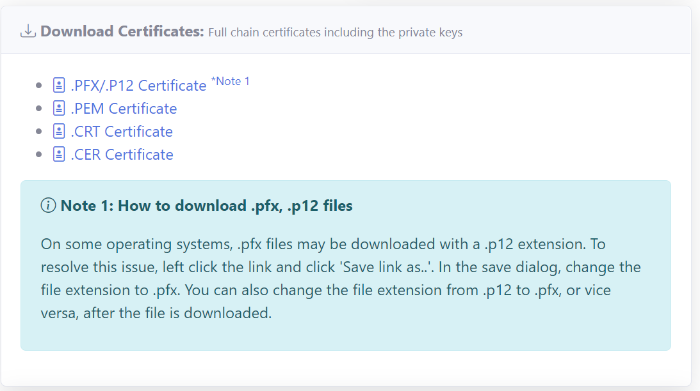

# Installing TLS/SSL Certificates in Apache Tomcat
**V7.1.0**

This article assumes that you have experience with Apache Tomcat in Linux or Windows.

You can use a .PFX (PKCS12) file to install a TLS/SSL certificate in Apache Tomcat.

## Get the Certificate Files Manually

You can download the files required to install the TLS/SSL certificate in the Apache Tomcat web server from the **RCL SSL Portal** on the **Certificate Details** page.



### Files Required

The files required are :

- .PFX/P12 Certificate - The PFX certificate file

Download the files to a suitable folder in your hosting machine.

#### Linux Command :
```
wget https://url-of-the-file -O /folder/to/save/filename.extension
```

In Linux you can use the ```wget``` command to download the file

#### Windows :
```
Download the file to a folder in the hosting machine
```

## Get the Certificate Files Automatically

You can also use the [RCL SSL HTTP AutoRenew](../httpautorenew/httpautorenew.md) or [RCL SSL DNS AutoRenew](../dnsautorenew/dnsautorenew.md) to automatically renew and download the files required to install the SSL/TLS certificate in the Apache Tomcat web server. 

The SSL/TLS certificate files will be stored at the path you specified in the ``appsettings.json`` configuration file. 

At this path, a folder is generated by the auto renew service based on the certificate name. All the files for the certificate will be stored in this folder.

For each certificate, the following files are downloaded and saved on the hosting machine with the following file names:

  - ``certificate.pfx`` - The PFX certificate file
  - ``primaryCertificate.crt`` - The Primary Certificate file
  - ``fullChainCertificate.crt`` - The full chain certificate file
  - ``caBundle.crt`` - The Intermediate Certificates (CA Bundle) file
  - ``privateKey.key`` - The Certificate Private Key file

   The files are saved in a folder generated by the auto renew service based on the certificate name following these conventions :

  |Type               |Example Certificate Name         |Example Folder Name
  |-------------------|---------------------------------|---------------------
  |Apex Domain        |shopeneur.com                    |shopeneur-com
  |Sub-domain         |store.shopeneur.com              |store-shopeneur-com
  |Wildcard domain    |*.shopeneur.com                  |wcard-shopeneur-com
  |SAN HTTP Challenge |shopeneur.com,www.shopeneur.com  |shopeneur-com-san-www
  |SAN DNS Challenge  |shopeneur.com,*.shopeneur.com    |shopeneur-com-san-wcard

## Configure Apache Tomcat

Tomcat can use a PFX (PKCS12) file just fine, there is no need to convert to JKS.

1. Open : ```/YOUR-PATH-TO-TOMCAT/conf/server.xml``` in XML or text editor.

2. Find the following lines for port 443 (or 8443) similar to the ones below. (If you do not find the lines, jump to point 4 and add whole tag in server.xml and change keystoreFile and keystorePassword)

```
<!--
<Connector 
 port="8443"
 protocol="org.apache.coyote.http11.Http11NioProtocol"
 maxThreads="150" 
 SSLEnabled="true">
 <SSLHostConfig>
    <Certificate certificateKeystoreFile="conf/localhost-rsa.jks"
    type="RSA" />
 </SSLHostConfig>
</Connector>
    -->
```

3. Delete the comment markers at the beginning of the code (<!–) and at the end of the code (–>)

4. Add the following attributes, change the keystoreFile and keystorePassword. The keystoreFile, is the path to where your PFX certificate is stored on the hosting machine. The keystorePassword can be found in the **Certificate Details** page (```Certificate Password```) in the **RCL SSL Portal**.


```
<Connector
    protocol="org.apache.coyote.http11.Http11NioProtocol"
    port="443"
    maxThreads="150"
    SSLEnabled="true">
  <SSLHostConfig>
    <Certificate
      certificateKeystoreFile="/path/to/certificate.pfx"
      certificateKeystorePassword="pwd1234"
      type="RSA"
      />
    </SSLHostConfig>
</Connector>
```

5. Save server.xml file.

6. Restart the Tomcat server.

Now you can confirm your domain SSL certificate using any of the SSL checker tools available. Or you can just browse the URL.