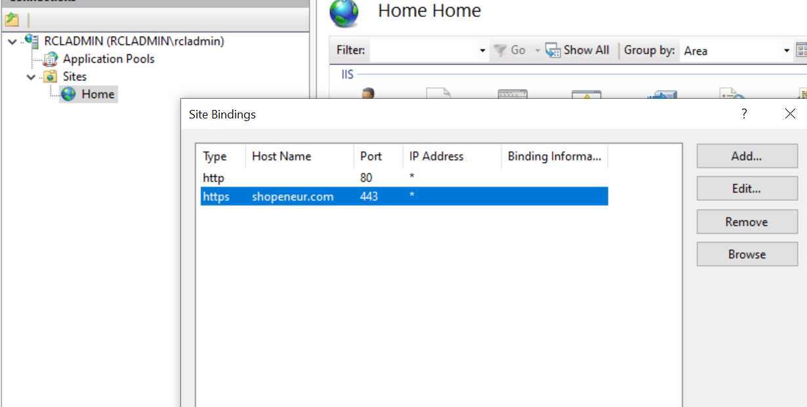

# Installing TLS/SSL Certificates in IIS
**V7.0.0**

This article assumes that you have experience with IIS.

## Get the Certificate Files Manually

You can download the files required to install the TLS/SSL certificate in IIS from the **RCL SSL Portal** on the **Certificate Details** page.


## Files Required

The files required are :

- Certificate PFX file (.pfx)

On some operating systems, .pfx files may be downloaded with a .p12 extension. To resolve this issue, left click the link to download the file and click 'Save link as..'. In the save dialog, change the file extension to .pfx. You can also change the file extension from .p12 to .pfx, or vice versa, after the file is downloaded.

## Get the Certificate Files Automatically

You can also use the [RCL SSL HTTP AutoRenew](../httpautorenew/httpautorenew.md) or [RCL CertificateBot](../certbot/certbot.md) to automatically renew and download the files required to install the SSL/TLS certificate in the IIS web server. 

The SSL/TLS certificate files will be stored at the path you specified in the ``appsettings.json`` configuration file. 

At this path, a folder is generated by the auto renew service based on the certificate name. All the files for the certificate will be stored in this folder.

For each certificate, the following files are downloaded and saved on the hosting machine with the following file names:

  - ``certificate.pfx`` - The PFX certificate file
  - ``primaryCertificate.crt`` - The Primary Certificate file
  - ``fullChainCertificate.crt`` - The full chain certificate file
  - ``caBundle.crt`` - The Intermediate Certificates (CA Bundle) file
  - ``privateKey.key`` - The Certificate Private Key file

   The files are saved in a folder generated by the auto renew service based on the certificate name following these conventions :

  |Type               |Example Certificate Name         |Example Folder Name
  |-------------------|---------------------------------|---------------------
  |Apex Domain        |shopeneur.com                    |shopeneur-com
  |Sub-domain         |store.shopeneur.com              |store-shopeneur-com
  |Wildcard domain    |*.shopeneur.com                  |wcard-shopeneur-com
  |SAN HTTP Challenge |shopeneur.com,www.shopeneur.com  |shopeneur-com-san-www
  |SAN DNS Challenge  |shopeneur.com,*.shopeneur.com    |shopeneur-com-san-wcard


# How To Import The PFX (PKCS12) File Into Microsoft IIS

Importing a PFX (PKCS12) file into Windows IIS is generally a straight-forward process.

- Step 1 : In “Start” find and open “Run”.

- Step 2 : In the “Run” dialogue box type “MMC” and click “OK”. The MMC should then appear.

- Step 3 : Go to the File tab or menu and select “Add / Remove Snap-In”.

- Step 4 : Click on “Certificates” and click “Add”.

- Step 5 : Select “Computer Account” and click “Next”.

- Step 6 : Select “Local Computer” and click “Finish”.

- Step 7 : Click “OK” to close the “Add / Remove Snap-In” window.

- Step 8 : Double click on “Certificates (Local Computer)” in the center window.

- Step 9 : Right click on the “Personal" certificates store folder.

- Step 10 : Choose “ALL TASKS” then select “Import”.

- Step 11 : Follow the “Certificate Import Wizard” to import your “Certificate” from the .PFX file that you downloaded from the RCCL SSL Portal and  saved on your hosting machine.

- Step 12 : Browse to the .PFX and enter the associated password when prompted. Enter the certificate password you assigned when creating the certificate in the RCL SSL portal. You can find this password in the **Certificate Details** page (```Certificate Password``) of the RCL SSL Portal.

- Step 13 : If desired, check the box to “Mark This Key As Exportable”. We recommend choosing this option.

- Step 14 : When prompted, choose to automatically place the Certificates in the Certificate Stores based on the type of the Certificate.

- Step 15 : Click “Finish” to close the Certificate Import Wizard.

- Step 16 : Close the MMC console. It is not necessary to save any changes that you have made to the MMC console.

The SSL Certificate, Private Key and any Intermediate Certificates should now be imported into your hosting machine in the certificates store. You must now follow the instructions below to bind your SSL Certificate to your website.

# How To Bind A SSL Certificate In IIS

Once the SSL Certificate has been imported, it is important to now bind the SSL Certificate to your website so that the website functions correctly. Your SSL Certificate will not function until the following steps are completed.

- Step 1 : Open **Internet Information Services (IIS) Manager**.

- Step 2 : Click on the server name and expand the “Sites” folder.

- Step 3 : Locate your website (usually this will be called “Default Web Site” or a name that you assigned to your website) and click on it.

- Step 4 : From the “Actions” menu (on the right) click on “Edit Site > Bindings” or similar.


- Step 5. In the “Site Bindings” window, click “Add” or similar. This will open the “Add Site Binding” window.

- Step 6 : Under “Type” choose https. The IP address should be the corresponding dedicated IP address of the site or “All Unassigned”. The “Port” which traffic will be secured by SSL is usually 443. The hostname should be the custom domain for your site (eg. contoso.com). The “SSL Certificate” field should specify the SSL Certificate that was installed during the import process above. You can choose the certificate from the drop down selector.

- Step 7 : Click “OK”.

- Step 8 : Your SSL Certificate should now be installed and functioning correctly in conjunction with your website. Occasionally a restart of IIS may be required before the new SSL Certificate is recognized.



Now you can confirm your domain SSL certificate using any of the SSL checker tools available. Or you can just browse the URL.

