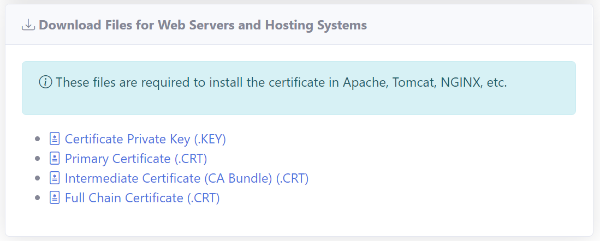

# Installing TLS/SSL Certificates in NGINX
**V7.1.0**

This article assumes that you have experience with NGINX in Linux or Windows.

## Get the Certificate Files Manually

You can download the files required to install the TLS/SSL certificate in the NGINX web server from the **RCL SSL Portal** on the **Certificate Details** page.



### Files Required

The files required are :

- Certificate Private Key (.key)
- Full Chain Certificate (.crt)

Download the files to a suitable folder in your hosting machine.

#### Linux Command :
```
wget https://url-of-the-file -O filename.extension
```

In Linux, you can use the ```wget``` command to download the files. Run the command for each file you want to download.

#### Windows :
```
Download the file to a folder in the hosting machine
```

## Get the Certificate Files Automatically

You can also use the [RCL SSL HTTP AutoRenew](../httpautorenew/httpautorenew.md) or [RCL SSL DNS AutoRenew](../dnsautorenew/dnsautorenew.md) to automatically renew and download the files required to install the SSL/TLS certificate in the NGINX web server. 

The SSL/TLS certificate files will be stored at the path you specified in the ``appsettings.json`` configuration file. 

At this path, a folder is generated by the auto renew service based on the certificate name. All the files for the certificate will be stored in this folder.

For each certificate, the following files are downloaded and saved on the hosting machine with the following file names:

  - ``certificate.pfx`` - The PFX certificate file
  - ``primaryCertificate.crt`` - The Primary Certificate file
  - ``fullChainCertificate.crt`` - The full chain certificate file
  - ``caBundle.crt`` - The Intermediate Certificates (CA Bundle) file
  - ``privateKey.key`` - The Certificate Private Key file

   The files are saved in a folder generated by the auto renew service based on the certificate name following these conventions :

  |Type               |Example Certificate Name         |Example Folder Name
  |-------------------|---------------------------------|---------------------
  |Apex Domain        |shopeneur.com                    |shopeneur-com
  |Sub-domain         |store.shopeneur.com              |store-shopeneur-com
  |Wildcard domain    |*.shopeneur.com                  |wcard-shopeneur-com
  |SAN HTTP Challenge |shopeneur.com,www.shopeneur.com  |shopeneur-com-san-www
  |SAN DNS Challenge  |shopeneur.com,*.shopeneur.com    |shopeneur-com-san-wcard


## Web Server Configuration

It is assumed that you have NGINX already installed and hosting your website on your hosting machine. In addition, you have established your own custom domain name that points to your website.

Update your configuration file.

For **Linux**, look in : 

```
/path-to-nginx/sites-enabled
``` 


For **Windows**, look in : 

``` 
/path-to-nginx/conf/nginx.conf
``` 

Add or update these attributes to the sites you want HTTPS on

```
# General SSL configuration

listen 443 ssl default_server;
listen [::]:443 ssl default_server;

# Important part

ssl_certificate  /path/to/fullChainCertificate.crt;
ssl_certificate_key  /path/to/privateKey.key;
```
You can modify the names of the files and paths to match the location and filename that you used to save your certificate files.

Remember to reload the service, or restart if it's a new site.

**Linux** command :
```
sudo systemctl reload nginx
```

**Windows** command :
```
nginx -s reload
```

Now you can confirm your domain SSL certificate using any of the SSL checker tools available. Or you can just browse the URL.