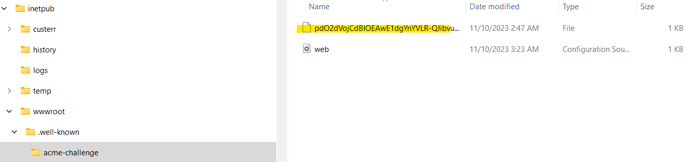

# Overview

RCL SSL creates SSL/TLS certificates using the [Let's Encrypt V2 API](https://letsencrypt.org/). Certificates a created in a simple to use Web UI called the RCL SSL Portal.

# Order a Certificate

You will create an order for a certificate for your domain. A certificate order can be for a single domain (eg. acme.com), a www domain (eg. www.acme.com), a subdomain (eg. store.acme.com). An order can also include two domains in a single certificate, eg. www.acme.com and acme.com ; or *.acme.com and acme.com. This is known as a Subject Alternative Name (SAN) certificate. A third type of certificate is the Wildcard certificate, eg. *.acme.com. This single certificate supports an unlimited amount of subdomains.

# Validate your Domain
Before a certificate can be created the certificate order must be validated. To validate an order you will need to prove that you won or have control over your domain. A challenge would need to be completed to prove that you control the domain. There are two types of challenges:

## HTTP Challenge

In the HTTP Challenge, you will need to add a file in the root folder of your website in a specific folder. You must have access to your website files in your hosting machine to add this file.

The file should be publicly accessible in a web browser.

## DNS Challenge

In the DNS Challenge, you will need to add a DNS TXT Record with a specific value with your DNS provider. You must have access to the DNS Records for your domain with your domain provider.

# Create a Certificate

Once your domain is validated, you will create your SSL/TLS certificate. The certificate will be stored in the Certificate's List in the RCL SSL portal. You can view and manage all your certificates in this list.

# Install a Certificate

You can download the Certificate files to install in a web server in the RCL SSL portal.

You can then install your certificate in your web server. The following links provides instructions on how to install the certificate in a web server

- [Installing SSL/TLS Certificates in Web Servers and Hosting Services](../installations/web-servers)
- [Installing SSL/TLS Certificates in Apache Server](../installations/apache)
- [Installing SSL/TLS Certificates in Apache Tomcat](../installations/apache-tomcat)
- [Installing SSL/TLS Certificates in NGINX](../installations/nginx)
- [Installing SSL/TLS Certificates in IIS](../installations/iis)

# Certificate Renewal

Certificates will expire in 90 days. You can delete the expired certificate, create a new certificate and install the new certificate in your web server. ALternatively, you can use one of the RCL SSL applications to automatically renew and install the certificates in your hosting machine. The following applications are available for automatic certificate renewal:

 - [RCL SSL HTTP AutoRenew](/httpautorenew/httpautorenew.md)
 - [RCL SSL CertificateBot](/certbot/certbot.md)
 - [RCL SSL AutoRenew Function](/autorenew/autorenew.md)