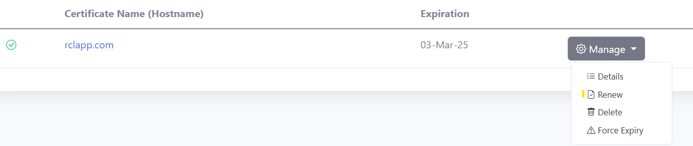

# SAN Certificate - Azure App Services
**V8.0**

RCL SSL creates a SAN TLS/SSL certificate using an [Azure DNS Zone](https://docs.microsoft.com/en-us/azure/dns/dns-zones-records) and automatically binds it to an **App Service**.

A Subject Alternative Name (SAN) TLS/SSL certificate will contain multiple host names  in a single certificate. SAN certificates created with an **Azure DNS Zone** will contain the host name (e.g. contoso.com) and the wild card host name (e.g. *.contoso.com) in a single TLS/SSL certificate.

# Single Domains

SAN certificates only allow a single domain. For instance, the two different domains 'fabricam.com' and 'contoso.com' are not allowed in a SAN multi-domain certificate.

# Access Control

## Organization Accounts

{: .warning }
Personal and Microsoft Accounts are not supported for Azure App Service. Only Microsoft Entra ID (formerly AAD) organizational accounts (also known as ‘Work or School Accounts’) are supported.

If you try to manage an Azure App service with a MSA account you will get the following error.

If you signed up for the RCL SSL Portal with a personal Microsoft account (MSA), please follow the instructions in the following link to associate an organization account to your subscription:

- [Sign-In Accounts for RCL SSL Portal](../authorization/sign-in-accounts)

## Set Access Control

To create certificates for Azure App service, the organizational account that you use to login to the RCL SSL Portal must :

- Have a role of ‘Owner’ or ‘Contributor’ to the subscription containing the Azure App Service

If this requirement is not  met, the ‘subscriptions list’ will be empty when you try to create a certificate.

You may also experience an error message.

To set up access control for your organization account, follow the instructions in the link below :

- [Set Access Control for the organization user](../authorization/access-control-user)

# Add Custom Domains to your App Service

If you registered a domain name, add a custom domain (or sub domain) to your app service following the instructions in this link:

- [Add a custom domain to an app service](https://docs.microsoft.com/en-us/azure/app-service/app-service-web-tutorial-custom-domain)

For a SAN certificate, you must add two custom domains. For instance , if you are creating a SAN certificate for ``shopeneur.com``, you must add the following custom domains:

- shopeneur.com
- *.shopneur.com

When adding the the wildcard domain, eg. ``*.yourdomain.com`` , you can ignore the ``asuid`` TXT record if it causes an error in your Azure DNS Zone.

# Prerequisites

If your app service site has a previous SSL binding, it is recommended that you delete the binding and the SSL certificates for the domain. Failure to do so may lead to errors when creating the new SSL certificate and site binding.

# Create a SAN SSL/TLS Certificate using an Azure DNS Zone

RCL SSL uses the DNS-01 challenge type to issue certificates for :

- primary domains (e.g. contoso.net)
- subdomains (e.g. store.contoso.net)
- wild card subdomains (e.g. *.contoso.net)

**The DNS challenge type ONLY works with an Azure DNS Zone.**

## Create a DNS Zone and Configure Name Server

If you bought your domain with a domain registrar, you must set up your Azure DNS Zone to manage the records for your domain.

Follow the instructions in the link below to set up your Azure DNS Zone and delegate the name server (NS) records for your domain :

- [Delegate Azure DNS Zone](https://docs.microsoft.com/bs-latn-ba/azure/dns/dns-delegate-domain-azure-dns)

# Create SSL/TLS Certificate

- In the ‘Certificates’ module of the portal, click on the **Create New SSL/TLS Certificate** link

- Select the ‘Azure App Services SAN’ option.

- Add the app service site that you are creating the certificate for

- Add the data to create the certificate. The image below illustrates sample data

- In this case, we are requesting a SAN SSL/TLS certificate for the domain, ‘shopeneur.com’. The wildcard domain ‘*.shopeneur.com’ will be automatically included in the certificate

# Certificate Creation

- You will need to wait up to 10 mins to validate the site and install the certificate. When this is done, the SSL/TLS certificate will be displayed in the certificates list.

- When this is done, the SSL/TLS certificate will be displayed in the certificates list.

The certificate will be automatically bound to the app service.

# Manually Renewing SSL/TLS Certificates

SSL/TLS certificates will expire in 90 days. You can manually renew a certificate at any point before the expiry date. Click on the 'Renew' link in the certificates list to update a certificate.

# Automatic Certificate Renewal and Installation

You can use the [RCL AutoRenew Function](../autorenew/autorenew) to automatically renew certificates in Azure App Service SAN.

Follow the instructions in the link to use the AutoRenew function :

- [RCL AutoRenew Function](../autorenew/autorenew)

# Rate Limits

**There is a rate limit of 50 SSL/TLS certificates per subscription.**

In addition, Let's Encrypt has instituted rate limits to ensure fair usage by as many people as possible. To find out more about these rate limits please refer to the following link :

- [Let's Encrypt Rate Limits](https://letsencrypt.org/docs/rate-limits/)