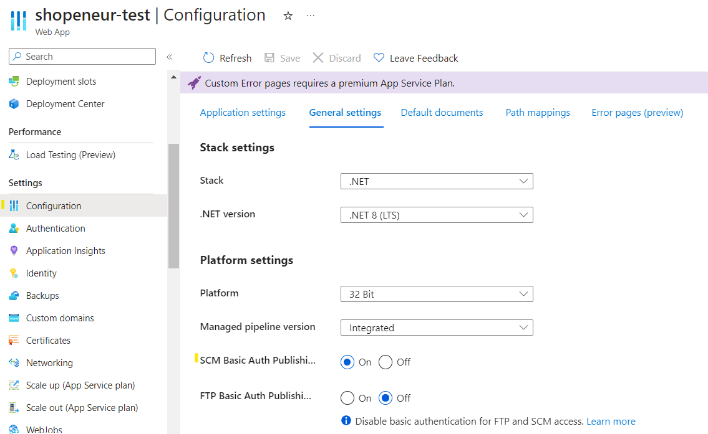
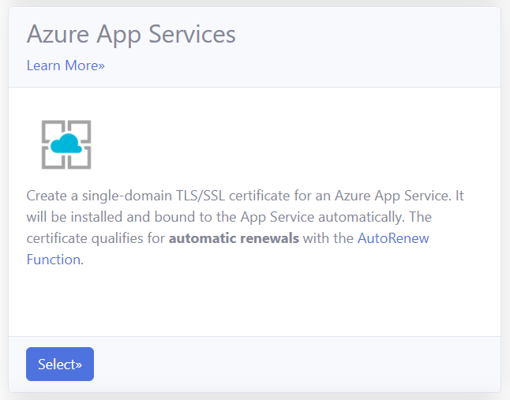
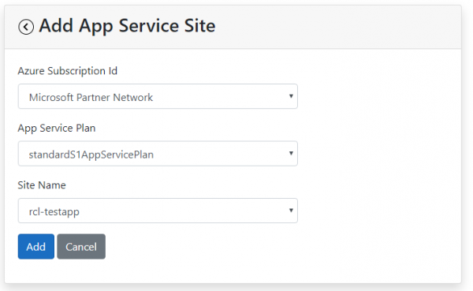
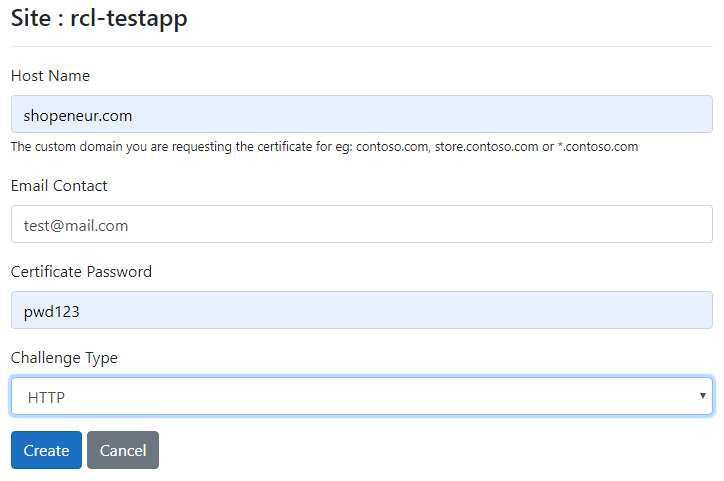
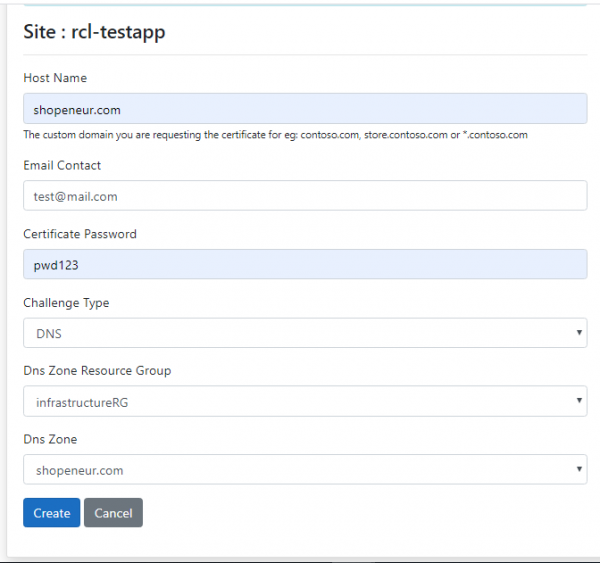
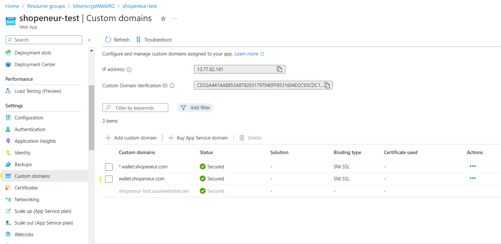

# Creating SSL/TLS Certificates for App Services
**V7.1.0**

You can use RCL SSL to create and install SSL/TLS certificates in your app services.

SSL/TLS certificates are created using either the HTTP or DNS challenge types.

Wild card certificates (eg: *.mydomain.com) are supported with the DNS challenge type in an **Azure DNS Zone**.

# Access Control

## AAD Accounts

**Personal and Microsoft Accounts are not supported for Azure App Service. Only Azure Active Directory (AAD) organizational accounts (also known as ‘Work or School Accounts’) are supported.**

If you try to manage an Azure App service with a MSA account you will get the following error.


If you signed up for the RCL SSL Portal with a personal Microsoft account (MSA), please follow the instructions in the following link to associate an AAD account to your subscription:

- [Sign-In Accounts for RCL SSL Portal](../authorization/sign-in-accounts)

## Set Access Control

To create certificates for Azure App service, the Azure AAD organizational account that you use to login to the RCL SSL Portal must :

- Have a role of ‘Owner’ or ‘Contributor’ to the subscription containing the Azure App Service

If this requirement is met, the ‘subscriptions’ and list will be empty when you try to create a certificate.

You may also experience an error message.


To set up access control for your AAD account, follow the instructions in the link below :

- [Set Access Control for the AAD user](../authorization/access-control-user)

# Add a Custom Domain to your App Service

If you registered a domain name, add a custom domain (or sub domain) to your app service following the instructions in this link:

- [Add a custom domain to an app service](https://docs.microsoft.com/en-us/azure/app-service/app-service-web-tutorial-custom-domain)

# Prerequisites

If your app service site has a previous SSL binding, it is recommended that you delete the binding and the SSL certificates for the domain. Failure to do so may lead to errors when creating the new SSL certificate and site binding.

# Create a SSL/TLS Certificate using HTTP

You can use the HTTP-01 challenge type with any domain registrar.

You do not need an Azure DNS Zone to use the HTTP-01 challenge type.

RCL SSL uses the HTTP-01 challenge type to issue certificates for :

- primary domains (e.g. contoso.net)
- subdomains (e.g. store.contoso.net)

Wildcard subdomains (e.g. *.contoso.net) are **NOT Supported** with the HTTP-01 challenge type. Use the DNS-01 challenge type for wildcard certificates instead.


## HTTP Validation Precautions

Normally, the HTTP validation is performed automatically and you are not required to make any configuration changes to your app service. 

{: .information }
> Only perform the following steps if the HTTP validation fails

If the HTTP validation should fail, the following recommendations may resolve the situation :

- For HTTP validation, an extension-less validation file will be automatically added to the root of your website at path : '/.well-known/acme-challenge/' . You must ensure that your website allows the folder and file to be created in your website root (/site/wwwroot) by providing the necessary read/write permissions. Alternatively, you can manually create the validation folder and path in your website root and provide the necessary read/write permissions using the 'App Service Editor'.

- Ensure the ``SCM Basic Auth Publishing Credentials`` is set to ``On`` in the app service configuration to allow for basic authorization.



- Your website must be able to serve the validation file publicly on the web from this path. If this fails, a 404 response will be returned. 

- There should be no authorization requirement (resulting in a 403 or 401) to view a file at this path. 

- Your website must be able to serve extension-less files. 

- You can test the validation by publicly browsing a file at the validation path in the browser and ensuring a valid response in the browser. The content of the extension-less file should be displayed in the browser.

- Extension-less files are not served by default in IIS. To solve this, add the following ``web.config`` file to the ``acme-challenge`` folder.

```xml
<configuration>
    <system.webServer>
        <staticContent>
            <mimeMap fileExtension="." mimeType="text/plain"/>
        </staticContent>
    </system.webServer>
</configuration>
```


# Create SSL/TLS Certificate

- In the ‘Certificates’ module of the portal, click on the **Create New SSL/TLS Certificate** link


- Select the ‘App Services’ option.



- Add the app service site that you are creating the certificate for



- Add the data to create the certificate. The image below illustrates data for a sample site.

- The ‘Host Name’ is the primary domain (eg: contoso.com) or subdomain (eg: store.contoso.com) that your are requesting the SSL/TLS certificate for.

- In this case, we are requesting a SSL/TLS certificate for the primary domain, ‘shopeneur.com’, that points to the azure app service at ‘rcl-testapp’.



- Click on the Create button when you are done.

# Create a SSL/TLS Certificate using DNS

RCL uses the DNS-01 challenge type to issue certificates for :

- primary domains (e.g. contoso.net)
- subdomains (e.g. store.contoso.net)
- wild card subdomains (e.g. *.contoso.net)

**The DNS challenge type ONLY works with an Azure DNS Zone.**

## Create a DNS Zone and Configure Name Server

If you bought your domain with a domain registrar, you must set up your Azure DNS Zone to manage the records for your domain.


Follow the instructions in the link below to set up your DNS Zone and delegate the name server (NS) records for your domain :

- [Delegate DNS Zone](https://docs.microsoft.com/bs-latn-ba/azure/dns/dns-delegate-domain-azure-dns)

# Create SSL/TLS Certificate

- In the ‘Certificates’ module of the portal, click on the **Create New SSL/TLS Certificate** link


- Select the ‘App Services’ option.


- Add the app service site that you are creating the certificate for


- Add the data to create the certificate. The image below illustrates sample data

- The ‘Host Name’ is the primary domain (eg. contoso.com), subdomain (eg. shop.contoso.com) or wildcard subdomain (eg. *.contoso.com) that your are requesting the SSL/TLS certificate for.

- In this case, we are requesting a SSL/TLS certificate for the custom primary domain, ‘shopeneur.com’, that points to the azure app service ‘rcl-testapp’.

- The Host Name must be valid for the DNS Zone. For instance, ‘shopeneur.com’, ‘store.shopeneur.com’, ‘*.shopeneur.com’ is valid for the DNS Zone ‘shopeneur.com’.



- Click the 'Create' button when you are done

# Certificate Creation

- You will need to wait up to 10 mins to validate the site and install the certificate. When this is done, the SSL/TLS certificate will be displayed in the certificates list.


- When this is done, the SSL/TLS certificate will be displayed in the certificates list.


# Manually Renewing SSL/TLS Certificates

SSL/TLS certificates will expire in 90 days. You can manually renew a certificate at any point before the expiry date. Click on the 'Update' link in the certificates list to update a certificate.


The certificate will be automatically bound to the app service.



# Automatic Certificate Renewal and Installation

You can use the [RCL AutoRenew Function](../autorenew/autorenew) to automatically renew certificates in Azure App Service.

Follow the instructions in the link to use the AutoRenew function :

- [RCL AutoRenew Function](../autorenew/autorenew)

# Rate Limits

**There is a rate limit of 50 SSL/TLS certificates per subscription.**

In addition, Let's Encrypt has instituted rate limits to ensure fair usage by as many people as possible. To find out more about these rate limits please refer to the following link :

- [Let's Encrypt Rate Limits](https://letsencrypt.org/docs/rate-limits/)


