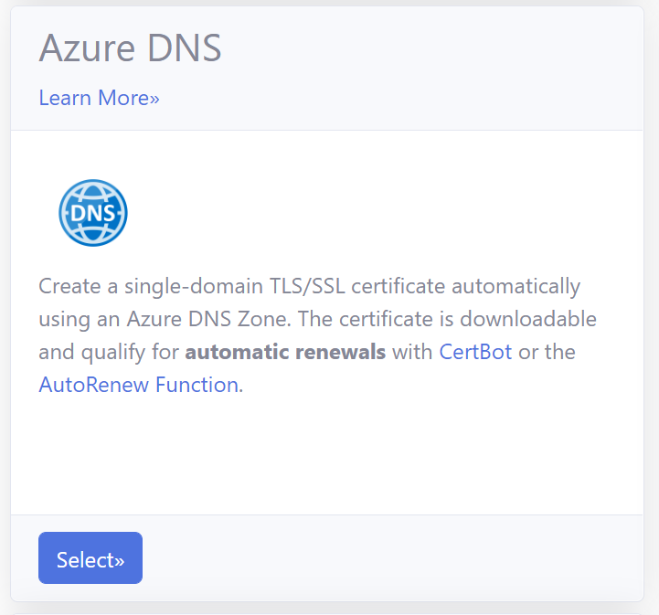
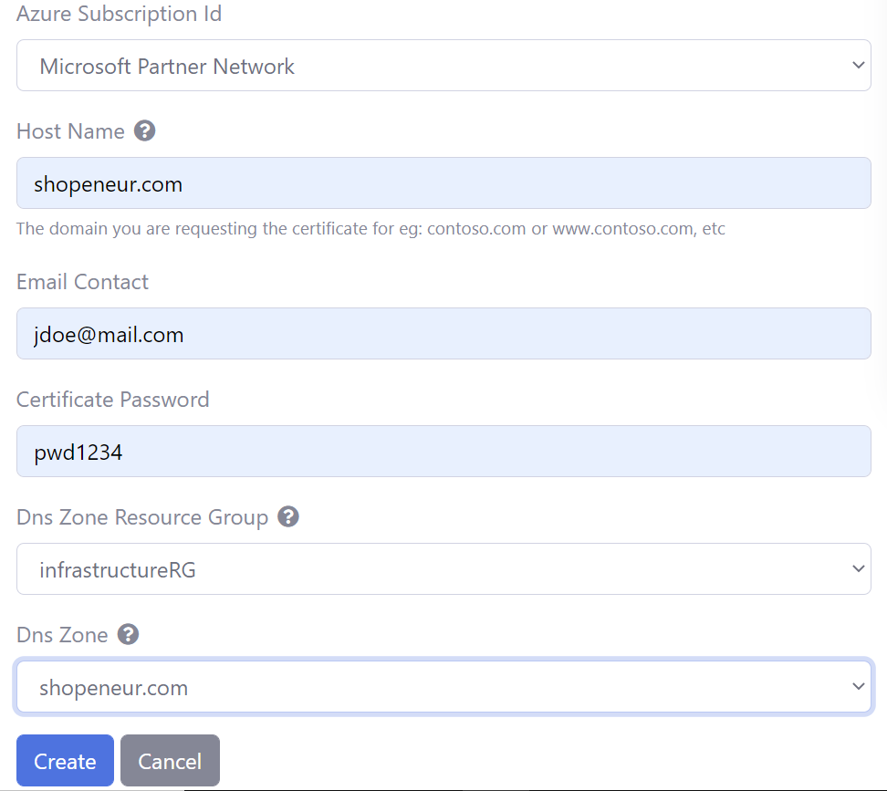

# Creating SSL/TLS Certificates with Azure DNS

**V6.0.10**

RCL creates SSL/TLS certificates using an [Azure DNS Zone](https://docs.microsoft.com/en-us/azure/dns/dns-zones-records).

# Access Control

## AAD Accounts

**Personal and Microsoft Accounts are not supported for Azure DNS. Only Azure Active Directory (AAD) organizational accounts (also known as ‘Work or School Accounts’) are supported.**

If you try to manage an Azure DNS with a MSA account you will get the following error.

If you signed up for the RCL Portal with a personal Microsoft account (MSA), please follow the instructions in the following link to associate an AAD account to your subscription:

- [Sign-In Accounts for RCL](../authorization/sign-in-accounts)

## Set Access Control

To create certificates for Azure DNS, the Azure AAD organizational account that you use to login to the RCL Portal must either be :

- An administrator to the subscription containing the Azure DNS Zone(s)

- Have a role of ‘Owner’ or ‘Contributor’ to the subscription containing the Azure DNS Zone(s)

If either of these requirements are not met, the ‘subscriptions’ and ‘DNS Zone’ lists will be empty when you try to create a certificate.

You may also experience an error message.

To set up access control for your AAD account, follow the instructions in the link below :

- [Set Access Control for the AAD user](../authorization/access-control-user)

# Create a SSL/TLS Certificate using DNS-01

RCL uses the DNS-01 challenge type to issue certificates for :

primary domains (e.g. contoso.net)
subdomains (e.g. store.contoso.net, www.contoso.net) and
wild card subdomains (e.g. *.contoso.net)

# Create a DNS Zone and Configure Name Server

If you bought your domain with a domain registrar, you must set up your Azure DNS Zone to manage the records for your domain.

Follow the instructions in the link below to set up your DNS Zone and delegate the name server (NS) records for your domain :

- [Delegate DNS Zone](https://docs.microsoft.com/bs-latn-ba/azure/dns/dns-delegate-domain-azure-dns)

# Create SSL/TLS Certificate

- In the ‘Certificates’ module of the portal, click on the **Create New SSL/TLS Certificate** link

- Select the ‘Azure DNS’ option.

- Add the data to create the certificate. The image below illustrates sample data.

- The ‘Host Name’ is the primary domain (eg. contoso.com), subdomain (eg. blog.contoso.com, shop.contoso.com, www.contoso.com, etc.) or wildcard subdomain (eg. *.contoso.com) that your are requesting the SSL/TLS certificate for.

- In the case below, we are requesting a SSL/TLS certificate for the custom primary domain, ‘shopeneur.com’.

- The Host Name must be valid for the DNS Zone. For instance, ‘shopeneur.com’, ‘store.shopeneur.com’, ‘*.shopeneur.com’, ‘www.shopeneur.com’ is valid for the DNS Zone ‘shopeneur.com’

- Click the **Create Button** when you are done

- You will need to wait up to 10 mins to validate the site and install the certificate. When this is done, the SSL/TLS certificate will be displayed in the certificates list.

- When this is done, the SSL/TLS certificate will be displayed in the certificates list.

# Manually Installing TLS/SSL Certificates in Web Servers

- To access the certificate, click the **Details** button in the **Manage** menu in the certificates list page.

- You can download the certificate in .PFX, .CER, .CRT or .PEM formats.

- You can also download the Certificate files required for installation in specific web servers (Apache, Apache Tomcat, NGINX, etc). The files include :

- Certificate Private Key (.key)
- Primary Certificate (.crt)
- Intermediate Certificate (CA Bundle) (.crt)
- Full Chain Certificate (.crt)

## Certificate Installation

You will need to manually download and install your certificate in your web server. The following links provides instructions on how to install the certificate in a web server

- [Installing SSL/TLS Certificates in Web Servers and Hosting Services](../installations/web-servers)
- [Installing SSL/TLS Certificates in Apache Server](../installations/apache)
- [Installing SSL/TLS Certificates in Apache Tomcat](../installations/apache-tomcat)
- [Installing SSL/TLS Certificates in NGINX](../installations/nginx)
- [Installing SSL/TLS Certificates in IIS](../installations/iis)

# Manually Renewing SSL/TLS Certificates

SSL/TLS certificates will expire in 90 days. You can manually renew a certificate at any point before the expiry date. Click on the 'Update' link in the certificates list to update a certificate.

# Rate Limits

**There is a rate limit of 50 SSL/TLS certificates per subscription.**

In addition, Let's Encrypt has instituted rate limits to ensure fair usage by as many people as possible. To find out more about these rate limits please refer to the following link :

- [Let's Encrypt Rate Limits](https://letsencrypt.org/docs/rate-limits/)

