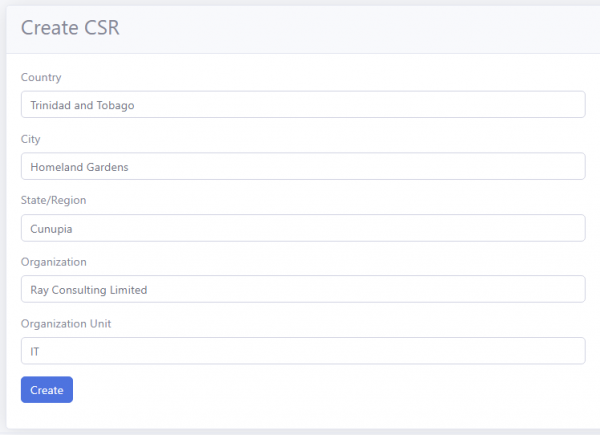

# Certificate Signing Request (CSR) Info
**V7.0.0**

The Certificate Signing Request (CSR) provides information about the holder of the certificate. To add the CSR info, follow these steps :

- In the RCL SSL Portal, expand the ‘SSL/TLS Certificates’ menu from the main side menu

- Click on the ‘CSR Info’ link 

- Add the CSR information and then click the ‘Create’ button

## Valid CSR Info

- The CSR Info may only contain words with common and capital letters (a-z, A-Z) and numbers (0 - 9).

- Commas (,) are allowed in addresses only. Do NOT use fullstops or hyphens (-, _).

- Do NOT use characters such as accents (à), tildes(ã), special characters (&,$,#,etc.), language specific character (eg: ç , ô , å , etc.).

**Failure to comply with this will result in an invalid X509 name.**