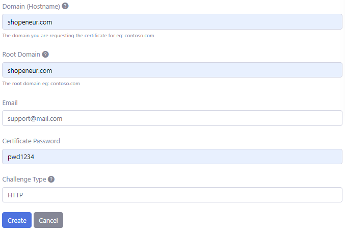

# SAN Certificates - Stand Alone
**V7.1.0**

A Subject Alternative Name (SAN) SSL/TLS certificate will contain multiple domains in a single certificate.

# HTTP SAN Certificate

A SAN certificate created with the HTTP Challenge will contain the domain (e.g. contoso.com) and the www subdomain (e.g. www.contoso.com) in a single SSL/TLS certificate.

# DNS SAN Certificate

A SAN certificate created with the DNS Challenge will contain the domain (e.g. contoso.com) and a wild card domain (e.g. *.contoso.com) in a single SSL/TLS certificate.

# Single Domains

SAN certificates only allow a single domain. For instance the two different domains, eg.  'fabricam.com' and 'contoso.com', are not allowed in a SAN multi-domain certificate.

# Creating Stand Alone SAN SSL/TLS Certificates

In the [RCL SSL Portal](../portal), you can create Stand Alone SAN SSL/TLS certificates using HTTP and DNS challenges. Your domain can be hosted with any domain registrar.

You will need to manually download and install the certificate in your web server. The following web servers are supported :

- Apache
- Apache Tomcat
- NGINX
- IIS
- cPanel, Plesk, etc
- Any hosting system that supports upload of SSL/TLS certificates


You can create a SSL/TLS certificate by using either the :

- HTTP-01 Challenge or
- DNS-01 Challenge

# Manual Certificate Renewal

When a certificate is close to expiration, you should delete the certificate and create a new one. Then, install the renewed certificate in your web server.

# Automatic Certificate Renewal

Automatic certificate renewal is only supported with the [HTTP Challenge Type](./stand-alone-san.md#completing-the-http-challenge). You can use [RCL SSL HTTP AutoRenew](/httpautorenew/httpautorenew.md) to automatically renew certificates created with the HTTP challenge.

## Create a SSL/TLS Certificate

- In the ‘Certificates’ module of the portal, click on the **Create New SSL/TLS Certificate** link


- Select the ‘Stand Alone SAN’ option.


# HTTP Challenge

RCL SSL uses the HTTP-01 challenge type to create a certificate that includes the following domains in a single SSL/TLS certificate:

- domain (e.g. contoso.com)
- www subdomain (e.g. www.contoso.com)

To validate your domain with the HTTP challenge, you will be required to place files in the root of your website and ensure that these files can be accessed publicly on the web.

- Add the data to create the certificate. The image below illustrates data for a sample domain.



- The Hostname is the Domain (eg: 'contoso.com') you are requesting the certificate for. Only a single domain is allowed. The additional www subdomain will be automatically included in the certificate.

- In this case, we are requesting a SSL/TLS certificate for the domain, ‘shopeneur.com’. The www subdomain, 'www.shopeneur.com' will be automatically included in the certificate.

- The root domain is the ‘apex’ domain. For instance, the root domain for the hostname: ‘shop.contoso.com’ is ‘contoso.com’. Similarly, the root domain for the hostname : ‘contoso.com’ is ‘contoso.com’ and 'www.contoso.com' is 'contoso.com'.

- Click the **Create** button when you are done

## Reachable Website

Your website must be publicly accessible in a web browser at the domain (eg. contoso.com) and the www domain (eg. www.contoso.com). If the website is not reachable at these two domains the validation will fail.
    
## Completing the HTTP Challenge

To validate your domain, you will be required to place **two (2)** files in the root of your website.

In your hosted website, create a folder named: .well-known/acme-challenge (note the dot at the start) in the root of your website.

Add a extension-less file with the file name identified in the HTTP Validation page. To this file, add the content identified in the HTTP Validation page.


**Note:** - In Windows, you must remove the extension on the validation file. It should not contain a .txt or other file name extension.


Ensure you can access the files **publicly** in the web browser by clicking on the links in the HTTP validation page. 


When you click on a link, you should see the validation content in the file displayed in the browser. If you do not see the content or the link is in-accessible the domain validation will fail. 


- The following example image illustrates one of the files in the web root directory


Perform the same steps for the second validation file.


**Note:** - for sites hosted in IIS, extension-less files are not served by default. To solve, this add the following ``web.config`` file to the ``acme-challenge`` folder.

```
<configuration>
    <system.webServer>
        <staticContent>
            <mimeMap fileExtension="." mimeType="text/plain"/>
        </staticContent>
    </system.webServer>
</configuration>
```

Click on the 'Validate' button when you are done.

# DNS Challenge

RCL SSL uses the DNS-01 challenge to create a certificate that includes the following domains in a single SSL/TLS certificate:

- domain (e.g. contoso.com)
- wildcard (e.g. *.contoso.com)

To validate your domain with the DNS challenge, you will be required to create a DNS TXT record in your domain settings with your domain registrar.

Add the data to create the certificate. The image below illustrates data for a sample domain.


- The Hostname is the Domain (eg: 'contoso.com') you are requesting the certificate for. Only a single domain is allowed. The additional wildcard domain (eg: '*.contoso.com') will be automatically included in the certificate.

- The root domain is the ‘apex’ domain. For instance, the root domain for the hostname: ‘shop.contoso.com’ is ‘contoso.com’. Similarly, the root domain for the hostname : ‘contoso.com’ is ‘contoso.com’ and '*.contoso.com' is 'contoso.com'.

- In this case, we are requesting a SSL/TLS certificate for the naked apex domain, ‘shopeneur.com’. The wild card domain, '*.shopeneur.com', will be automatically included in the certificate.

## Completing the DNS Challenge

To validate the domain, you are required to create a DNS TXT record in your domain registrar or the application that manages your domain records.

In your management portal for your domain, add a DNS TXT record as defined in the ‘DNS Validation’ page (note the underscore '_').

Then add the two (2) separate values for the DNS TXT record as defined in the 'DNS Validation' page.


The following is an example of the DNS TXT record.


## Verifying the DNS TXT Record with Dig

- You can test the DNS record in the [Dig site](https://toolbox.googleapps.com/apps/dig/). In the site, add the name identified in the DNS Validation page; and select the **TXT** record. The values for the record will be shown in the **TXT** section


- If you see the correct DNS TXT record and values, the test is successful

- If the test is successful, click the 'Validate' button. 

# Certificate Creation

- You will need to wait up to 10 mins to validate the site and install the certificate. When this is done, the SSL/TLS certificate will be displayed in the certificates list.


- When this is done, the SSL/TLS certificate will be displayed in the certificates list.


# Accessing the TLS/SSL Certificate

- To access the certificate, click the **Details** button in the **Manage** menu in the certificates list page.


- You can download the certificate in .PFX, .CER, .CRT or .PEM formats.


- You can also download the Certificate files required for installation in specific web servers (Apache, Apache Tomcat, NGINX, etc). The files include :

- Certificate Private Key (.key)
- Primary Certificate (.crt)
- Intermediate Certificate (CA Bundle) (.crt)
- Full Chain Certificate (.crt)


# Certificate Installation

You will need to manually download and install your certificate in your web server. The following links provides instructions on how to install the certificate in a web server

- [Installing SSL/TLS Certificates in Web Servers and Hosting Services](../installations/web-servers)
- [Installing SSL/TLS Certificates in Apache Server](../installations/apache)
- [Installing SSL/TLS Certificates in Apache Tomcat](../installations/apache-tomcat)
- [Installing SSL/TLS Certificates in NGINX](../installations/nginx)
- [Installing SSL/TLS Certificates in IIS](../installations/iis)

# Manually Renewing SSL/TLS Certificates

SSL/TLS certificates will expire in 90 days. You can manually renew a certificate by following these steps :

- Delete the old certificate
- Create a new certificate
- Remove the old certificate from the web server and install the new certificate

# Automatic Certificate Renewal

If the certificate was created using the [HTTP Challenge](#completing-the-http-challenge) type, you can use [RCL SSL HTTP AutoRenew](../httpautorenew/httpautorenew.md) to automatically renew and install certificates in a web server.

# Rate Limits

**There is a rate limit of 50 SSL/TLS certificates per subscription.**

In addition, Let's Encrypt has instituted rate limits to ensure fair usage by as many people as possible. To find out more about these rate limits please refer to the following link :

- [Let's Encrypt Rate Limits](https://letsencrypt.org/docs/rate-limits/)


