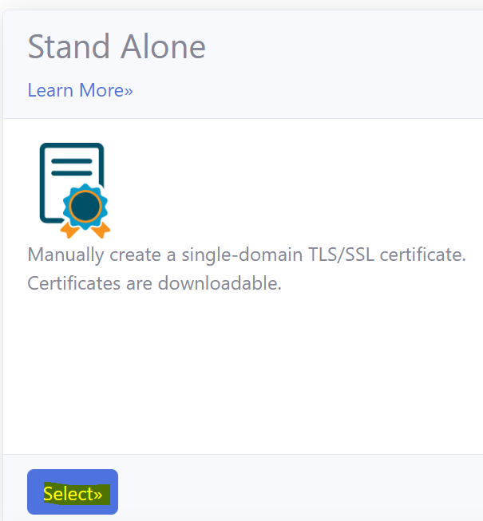
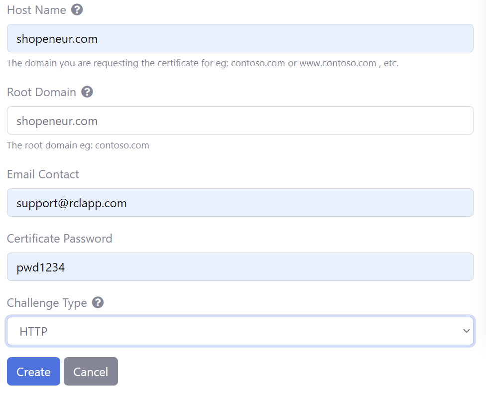
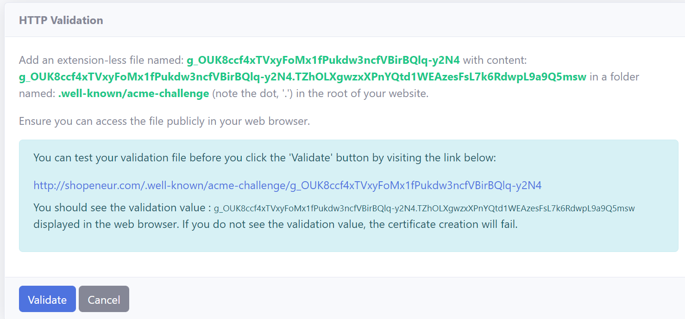
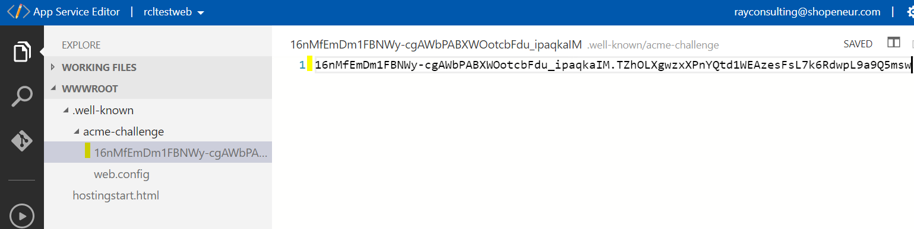
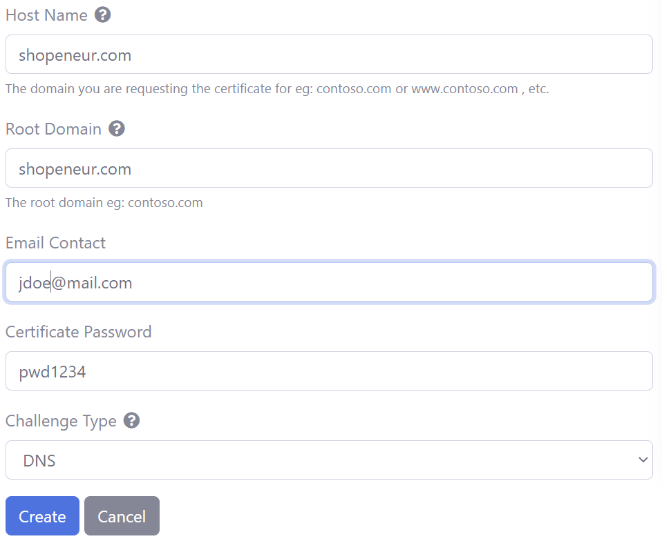
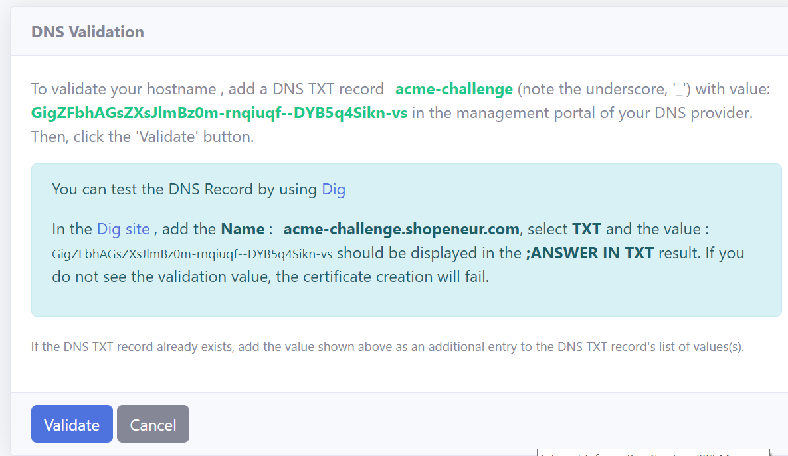
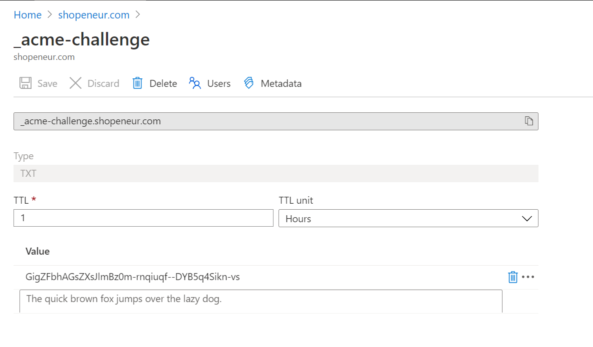
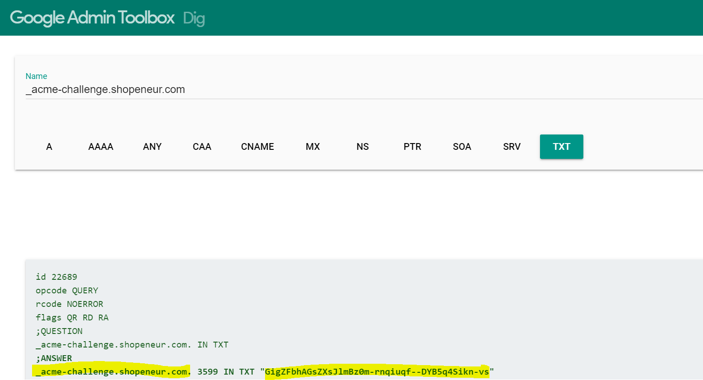

# Creating Stand Alone SSL/TLS Certificates
**V7.0.0**

In the RCL SSL Portal, you can create Stand Alone single-domain SSL/TLS certificates using HTTP and DNS challenges. Your domain can be hosted with any domain registrar.

You will need to download and install the certificate in your web server. The following web servers are supported :

- Apache
- Apache Tomcat
- NGINX
- IIS
- cPanel, Plesk, etc
- Any hosting system that supports the upload of SSL/TLS certificates


You can create a SSL/TLS certificate by using either the :

- HTTP Challenge or
- DNS Challenge

# Manual Certificate Renewal

When a certificate is close to expiration, you should delete the certificate and create a new one. Then, install the renewed certificate in your web server.

# Automatic Certificate Renewal

Automatic certificate renewal is only supported with the [HTTP Challenge Type](./stand-alone.md#completing-the-http-challenge). You can use [RCL SSL HTTP AutoRenew](/httpautorenew/httpautorenew.md) to automatically renew certificates created with the HTTP challenge.

# Create a SSL/TLS Certificate using HTTP

The RCL SSL Portal uses the HTTP-01 challenge type to issue certificates for : 

- primary domains (e.g. contoso.net)
- subdomains (e.g. store.contoso.net, www.contoso.net, etc.)

To validate your domain with the HTTP challenge, you will be required to place a file in the root of your website and ensure that this file can be accessed publicly on the web.

**Wildcard subdomains (e.g. \*.contoso.net) are NOT supported with the HTTP-01 challenge type.**

## Create a SSL/TLS Certificate

- In the ‘Certificates’ module of the portal, click on the **Create New SSL/TLS Certificate** link


- Select the **Stand Alone Certificate** option



- Add the data to create the certificate. The image below illustrates data for a sample site.

    - The **Host Name** is the primary domain (eg: contoso.com) or subdomain (eg: www.contoso.com) that your are requesting the SSL/TLS certificate for.

    - In this case, we are requesting a SSL/TLS certificate for the primary domain, ‘shopeneur.com’

    - The root domain is the ‘apex’ domain. For instance, the root domain for the hostname: ‘shop.contoso.com’ is ‘contoso.com’. Similarly, the root domain for the hostname : ‘contoso.com’ is ‘contoso.com’ and '*.contoso.com' is 'contoso.com'.



- **The website must exist at the domain you entered, eg. in our example, the website can be accessed publicly on the web at 'http://shopeneur.com' in a web browser.**

- Click the **Create** button when you are done

### Completing the HTTP Challenge

- In your hosted website, you will need to create a folder named: **.well-known/acme-challenge** (note the dot at the start) in the root of your website.

- Add a extension-less file with the file name identified in the HTTP Validation page. To this file, add the file content identified in the **HTTP Validation Page**.

**Note:** - In Windows, you must also remove the extension on the validation file. It should not contain a .txt or other file name extension.



- The following example image illustrates the file in the web root directory



**Note:** - for sites hosted in a Windows Server in IIS, extension-less files are not served by default. To solve this, add the following ``web.config`` file to the ``acme-challenge`` folder.

```
<configuration>
    <system.webServer>
        <staticContent>
            <mimeMap fileExtension="." mimeType="text/plain"/>
        </staticContent>
    </system.webServer>
</configuration>
```

- Ensure the website and ‘well known’ file can be accessed **publicly** on the web. On the **HTTP Validation Page**, click on the link to test your validation file 

- For a successful test, you should see the validation value in the web browser.


- If the test is successful, click the 'Validate' button. If the test is not successful the certificate creation will fail.

### Certificate Creation

- You will need to wait up to 10 mins to validate the site and create the certificate. When this is done, the SSL/TLS certificate will be displayed in the certificates list.


- When this is done, the SSL/TLS certificate will be displayed in the certificates list.


- You can download the SSL/TLS certificate or the relevant certificates files for installation in your webserver is the **Certificate Details** page.

# Create a SSL/TLS Certificate using DNS

The RCL SSL Portal uses the DNS-01 challenge type to issue certificates for :

- primary domains (e.g. contoso.net)
- subdomains (e.g. store.contoso.net, www.contoso.net, etc.)
- wild card subdomains (e.g. *.contoso.net)

To validate your domain with the DNS challenge, you will be required to add a DNS TXT Record to your domain settings with your domain provider.

## Add a SSL/TLS Certificate

- In the ‘Certificates’ module of the RCL SSL Portal , click on the 'Create New SSL/TLS Certificate' link.


- Select the **Stand Alone Certificate** option


- Add the data to create the certificate. The image below illustrates sample data.

- The ‘Host Name’ is the primary domain (eg. contoso.com), subdomain (eg. shop.contoso.com) or wildcard subdomain (eg. *.contoso.com) that your are requesting the SSL/TLS certificate for.

- In this case, we are requesting a SSL/TLS certificate for the custom primary domain, ‘shopeneur.com’.

- The root domain is the ‘apex’ domain. For instance, the root domain for the hostname: ‘shop.contoso.com’ is ‘contoso.com’. Similarly, the root domain for the hostname : ‘contoso.com’ is ‘contoso.com’.



- Click the 'Create' button when you are done

### Completing the DNS Challenge

- In your management portal from your domain registrar, add a DNS TXT record (name/host) as defined in the ‘DNS Validation’ page (note the underscore '_' at the start) with the value as defined on the page



- This is an example of a DNS record



### Verifying the DNS TXT Record with Dig

- You can test the DNS record in the [Dig site](https://toolbox.googleapps.com/apps/dig/). In the site, add the name identified in the DNS Validation page; and select the **TXT** record. The value for the record will be shown in the **TXT** section



- If you see the correct DNS TXT record and value, the test is successful

- If the test is successful, click the 'Validate' button. 

### Certificate Creation

- You will need to wait up to 10 mins to validate the site and create the certificate. When this is done, the SSL/TLS certificate will be displayed in the certificates list.


- When this is done, the SSL/TLS certificate will be displayed in the certificates list.


- You can download the SSL/TLS certificate or the relevant certificates files for installation in your webserver is the **Certificate Details** page.

# Accessing the TLS/SSL Certificate

- To access the certificate, click the **Details** button in the **Manage** menu in the certificates list page.


- You can download the certificate in .PFX, .CER, .CRT or .PEM formats.


- You can also download the Certificate files required for installation in specific web servers (Apache, Apache Tomcat, NGINX, etc). The files include :

- Certificate Private Key (.key)
- Primary Certificate (.crt)
- Intermediate Certificate (CA Bundle) (.crt)
- Full Chain Certificate (.crt)


# Certificate Installation

You will need to manually download and install your certificate in your web server. The following links provides instructions on how to install the certificate in a web server

- [Installing SSL/TLS Certificates in Web Servers and Hosting Services](../installations/web-servers)
- [Installing SSL/TLS Certificates in Apache Server](../installations/apache)
- [Installing SSL/TLS Certificates in Apache Tomcat](../installations/apache-tomcat)
- [Installing SSL/TLS Certificates in NGINX](../installations/nginx)
- [Installing SSL/TLS Certificates in IIS](../installations/iis)


# Rate Limits

**There is a rate limit of 50 SSL/TLS certificates per subscription.**

In addition, Let's Encrypt has instituted rate limits to ensure fair usage by as many people as possible. To find out more about these rate limits please refer to the following link :

- [Let's Encrypt Rate Limits](https://letsencrypt.org/docs/rate-limits/)
