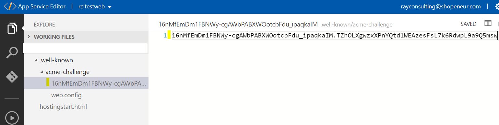

# Creating Stand Alone TLS/SSL Certificates

In the RCL Portal, you can create Stand Alone single-domain TLS/SSL certificates using HTTP and DNS challenges. Your domain can be hosted with any domain registrar.

You will need to manually download and install the certificate in your web server.


**When a certificate is close to expiration, you should delete the certificate and create a new one. Then, install the renewed certificate in your web server.**

You can create a TLS/SSL certificate by using either the :

- HTTP-01 Challenge or
- DNS-01 Challenge

# Create a SSL/TLS Certificate using HTTP-01

RCL Portal uses the HTTP-01 challenge type to issue certificates for

primary domains (e.g. contoso.net)
subdomains (e.g. store.contoso.net).
To validate your domain with the HTTP challenge, you will be required to place a file in the root of your website and ensure that this file can be accessed publicly on the web.

**Wildcard subdomains (e.g. \*.contoso.net) are NOT supported with the HTTP-01 challenge type. Use the DNS-01 challenge type for wildcard certificates instead.**

## Create a SSL/TLS Certificate

- In the ‘Certificates’ module of the portal, click on the **Create New SSL/TLS Certificate** link


- Select the **Stand Alone Certificate** option


- Add the data to create the certificate. The image below illustrates data for a sample site.

    - The **Host Name** is the primary domain (eg: contoso.com) or subdomain (eg: store.contoso.com) that your are requesting the SSL/TLS certificate for.

    - In this case, we are requesting a SSL/TLS certificate for the primary domain, ‘shopeneur.com’

    - The root domain is the ‘apex’ domain. For instance, the root domain for the hostname: ‘shop.contoso.com’ is ‘contoso.com’. Similarly, the root domain for the hostname : ‘contoso.com’ is ‘contoso.com’.


- Clieck the **Create** button when you are done

- In your hosted website, you will need to create a folder named: **.well-known/acme-challenge** (note the dot at the start) in the root of your website.

- Add a extension-less file with the file name identified in the HTTP Validation page. To this file, add the content identified in the **HTTP Validation Page**.


- The following example image illustrates the file in the web root directory



**Note:** - for sites hosted in Azure App Service in a Windows Server, extension-less files are not served by default. To solve, this add the following ``web.config`` file to the ``acme-challenge`` folder.

```
<configuration>
    <system.webServer>
        <staticContent>
            <mimeMap fileExtension="." mimeType="text/plain"/>
        </staticContent>
    </system.webServer>
</configuration>
```

- Ensure the website and ‘well known’ file can be accessed. Click on the link to test your validation file on the **HTTP Validation Page**


- For a successful test, you should see the validation value in the web browser.

- If the test is successful, click the Validate button. If the test is not successful the certificate creation will fail.

- You will need to wait up to 10 mins to validate the site and install the certificate. When this is done, the SSL/TLS certificate will be displayed in the certificates list.


- When this is done, the SSL/TLS certificate will be displayed in the certificates list.


# Create a SSL/TLS Certificate using DNS-01

RCL uses the DNS-01 challenge type to issue certificates for :

- primary domains (e.g. contoso.net)
- subdomains (e.g. store.contoso.net)
- wild card subdomains (e.g. *.contoso.net)

## Add A SSL/TLS Certificate

- In the ‘Certificates’ module of RCL , click on the 'Create New SSL/TLS Certificate' link.


- Select the **Stand Alone Certificate** option


- Add the data to create the certificate. The image below illustrates sample data.

- The ‘Host Name’ is the primary domain (eg. contoso.com), subdomain (eg. shop.contoso.com) or wildcard subdomain (eg. *.contoso.com) that your are requesting the SSL/TLS certificate for.

- In this case, we are requesting a SSL/TLS certificate for the custom primary domain, ‘shopeneur.com’.

- The root domain is the ‘apex’ domain. For instance, the root domain for the hostname: ‘shop.contoso.com’ is ‘contoso.com’. Similarly, the root domain for the hostname : ‘contoso.com’ is ‘contoso.com’.


- Click the 'Create' button when you are done

- In your management portal from your domain registrar, add a DNS TXT record (name/host) as defined in the ‘DNS Validation’ page (note the underscore '_') with the value as defined on the page.


- This is an example of a DNS record


- You can test the DNS record in the [Dig site](https://toolbox.googleapps.com/apps/dig/). In the site add the name identified in the DNS Validation page; and select the **TXT** record. The value for the record will be shown in the **;ANSWER** section


- If you see the correct DNS TXT record and value, the test is successful

- If the test is successful, click the Validate button. 

- You will need to wait up to 10 mins to validate the site and install the certificate. When this is done, the SSL/TLS certificate will be displayed in the certificates list.


- When this is done, the SSL/TLS certificate will be displayed in the certificates list.


# Accessing the TLS/SSL Certificate

- To access the certificate, click the **Details** button in the certificates list page.

- You can download the certificate in .PFX, .CER, .CRT or .PEM formats.


- You can also download the Certificate files required for installation in specific web servers (Apache, Apache Tomcat, NGINX, etc). The files include :

- Certificate Private Key (.key)
- Primary Certificate (.crt)
- Intermediate Certificate (CA Bundle) (.crt)
- Full Chain Certificate (.crt)


# Certificate Installation

You will need to manually download and install your certificate in your web server. The following links provides instructions on how to install the certificate in a web server

- [Installing TLS/SSL Certificates in Apache Server](../installations/apache)
- [Installing TLS/SSL Certificates in Apache Tomcat](../installations/apache-tomcat)
- [Installing TLS/SSL Certificates in NGINX](../installations/nginx)
- [Installing TLS/SSL Certificates in IIS](../installations/iis)

# Certificate Renewal

When a certificate is close to expiration, you should delete the certificate and create a new one.

# Rate Limits

**There is a rate limit of 50 SSL/TLS certificates per subscription.**

In addition, Let's Encrypt has instituted rate limits to ensure fair usage by as many people as possible. To find out more about these rate limits please refer to the following link :

- [Let's Encrypt Rate Limits](https://letsencrypt.org/docs/rate-limits/)
