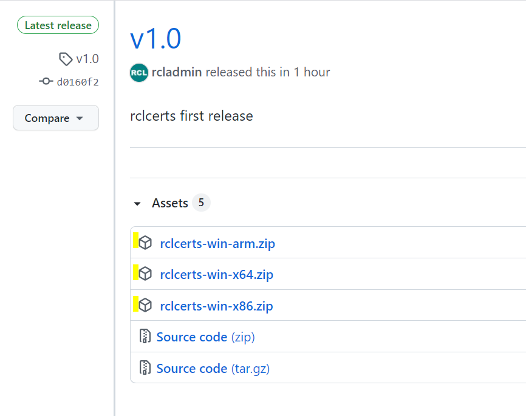
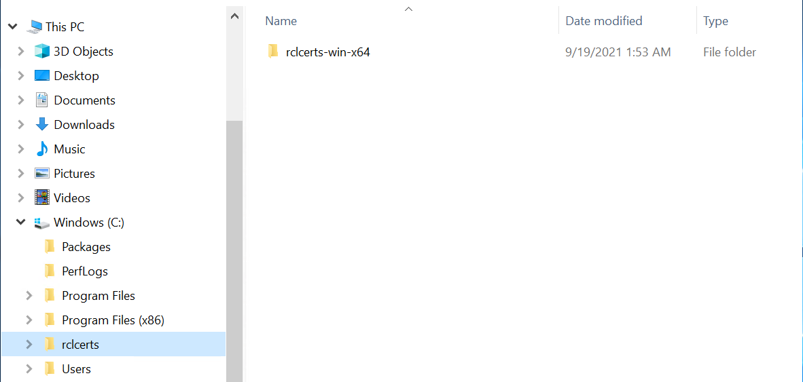
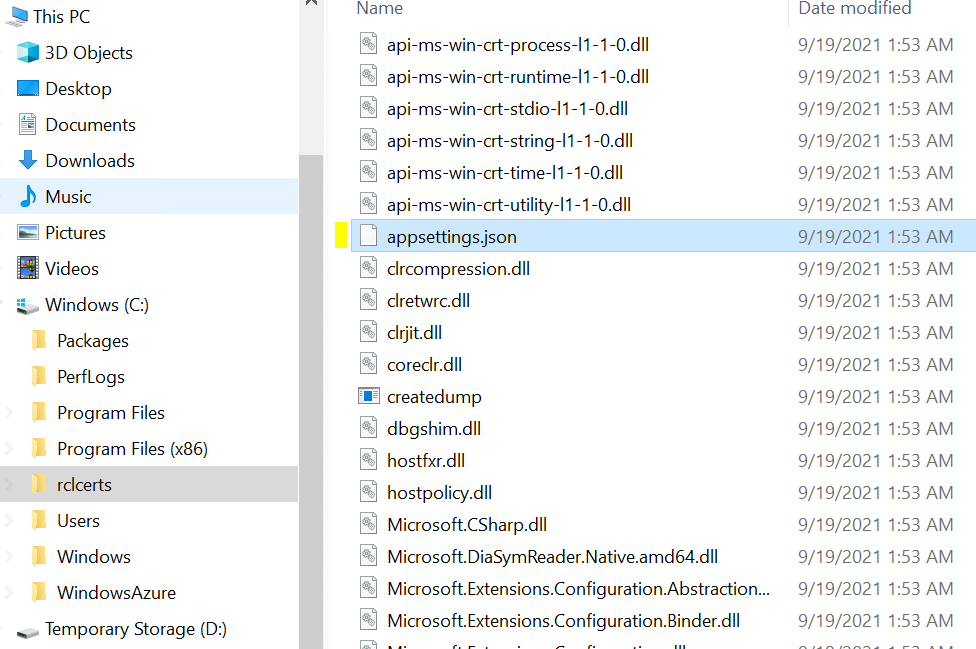
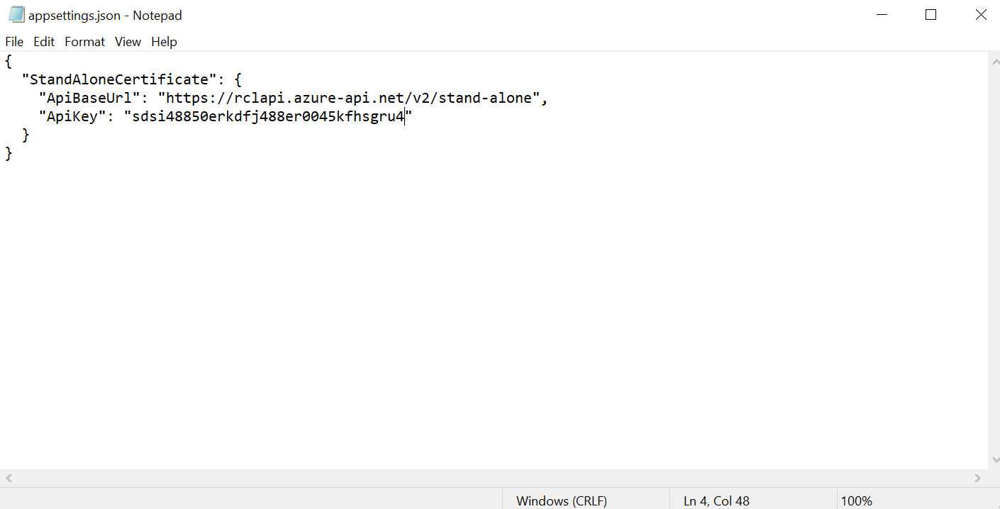
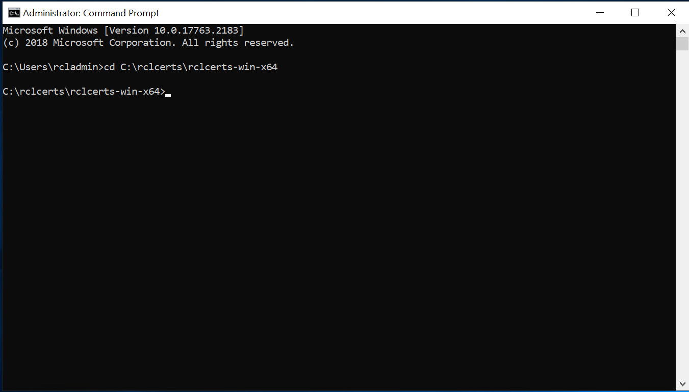
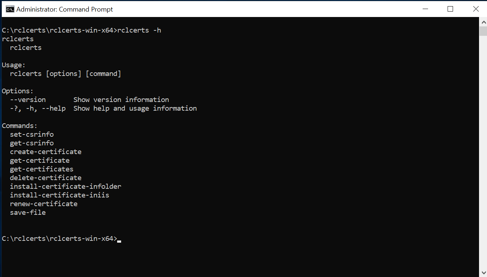
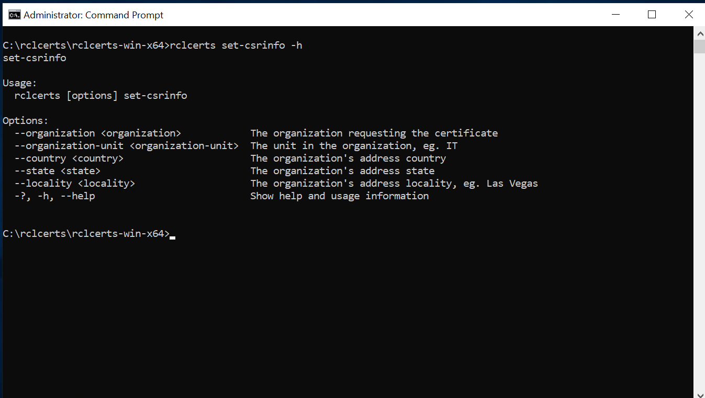
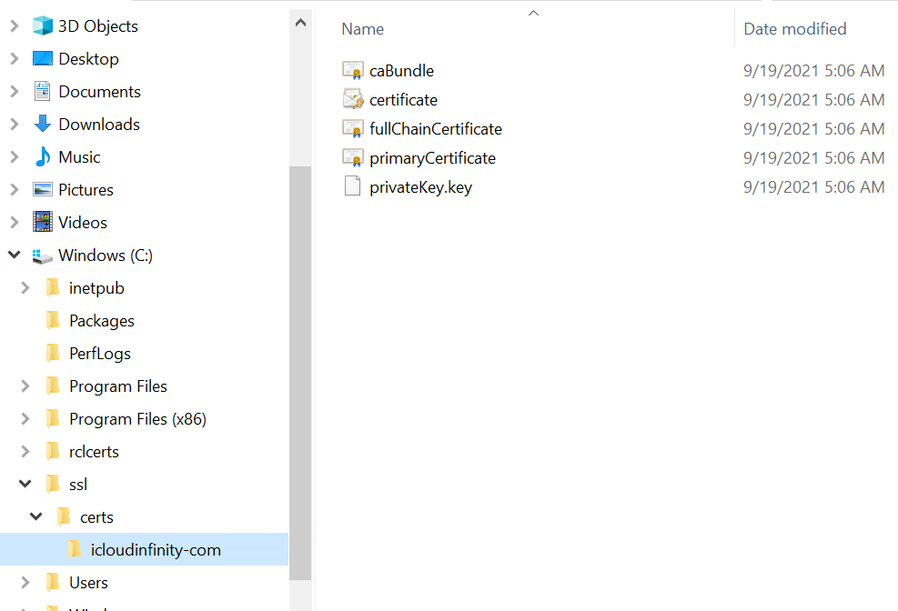
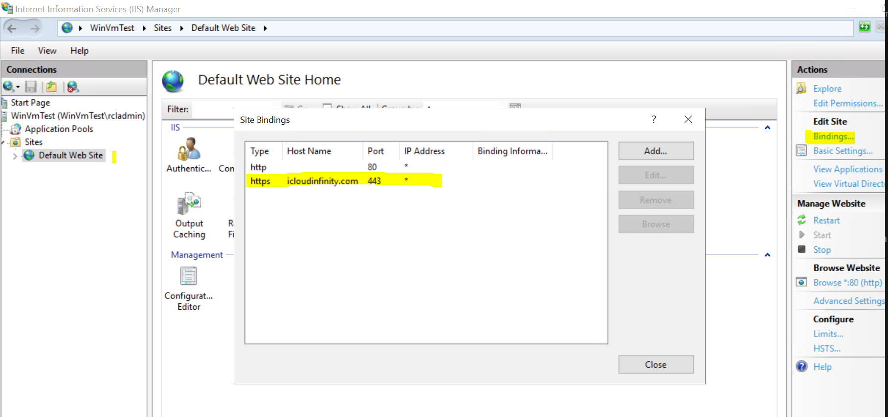

# Introduction

**rclcerts Windows CLI** is a command line application for use in the Windows operating systems to create, install and renew TLS/SSL certificates

# Installation

- Download the zip installation file for your particular Windows environment from the [rclcerts GitHub Project](https://github.com/rcl-ssl/rclcerts-applications/releases/tag/v1.0) site



- Unzip the file to a suitable folder



# Set the API Key

rclerts is built on the RCL Stand Alone API and SDK. To access the APIs you must register an API key to make authorized requests to the API.

- Follow the instructions in the following link to Register and API Key

[Register an API Key](https://docs.standalone-certificate-api.rclapp.com/authorization/authorization.html)

- Navigate to the folder that you unzipped the application files

- Open the `appsettings.json` file



- Add the API Key that you registered above




# Running the Application

- Open a `Command` window as an **Administrator**

- cd into to the application folder



# Get Help

- To get het run this command

```bash
> rclcerts -h
```



- To get help on a particular command, follow the example below

```bash
> rclcerts set-csrinfo -h 
```



# CSR Info

## Set the CSR Info

- You must create the Certificate Signing Request (CSR) Information before you can create a create

- To **create or update** the CSR Info, follow the example below :

```bash
> rclcerts set-csrinfo 
--organization RCL 
--organization-unit IT 
--country USA 
--state Califormia 
--locality "San Diego"
```

  - organization : The organization requesting the certificate
  - organization-unit : The unit in the organization, eg. IT
  - country : The organization's address country
  - state The organization's address state
  - locality : The organization's address locality, eg. Las Vegas

**Note : text containing blank spaces, eg. San Diego, must be placed in quotation marks**

## Get the CSR Info

- To **get** the CSR Info, run the following command

```bash
> rclcerts get-csrinfo
```

# Certificate

## Create a certificate

- To **create** a TLS/SSL certificate, follow the example below :

```bash
rclcerts create-certificate 
--hostname icloudinfinity.com 
--domainroot icloudinfinity.com 
--email rayconsulting@hotmail.com 
--password pwd1234 
--webroot-path C:\inetpub\wwwroot 
--is-san false
```

  - hostname : The hostname (domain) for the certificate, eg. contoso.com. The website must be accessible on the web at this domain in a web browser before a certificate can be created. 

  - domainroot : The root domain for the hostname. This is the apex primary domain for the hostname. For instance, the domainroot for any one of the hostnames : contoso.com, www.contoso.com, store.contoso.com is ``contoso.com``

  - email : An email contact for organization requesting the certificate

  - password : The password for the certificate

  - webroot-path : The folder path for the root of the website in the web server. For instance, your websites may be hosted at 'C:\inetpub\wwwroot\contoso' in Windows. If the webroot path is incorrect the certificate creation will fail. 

  - is-san : set to `true` if a SAN certificate is being requested

  
**Note:** - To create a certificate an extenionless file is added to the webroot path. For sites hosted in a Windows Server in IIS, extension-less files are not served by default. To solve this, add the following ``web.config`` file to the root of your website.

```
<configuration>
    <system.webServer>
        <staticContent>
            <mimeMap fileExtension="." mimeType="text/plain"/>
        </staticContent>
    </system.webServer>
</configuration>
```

## Get a Certificate

- To **get** a certificate, run the command following the example below :

```bash
rclcerts get-certificate --hostname icloudinfinity.com
```

## Delete a Certificate

- To **delete** a certificate, run the command following the example below :

```bash
rclcerts delete-certificate --hostname icloudinfinity.com
```

## Install Certificate Files in a Folder

- To install certificate files in a folder, run the command following the example below :

```bash
rclcerts install-certificate-infolder 
--hostname icloudinfinity.com 
--installation-folderpath C:\ssl\certs
```

  - hostname : The hostname (domain) for the certificate
  - installation-folderpath : The path to the folder to install the certificate files

  

## Install Certificate in IIS Service

- To install the certificate in the IIS Server, run the command following the example below :

```bash
rclcerts install-certificate-iniis 
--hostname icloudinfinity.com 
--installation-folderpath C:\ssl\certs 
--iis-sitename "Default Web Site"  
--iis-host icloudinfinity.com --iis-ip * 
--iis-port 443
```

  - hostname : The hostname (domain) for the certificate
  - installation-folderpath : The path to the folder to install the certificate files
  - iis-sitename : The site name of the IIS website
  --iis-host : The host name assigned to the IIS website
  --iis-ip : The IP address assigned to the IIS website
  --iis-port : The port number of the IIS website

  **Note : text containing blank spaces, eg. Default Web SIte, must be placed in quotation marks**




## Renew a Certificate

- To renew a certificate, run the command following the example shown below :

```bash
rclcerts-win-x64>rclcerts renew-certificate --hostname icloudinfinity.com
```


