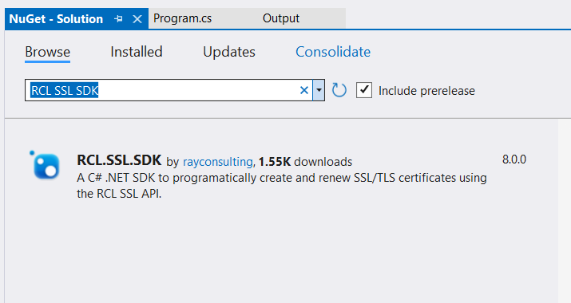
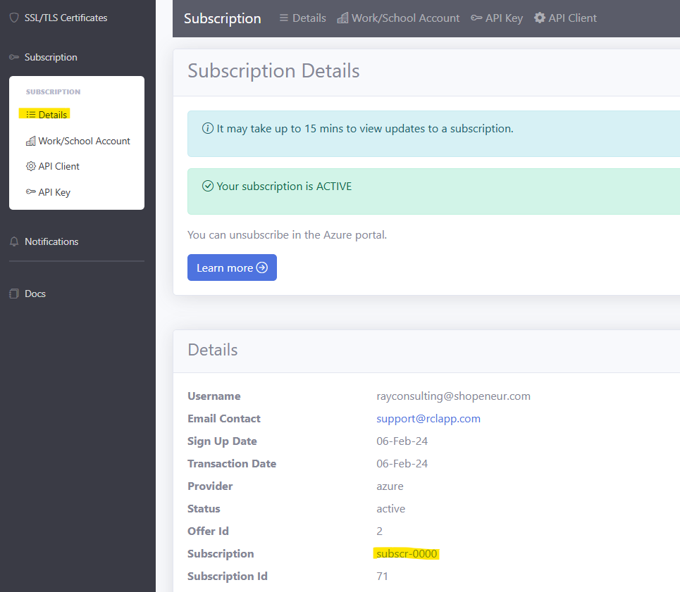

# RCL SSL SDK
**V8.0**

The RCL SSL SDK provides a C# .NET Core library to make authorized requests to the [RCL SSL API](../api/api.md). Use the SDK to get, create and renew SSL/TLS certificates in a user's subscription in the [RCL Portal](../portal/portal.md).

## Prerequisites

Before you can use the SDK, you must first :

- Obtain an [API Key](./authorization.md)
- Create the [CSR Information](../portal/csr-info.md)

## Install the SDK

You will install the SDK as a Nuget package. 



## Adding the SDK to an Application

Add the SDK to your application in the ```Program.cs``` file using Dependency Injection

```csharp
using Microsoft.Extensions.Configuration;
using Microsoft.Extensions.DependencyInjection;
using RCL.SSL.SDK;

IServiceCollection services = new ServiceCollection();

ConfigurationBuilder builder = new ConfigurationBuilder();
builder.AddUserSecrets<TestProject>();
IConfiguration configuration = builder.Build();

services.AddRCLSSLAPIService(options => configuration.Bind("RCLSSLAPI", options));

ServiceProvider serviceProvider = services.BuildServiceProvider();

class TestProject { }
```

## Configuration

Configure the SDK in ```User Secrets```


### Authorization

Obtain the [API Key](./authorization.md) in the **Subscription > API Key** page in the RCL SSL Portal.

You will use the API Key to configure the SDK.

## Subscription

To use the SDK, you must use your subscription. You can obtain the subscription value from the **Subscription > Details** page in the RCL SSL Portal.



Use the API Key and Subscription to configure the SDK :

```json
{
  "RCLSSLAPI:ApiBaseUrl": "https://rclapi.azure-api.net/prod/v3",
  "RCLSSLAPI:ApiKey": "546yt546-yt67-038usd-8876g",
  "RCLSSLAPI:Subscription": "sud56298tr",
  "RCLSSLAPI:Source": "Test"
}
```
## Create a Certificate Order for a Stand Alone Certificate

You will first need to create a certificate order before you can create a Stand Alone certificate. 

### Example Console Application

```csharp
#nullable disable

using Microsoft.Extensions.Configuration;
using Microsoft.Extensions.DependencyInjection;
using RCL.SSL.SDK;
using System.Text.Json;

IServiceCollection services = new ServiceCollection();

ConfigurationBuilder builder = new ConfigurationBuilder();
builder.AddUserSecrets<TestProject>();
IConfiguration configuration = builder.Build();

// Add the service to the Dependency Injection (DI) container
services.AddRCLSSLAPIService(options => configuration.Bind("RCLSSLAPI", options));

ServiceProvider serviceProvider = services.BuildServiceProvider();

// Get the service directly from the DI container or use constructor injection in your platform (eg. ASP.NET Core)
ICertificateService certificateService = (ICertificateService)serviceProvider.GetService(typeof(ICertificateService));

// Create an Order for a Stand ALone Certificate
async Task<Certificate> OrderStandAloneCertificateAsync()
{    
    Certificate certificate = new Certificate
    {
        certificateName = "shopeneur.com",
        rootDomain = "shopeneur.com",
        challengeType = RCLSSLAPIConstants.dnsChallenge,
        email = "rcl@mail.com",
        password = "password123",
        target = RCLSSLAPIConstants.targetStandAlone,
        isSAN = false
    };

    Certificate certificateOrder = await certificateService.CertificateCreateOrderAsync(certificate);

    return certificateOrder;
}

// Run the method
Certificate certificateOrder =  await OrderStandAloneCertificateAsync();
Console.WriteLine(JsonSerializer.Serialize(certificateOrder));

class TestProject { }
```

## Schedule the Creation of a Stand Alone Certificate

Once an order is created for a certificate, you will need to validate that you own or control the domain that you are requesting the certificate for.

To [validate the http challenge](../portal/stand-alone.md#completing-the-http-challenge) you will need to place 
a file at the root of your website.

To [validate the dns challenge](../portal/stand-alone.md#completing-the-dns-challenge) you will need to add 
a TXT record in your DNS Registrar.

You will get the validation token from the ``Certificate.tokens`` property when you ordered the certificate.

Once you complete the validation, you can now create a certificate.

You will need to add the order uri when you schedule the certificate creation. You will get the order uri from the ``Certificate.orderUri`` property when you ordered the certificate.

### Example Console Application

```csharp
#nullable disable

using Microsoft.Extensions.Configuration;
using Microsoft.Extensions.DependencyInjection;
using RCL.SSL.SDK;
using System.Text.Json;

IServiceCollection services = new ServiceCollection();

ConfigurationBuilder builder = new ConfigurationBuilder();
builder.AddUserSecrets<TestProject>();
IConfiguration configuration = builder.Build();

// Add the service to the Dependency Injection (DI) container
services.AddRCLSSLAPIService(options => configuration.Bind("RCLSSLAPI", options));

ServiceProvider serviceProvider = services.BuildServiceProvider();

// Get the service directly from the DI container or use constructor injection in your platform (eg. ASP.NET Core)
ICertificateService certificateService = (ICertificateService)serviceProvider.GetService(typeof(ICertificateService));

// Schedule the creation of a  Stand ALone Certificate
async Task ScheduleCreateStandAloneCertificateAsync()
{
    Certificate certificate = new Certificate
    {
        certificateName = "shopeneur.com",
        rootDomain = "shopeneur.com",
        challengeType = RCLSSLAPIConstants.dnsChallenge,
        email = "rcl@mail.com",
        password = "password123",
        target = RCLSSLAPIConstants.targetStandAlone,
        isSAN = false,
        orderUri = "https://acme-staging-v02.api.letsencrypt.org/acme/order/135518893/21142428364"
    };

    await certificateService.CertificateScheduleCreateAsync(certificate);
}

// Run the method
await ScheduleCreateStandAloneCertificateAsync();

class TestProject { }
```
Your certificate will be scheduled for creation at a later time. During this process, your domain will be validated based on the challenge you completed.
Once the domain is validated, your certificate will be created. You can access your new certificate using the SDK.

## Get a Certificate

You can use the SDK to get a certificate by its name.

### Example Console Application

```csharp
#nullable disable

using Microsoft.Extensions.Configuration;
using Microsoft.Extensions.DependencyInjection;
using RCL.SSL.SDK;
using System.Text.Json;

IServiceCollection services = new ServiceCollection();

ConfigurationBuilder builder = new ConfigurationBuilder();
builder.AddUserSecrets<TestProject>();
IConfiguration configuration = builder.Build();

// Add the service to the Dependency Injection (DI) container
services.AddRCLSSLAPIService(options => configuration.Bind("RCLSSLAPI", options));

ServiceProvider serviceProvider = services.BuildServiceProvider();

// Get the service directly from the DI container or use constructor injection in your platform (eg. ASP.NET Core)
ICertificateService certificateService = (ICertificateService)serviceProvider.GetService(typeof(ICertificateService));

// Get a certificate by its name
async Task<Certificate> GetCertificateAsync()
{
    Certificate certificate = await certificateService.CertificateGetAsync("shopeneur.com");
    return certificate;
}

// Run the method
 Certificate certificate = await GetCertificateAsync();
 Console.WriteLine(JsonSerializer.Serialize(certificate));

class TestProject { }

```

## Schedule the Creation of a Certificate using an Azure DNS Zone

### Getting an Azure Access Token

To access resources in your Azure account (eg. DNS Zone, Subscription, etc) , you must get an Azure Access Token.

Register a [Microsoft Entra ID Application ](../authorization/aad-application.md) and obtain the following credentials from the application :

```bash
- Client ID (Application ID)
- Tenant ID (Directory ID)
- Client Secret
```

Set [Access Control](../authorization/access-control-app.md) for your application to access your Azure Subscription that contains
your Azure resources (eg. DNS Zone, etc)

You will create an Azure Access Token using the SDK. Add the Azure Access Token Service and configure it in the user secrets.

### Example Configuration in User Secrets
```json
  "RCLSSLAPI:ApiBaseUrl": "https://rclapi.azure-api.net/dev/v3",
  "RCLSSLAPI:ApiKey": "266d72b5-caae-4760-9958-975e07672135",
  "RCLSSLAPI:Subscription": "subscr-0000",
  "RCLSSLAPI:Source": "Test",

  "MicrosoftEntraApp:ClientId": "57937645-666d-7k92-552g-53g84635eecd",
  "MicrosoftEntraApp:ClientSecret": "rr456l64ngrtyher6GHT4Re2$gtrhTRedSA",
  "MicrosoftEntraApp:TenantId": "ghf6748-d5htrhf-7rtyher-vbhgrdtg-gftred"
```

To create a certificate using an Azure DNS Zone, add the id of the azure subscription and the resource group that contains the Azure DNS Zone. 

### Example Console Application

```csharp
#nullable disable

using Microsoft.Extensions.Configuration;
using Microsoft.Extensions.DependencyInjection;
using RCL.SSL.SDK;

IServiceCollection services = new ServiceCollection();

ConfigurationBuilder builder = new ConfigurationBuilder();
builder.AddUserSecrets<TestProject>();
IConfiguration configuration = builder.Build();

// Add the RCL SSL API service and configure it in user secrets
services.AddRCLSSLAPIService(options => configuration.Bind("RCLSSLAPI", options));

// Add the azure accesstoken service and configure it in user secrets
services.AddRCLSSLAzureAccessTokenService(options => configuration.Bind("MicrosoftEntraApp", options));

ServiceProvider serviceProvider = services.BuildServiceProvider();

// Get certificate service 
ICertificateService certificateService = (ICertificateService)serviceProvider.GetService(typeof(ICertificateService));

// Get the azure access token service
IAzureAccessTokenService azureAccessTokenService = (IAzureAccessTokenService)serviceProvider.GetService(typeof(IAzureAccessTokenService));

// Schedule the creation of a certificate 
async Task ScheduleCreateCertificateAsync()
{
    // Create an access token for azure resources
    var token = await azureAccessTokenService.GetTokenAsync(RCLSSLAPIConstants.azureResource);

    Certificate certificate = new Certificate
    {
        certificateName = "shopeneur.com",
        rootDomain = "shopeneur.com",
        challengeType = RCLSSLAPIConstants.dnsChallenge,
        email = "rcl@mail.com",
        password = "password123",
        target = RCLSSLAPIConstants.targetAzureDNS,
        isSAN = false,
        accessToken = token.access_token,
        azureSubscriptionId = "954gterfs-htgfd-trher-grfed-fgrdtsw",
        dnsZoneResourceGroup = "shopeneurRG"
    };

    await certificateService.CertificateScheduleCreateAsync(certificate);
}

// Run the method
await ScheduleCreateCertificateAsync();

class TestProject { }
```
Your certificate will be scheduled for creation at a later time. 

After a few minutes, you can access your new certificate using the SDK.

## Schedule the Creation of a Certificate using an Azure DNS Zone and Save it to Key Vault

In addition to an azure access token for azure resources, use the SDK to get an access token for Key Vault.

Add the Key Vault name to schedule the creation of the certificate.

### Example Console Application

```csharp
#nullable disable

using Microsoft.Extensions.Configuration;
using Microsoft.Extensions.DependencyInjection;
using RCL.SSL.SDK;

IServiceCollection services = new ServiceCollection();

ConfigurationBuilder builder = new ConfigurationBuilder();
builder.AddUserSecrets<TestProject>();
IConfiguration configuration = builder.Build();

// Add the RCL SSL API service and configure it in user secrets
services.AddRCLSSLAPIService(options => configuration.Bind("RCLSSLAPI", options));

// Add the azure accesstoken service and configure it in user secrets
services.AddRCLSSLAzureAccessTokenService(options => configuration.Bind("MicrosoftEntraApp", options));

ServiceProvider serviceProvider = services.BuildServiceProvider();

// Get certificate service 
ICertificateService certificateService = (ICertificateService)serviceProvider.GetService(typeof(ICertificateService));

// Get the azure access token service
IAzureAccessTokenService azureAccessTokenService = (IAzureAccessTokenService)serviceProvider.GetService(typeof(IAzureAccessTokenService));

// Schedule the creation of a certificate
async Task ScheduleCreateCertificateAsync()
{
    // Create an access token for azure resources
    var token = await azureAccessTokenService.GetTokenAsync(RCLSSLAPIConstants.azureResource);

    // Create an access token for key vault
    var tokenKeyVault = await azureAccessTokenService.GetTokenAsync(RCLSSLAPIConstants.keyVaultResource);

    Certificate certificate = new Certificate
    {
        certificateName = "shopeneur.com",
        rootDomain = "shopeneur.com",
        challengeType = RCLSSLAPIConstants.dnsChallenge,
        email = "rcl@mail.com",
        password = "password123",
        target = RCLSSLAPIConstants.targetAzureKeyVaultDNS,
        isSAN = false,
        accessToken = token.access_token,
        accessTokenKeyVault = tokenKeyVault.access_token,
        azureSubscriptionId = "954gterfs-htgfd-trher-grfed-fgrdtsw",
        dnsZoneResourceGroup = "shopeneurRG",
        keyVaultName = "shopeneurkeyvault",
    };

    await certificateService.CertificateScheduleCreateAsync(certificate);
}

// Run the method
await ScheduleCreateCertificateAsync();

class TestProject { }

```

Your certificate will be scheduled for creation at a later time. 

After a few minutes, you can access your new certificate using the SDK. In addition, check to ensure that the certificate was saved in your Key Vault.

# Schedule the Creation of a Certificate for Azure App Service

To schedule a certificate for Azure App Service you must add the following :

- The Resource Group that contains the App Service Plan
- The name of the App Service Plan
- The Resource Group for the App Service 
- The App Service name
- The name of the slot (if any) that the App Service is in

For the dns challenge type include the Azure DNS Zone Resource Group.

Before you use the SDK, ensure you [Take the necessary Precautions in your App Service](../portal/azure-appservice.md#http-validation-precautions) if your are using the HTTP challenge type. In addition, you should configured your [Custom Domain](../portal/azure-appservice.md#add-a-custom-domain-to-your-app-service) for your App Service.

### Example Console Application

```csharp
#nullable disable

using Microsoft.Extensions.Configuration;
using Microsoft.Extensions.DependencyInjection;
using RCL.SSL.SDK;

IServiceCollection services = new ServiceCollection();

ConfigurationBuilder builder = new ConfigurationBuilder();
builder.AddUserSecrets<TestProject>();
IConfiguration configuration = builder.Build();

// Add the RCL SSL API service and configure it in user secrets
services.AddRCLSSLAPIService(options => configuration.Bind("RCLSSLAPI", options));

// Add the azure accesstoken service and configure it in user secrets
services.AddRCLSSLAzureAccessTokenService(options => configuration.Bind("MicrosoftEntraApp", options));

ServiceProvider serviceProvider = services.BuildServiceProvider();

// Get certificate service 
ICertificateService certificateService = (ICertificateService)serviceProvider.GetService(typeof(ICertificateService));

// Get the azure access token service
IAzureAccessTokenService azureAccessTokenService = (IAzureAccessTokenService)serviceProvider.GetService(typeof(IAzureAccessTokenService));

// Schedule the creation of a certificate using and Azure DNS Zone + Key Vault
async Task ScheduleCreateCertificateAsync()
{
    // Create an access token for azure resources
    var token = await azureAccessTokenService.GetTokenAsync(RCLSSLAPIConstants.azureResource);

    Certificate certificate = new Certificate
    {
        certificateName = "shopeneur.com",
        rootDomain = "shopeneur.com",
        challengeType = RCLSSLAPIConstants.httpChallenge, // change for dns
       // challengeType = RCLSSLAPIConstants.dnsChallenge, // for dns challenge
        email = "rcl@mail.com",
        password = "password123",
        target = RCLSSLAPIConstants.targetAzureAppService,
        isSAN = false,
        accessToken = token.access_token,
        azureSubscriptionId = "954gterfs-htgfd-trher-grfed-fgrdtsw", 
       // dnsZoneResourceGroup = "shopeneurRG", // for dns challenge
        azureAppServicePlanResourceGroup = "aspRG",
        azureAppServicePlanName = "standardASP",
        azureAppServiceResourceGroup = "shopeneurRG",
        azureAppServiceName = "shopeneur",
        azureAppServiceSlotName = ""
    };

    await certificateService.CertificateScheduleCreateAsync(certificate);
}

// Run the method
await ScheduleCreateCertificateAsync();

class TestProject { }
```

Your certificate will be scheduled for creation at a later time. 

After a few minutes, you can access your new certificate using the SDK. In addition, check to ensure that the certificate was bound to your App Service in the Azure Portal.

## Schedule the Renewal

To schedule a certificate that is about to expire, you must add the certificate name a azure access token. If you are renewing a certificate for Azure Key Vault, you must also add the Key Vault Access Token.

### Example Console Application

```csharp
#nullable disable

using Microsoft.Extensions.Configuration;
using Microsoft.Extensions.DependencyInjection;
using RCL.SSL.SDK;

IServiceCollection services = new ServiceCollection();

ConfigurationBuilder builder = new ConfigurationBuilder();
builder.AddUserSecrets<TestProject>();
IConfiguration configuration = builder.Build();

// Add the RCL SSL API service and configure it in user secrets
services.AddRCLSSLAPIService(options => configuration.Bind("RCLSSLAPI", options));

// Add the azure accesstoken service and configure it in user secrets
services.AddRCLSSLAzureAccessTokenService(options => configuration.Bind("MicrosoftEntraApp", options));

ServiceProvider serviceProvider = services.BuildServiceProvider();

// Get certificate service 
ICertificateService certificateService = (ICertificateService)serviceProvider.GetService(typeof(ICertificateService));

// Get the azure access token service
IAzureAccessTokenService azureAccessTokenService = (IAzureAccessTokenService)serviceProvider.GetService(typeof(IAzureAccessTokenService));

// Schedule the renewal of a certificate
async Task ScheduleRenewCertificateAsync()
{
    // Create an access token for azure resources
    var token = await azureAccessTokenService.GetTokenAsync(RCLSSLAPIConstants.azureResource);

    // Access token for key vault
    // var accesstokenKeyVault = await azureAccessTokenService.GetTokenAsync(RCLSSLAPIConstants.azureResource);

    Certificate certificate = new Certificate
    {
        certificateName = "shopeneur.com",
        accessToken = token.access_token,
       // accessTokenKeyVault = accesstokenKeyVault.access_token // For Key Vault
    };

    await certificateService.CertificateScheduleRenewAsync(certificate);
}

// Run the method
await ScheduleRenewCertificateAsync();

class TestProject { }
```

Your certificate will be scheduled for renewal at a later time. 

After a few minutes, you can access your new certificate using the SDK.

## Delete a certificate

You can delete a certificate by its name.

### Example Console Application

```csharp
#nullable disable

using Microsoft.Extensions.Configuration;
using Microsoft.Extensions.DependencyInjection;
using RCL.SSL.SDK;

IServiceCollection services = new ServiceCollection();

ConfigurationBuilder builder = new ConfigurationBuilder();
builder.AddUserSecrets<TestProject>();
IConfiguration configuration = builder.Build();

// Add the RCL SSL API service and configure it in user secrets
services.AddRCLSSLAPIService(options => configuration.Bind("RCLSSLAPI", options));

ServiceProvider serviceProvider = services.BuildServiceProvider();

// Get certificate service 
ICertificateService certificateService = (ICertificateService)serviceProvider.GetService(typeof(ICertificateService));

// Delete a certificate
async Task DeleteCertificateAsync()
{
    await certificateService.CertificateDeleteAsync("shopeneur.com");
}

// Run the method
await DeleteCertificateAsync();

class TestProject { }
```


