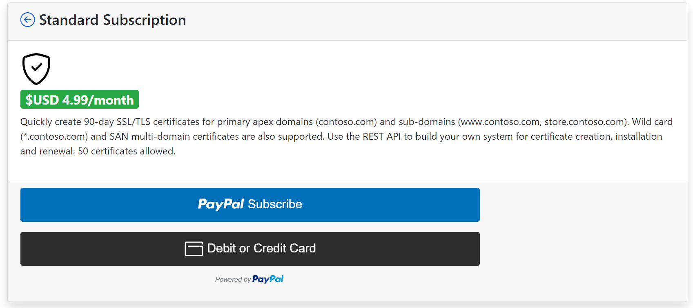
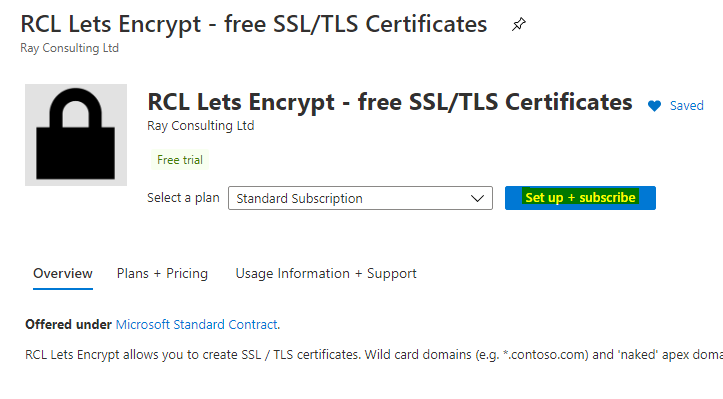
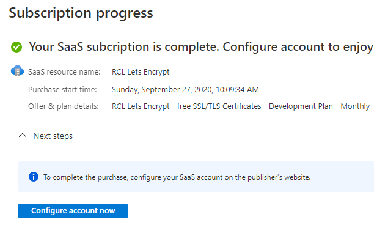
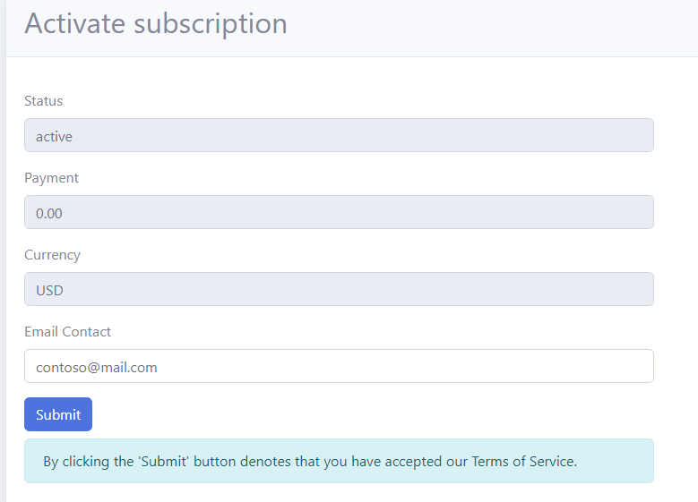
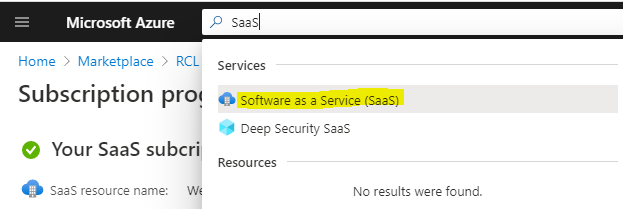
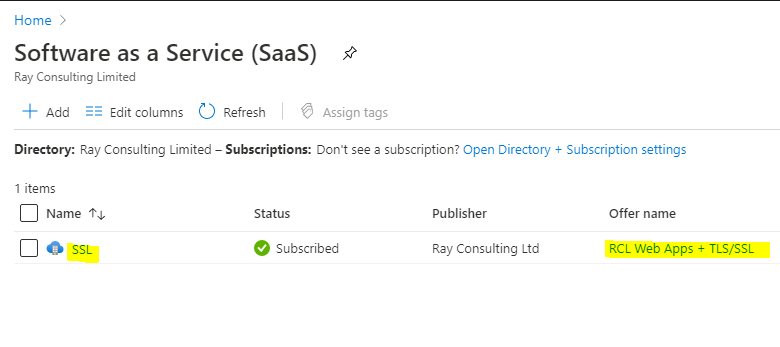
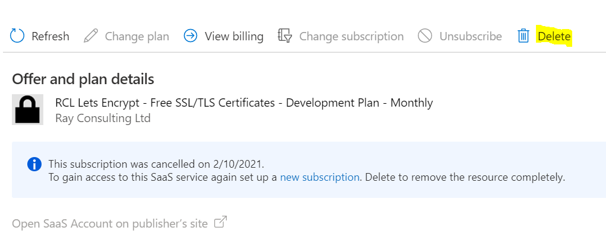

# Subscription Types

There are two subscription types 

- **Standard Subscription** - you can subscribe on the [RCL Website](https://rclapp.com) , payments are handled through PayPal. This subscription is ideal for users creating stand alone TLS/SSL certificates. Users can use a REST API or custom applications to automate certificate renewal. 

- **Azure Marketplace Subscription** - you can subscribe in the [Azure Marketplace](https://azuremarketplace.microsoft.com/en-us/marketplace/apps/rayconsulting.002?tab=overview), payments are handled through Microsoft. This subscription is ideal for users wishing to automate TLS/SSL certificate creation and renewal using an Azure DNS Zone. It is also ideal for installing certificates in Azure App Services and Key Vault.

# Standard Subscription

- You will subscribe in the [RCL Website](https://rclapp.com)

# Azure Marketplace Subscription

- You will subscribe to RCL in the Azure portal or in the [Azure Marketplace](https://azuremarketplace.microsoft.com/en-us/marketplace/apps/rayconsulting.002?tab=overview)

- In the Azure portal, search for the RCL application. Click on the ‘Setup+Subscribe’ button to add a subscription

- Select a subscription and subscribe

- Click on the 'Configure account now' button

- Add your email contact and click the Submit button

# Unsubscribe to RCL 

You can access the RCL apps that you have subscribed to in the Azure portal.

- In the Azure portal, search for Software as a Service (SaaS) and open it

- In the list of SaaS application, click on an application to open it

- You can now view the details of the application

- In the SaaS application, click on the ‘Delete’ link to unsubscribe

