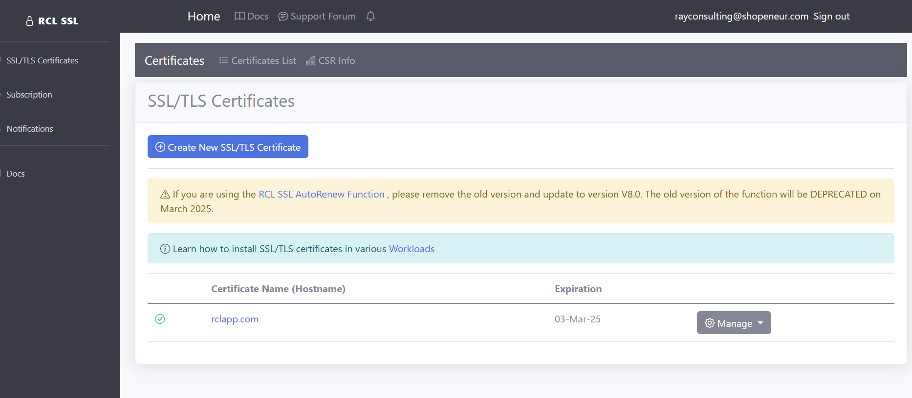

# Subscription Types

There are two subscription types 

- **Standard Subscription** - you can subscribe on the [RCL Website](https://rclapp.com) , payments are handled through PayPal. This subscription is ideal for users creating stand alone TLS/SSL certificates. Users can use a REST API or custom applications to automate certificate renewal. 

- **Azure Marketplace Subscription** - you can subscribe in the [Azure Marketplace](https://azuremarketplace.microsoft.com/en-us/marketplace/apps/rayconsulting.002?tab=overview), payments are handled through Microsoft. This subscription is ideal for users wishing to automate TLS/SSL certificate creation and renewal using an Azure DNS Zone. It is also ideal for installing certificates in Azure App Services and Key Vault.

# Standard Subscription

- You will subscribe in the [RCL Website](https://rclapp.com)

- Login with your email address. **Your subscription will be linked to this email address**. You must login to the Admin portal with this email address to use the application.

- Complete the steps to subscribe via PayPal

- Once the subscription is complete, you will need to wait a few minutes for the subscription to be configured

- After the subscription has been provisioned, go to the admin portal to start using the application

# Azure Marketplace Subscription

- You will subscribe to RCL in the Azure portal or in the [Azure Marketplace](https://azuremarketplace.microsoft.com/en-us/marketplace/apps/rayconsulting.002?tab=overview)

- In the Azure portal, search for the RCL application. Click on the ‘Setup+Subscribe’ button to add a subscription

- Select a subscription and subscribe

- Click on the 'Configure account now' button

- Add your email contact and click the Submit button

# Unsubscribe to RCL 

## Standard Subscription

- In the Admin portal, open the 'Subscription' section

- Then, click on the 'Cancel Subscription' button

- In the 'Cancel Subscription' page, click the 'Delete' button to cancel the subscription

- Once you cancel a subscription, your data will be scheduled for deletion within the next few days

**Download your certificates before your data is deleted. A cancelled subscription cannot be re-activated. You will need to wait a few days create a new subscription and your old data will not be restored.**

## Azure Marketplace Subscription

You can access the RCL apps that you have subscribed to in the Azure portal.

- In the Azure portal, search for Software as a Service (SaaS) and open it

- In the list of SaaS application, click on an application to open it

- You can now view the details of the application

- In the SaaS application, click on the ‘Delete’ link to unsubscribe

- Once you cancel a subscription, your data will be scheduled for deletion within the next few days

**Download your certificates before your data is deleted. A cancelled subscription cannot be re-activated. You will need to wait a few days create a new subscription and your old data will not be restored.**

