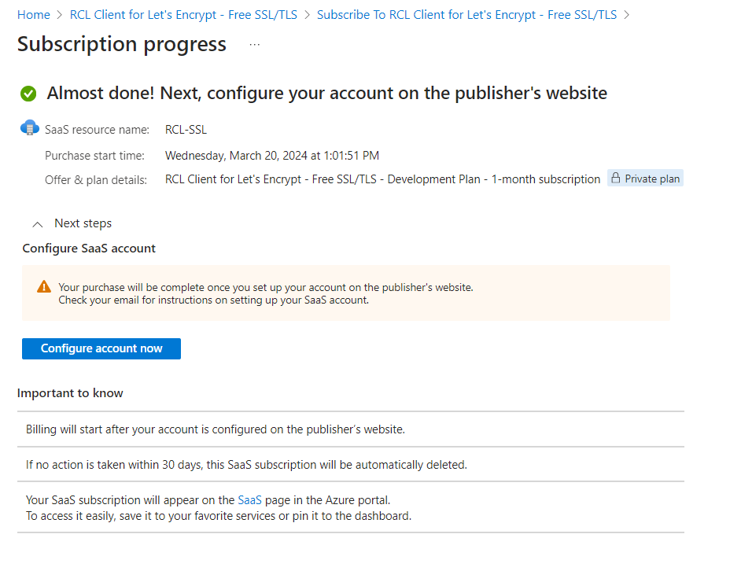

# Azure Marketplace Subscription
**V7.0.0**

- You will subscribe to [RCL SSL Portal](../portal/portal.md) app in the Azure portal or in the [Azure Marketplace](https://azuremarketplace.microsoft.com/en-us/marketplace/apps/rayconsulting.002?tab=overview)

- In the Azure portal, search for the RCL SSL application. Click on the ‘Setup+Subscribe’ button to add a subscription

- Select a subscription and subscribe

- Click on the 'Configure account now' button

- Add your email contact and click the Submit button

# Unsubscribe 

You can access the RCL Portal app that you have subscribed to in the Azure portal.

- In the Azure portal, search for Software as a Service (SaaS) and open it

- In the list of SaaS applications, click on the application to open it

- You can now view the details of the application

- In the SaaS application, click on the ‘Cancel subscription’ link to unsubscribe

- After, you can Delete the subscription

- Once you cancel a subscription, your data will be scheduled for deletion within the next few days

**Download your certificates before your data is deleted. A cancelled subscription cannot be re-activated. You will need to wait a few days to create a new subscription. Your data will not be restored.**

